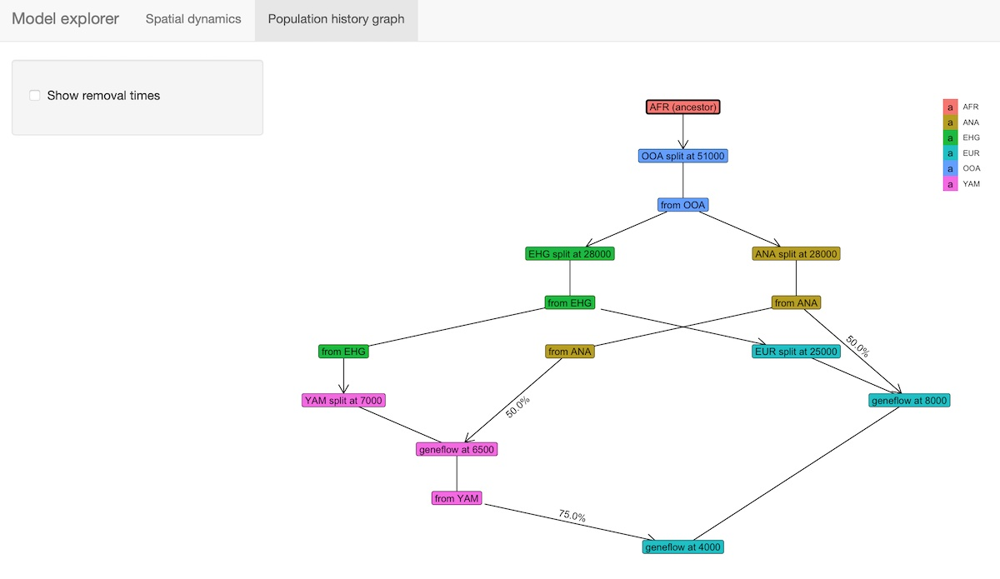

<!-- README.md is generated from README.Rmd. Edit that file instead. -->

```{r, include = FALSE}
env_present <- slendr:::is_slendr_env_present()

knitr::opts_chunk$set(
  collapse = TRUE,
  comment = "#>",
  fig.path = "man/figures/README-",
  fig.width = 6,
  fig.height = 4,
  fig.cap = "",
  dpi = 80,
  eval = Sys.which("slim") != "" && env_present
)
set.seed(314159)
```

# _slendr_: Population Genetic Simulations in R

<!-- badges: start -->

[](https://cran.r-project.org/package=slendr) [](https://cran.r-project.org/package=slendr) [](https://github.com/bodkan/slendr/actions) [](http://beta.mybinder.org/v2/gh/bodkan/slendr/main?urlpath=rstudio)

<!-- [](https://codecov.io/github/bodkan/slendr?branch=main)  -->

<!-- badges: end -->

### *Overview* <a href='https://www.slendr.net'></a>

*slendr* is an R package toolbox for defining population genetic models and simulating genomic data entirely from R. It has been originally conceived as a framework for simulating spatially-explicit genomic data on real geographic landscapes but it has grown to be much more than that.

This page briefly summarizes *slendr'*s most important features. A a much detailed description of the *slendr* architecture and an extensive set of practical code examples can be found in our [preprint](https://www.biorxiv.org/content/10.1101/2022.03.20.485041v1) on bioRxiv and on our [website](https://www.slendr.net).

------------------------------------------------------------------------

### Main features

Here is a brief summary of *slendr*'s most important features. The R package allows you to:

-   **Program demographic models**, including population splits, population size changes, and gene-flow events **using an extremely simple declarative language entirely in R** ([see this vignette](https://www.slendr.net/articles/vignette-04-nonspatial-models.html) for an example of the model-definition interface). Even complex models can be written with only a very little code and require only a bare minimum of R programming knowledge (the only thing the user needs to know is how to call an R function and what does an R data frame look like).

-   Execute *slendr* models using **efficient, tailor-made SLiM or *msprime* simulation scripts** **which are bundled with the R package**. Both of these simulation engines save outputs in the form of an efficient tree-sequence data structure. **No SLiM or *msprime* programming is needed!**

-   **Load, process, and analyse tree-sequence outputs** via *slendr*'s built-in R interface to the tree-sequence library [*tskit*](https://tskit.dev/tskit/docs/)*.* You can compute many [population genetic statistics](https://www.slendr.net/reference/index.html#tree-sequence-statistics) in R immediately after the simulation finishes [directly on the output tree sequences](https://www.slendr.net/articles/vignette-05-tree-sequences.html#calculating-f-statistics), without having to convert files to other formats (VCF, EIGENSTRAT) for analysis in different software.

-   **Encode complex models of population movements on a landscape** (see a brief example of such model [here](https://www.slendr.net/articles/vignette-06-locations.html#model-specification), and a more extended explanation in [this tutorial](https://www.slendr.net/articles/vignette-01-tutorial.html)). No knowledge of cartographic or geospatial analysis concepts is needed.

-   **Simulate these dynamic spatial demographic models using SLiM's continuous-space simulation capabilities directly in R** **(again, no SLiM programming required).** The outputs from such simulations are saved as tree sequences and can be analysed using [standard R geospatial data analysis libraries](https://www.slendr.net/articles/vignette-09-paper.html#example-4-figure-5). This is because *slendr* performs the conversion of tree sequence tables to the appropriate spatial R data type automatically.

-   Specify within-population individual [dispersal dynamics](https://www.slendr.net/articles/vignette-03-interactions.html) from the R interface by leveraging SLiM's individual interaction parameters implemented in the SLiM back-end script.

-   [**Schedule sampling events**](https://www.slendr.net/articles/vignette-05-tree-sequences.html#scheduling-of-sampling-events) which specify how many individuals' genomes, from which populations, and at which times (optionally, at which locations) should be recorded by the simulation engine (SLiM or *msprime*) in the output tree-sequence files.

**Utilizing the flexibility of R with its wealth of libraries for statistics, geospatial analysis and graphics, and combining it with the power of population genetic simulation frameworks SLiM and *msprime*, the *slendr* R package makes it possible to write entire simulation and analytic pipelines without the need to leave the R environment.**

------------------------------------------------------------------------

### Testing the R package in an online RStudio session

You can open an RStudio session and test examples from the [vignettes](https://www.slendr.net/articles/) directly in your web browser by clicking this button (no installation is needed!):

[](http://beta.mybinder.org/v2/gh/bodkan/slendr/main?urlpath=rstudio)

**In case the RStudio instance appears to be starting very slowly, please be patient (Binder is a freely available service with limited computational resources provided by the community).** If Binder crashes, try reloading the web page, which will restart the cloud session.

Once you get a browser-based RStudio session, you can navigate to the `vignettes/` directory and test the examples on your own!

------------------------------------------------------------------------

### Installation

*slendr* is now available CRAN which means that you can install it simply by entering `install.packages("slendr")` into your R console.

If you would like to test the latest features of the software (perhaps because you need some bug fixes), you can install it with `devtools::install_github("bodkan/slendr")` (note that this requires the R package *devtools*).

------------------------------------------------------------------------

**This software is under active development!**

If you would like to stay updated:

1.  Click on the "Watch" button on the project's [GitHub website](https://github.com/bodkan/slendr/).

2.  Follow me on [Twitter](https://twitter.com/fleventy5) where I will be posting progress updates.

3.  From time to time, take a look at the [changelog](https://www.slendr.net/news/index.html) where I will post updates on new features, breaking changes, etc.

------------------------------------------------------------------------

### Example

Here is a very brief demonstration of the kind of spatial model which *slendr* has been originally designed to simulate data from. Please note that although this is a spatially-explicit population genetic model, *slendr* has an extensive support for [traditional, non-spatial simulations as well](https://www.slendr.net/articles/vignette-04-nonspatial-models.html). Furthermore, this example only shows how to specify and simulate a model in R. It doesn't show how to analyse tree-sequence outputs and compute population genetic statistics from them (this important feature is demonstrated in [this tutorial](https://www.slendr.net/articles/vignette-05-tree-sequences.html#calculating-f-statistics)).

#### 1. Setup the spatial context

Imagine that we wanted to simulate spatio-temporal genomic data from a toy model of the history of modern humans in West Eurasia after the Out of Africa migration.

First, we define the spatial context of the simulation. This will represent the "world" which will be occupied by populations in our model.

```{r, results = FALSE, message = FALSE}
library(slendr)

# activate the internal Python environment needed for simulation and
# tree-sequence processing
init_env()

map <- world(
  xrange = c(-13, 70), # min-max longitude
  yrange = c(18, 65),  # min-max latitude
  crs = "EPSG:3035"    # coordinate reference system (CRS) for West Eurasia
)
```

We can visualize the defined world map using the function `plot_map` provided by the package.

```{r plot_world}
plot_map(map)
```

Although in this example we use a real Earth landscape, the `map` can be completely abstract (either blank or with user-defined landscape features such as continents, islands, corridors and barriers).

#### 2. Define broader geographic regions

In order to make the definitions of population ranges (below) easier, we can define smaller regions on the map using the function `region`.

Note that all coordinates in *slendr* are specified in the geographic coordinate system (i.e., degrees longitude and latitude), but are internally represented in a projected CRS (in our case, EPSG 3035 as specified above).

This makes it easier for us to define spatial features simply by reading the coordinates from a regular map but the internal projected CRS makes simulations more accurate (distances and shapes are not distorted because we can use a CRS tailored to the region of the world we are working with). The projected CRS takes care of the projection of the part of the world we're interested in from the three-dimensional Earth surface to a two-dimensional map.

```{r}
africa <- region(
  "Africa", map,
  polygon = list(c(-18, 20), c(38, 20), c(30, 33),
                 c(20, 33), c(10, 38), c(-6, 35))
)
europe <- region(
  "Europe", map,
  polygon = list(
    c(-8, 35), c(-5, 36), c(10, 38), c(20, 35), c(25, 35),
    c(33, 45), c(20, 58), c(-5, 60), c(-15, 50)
  )
)
anatolia <- region(
  "Anatolia", map,
  polygon = list(c(28, 35), c(40, 35), c(42, 40),
                 c(30, 43), c(27, 40), c(25, 38))
)
```

Again, we can use the generic `plot_map` function to visualize these objects, making sure we specified them correctly:

```{r plot_regions}
plot_map(africa, europe, anatolia)
```

#### 3. Define demographic history and population boundaries

The most important function in the *slendr* package is `population()`, which is used to define names, split times, sizes and spatial ranges of populations. Here, we specify times in years before the present, distances in kilometers. If this makes more sense for your models, times can also be given in a forward direction.

You will also note functions such as `move()` or `expand_range()` which are designed to take a *slendr* population object and schedule its spatial dynamics at appropriate times during the model simulation (which will happen at a later step).

Note that in order to make this example executable in a reasonable time on my extremely old laptop, I decreased the sizes of all populations to unrealistic levels. This will speed up the SLiM simulation at a later step.

```{r, message = FALSE}
afr <- population( # African ancestral population
  "AFR", time = 52000, N = 3000, map = map, polygon = africa
)

ooa <- population( # population of the first migrants out of Africa
  "OOA", parent = afr, time = 51000, N = 500, remove = 25000,
  center = c(33, 30), radius = 400e3
) %>%
  move(
    trajectory = list(c(40, 30), c(50, 30), c(60, 40)),
    start = 50000, end = 40000, snapshots = 20
  )

ehg <- population( # Eastern hunter-gatherers
  "EHG", parent = ooa, time = 28000, N = 1000, remove = 6000,
  polygon = list(
    c(26, 55), c(38, 53), c(48, 53), c(60, 53),
    c(60, 60), c(48, 63), c(38, 63), c(26, 60))
)

eur <- population( # European population
  name = "EUR", parent = ehg, time = 25000, N = 2000,
  polygon = europe
)

ana <- population( # Anatolian farmers
  name = "ANA", time = 28000, N = 3000, parent = ooa, remove = 4000,
  center = c(34, 38), radius = 500e3, polygon = anatolia
) %>%
  expand_range( # expand the range by 2.500 km
    by = 2500e3, start = 10000, end = 7000,
    polygon = join(europe, anatolia), snapshots = 20
  )

yam <- population( # Yamnaya steppe population
  name = "YAM", time = 7000, N = 500, parent = ehg, remove = 2500,
  polygon = list(c(26, 50), c(38, 49), c(48, 50),
                 c(48, 56), c(38, 59), c(26, 56))
) %>%
  move(trajectory = list(c(15, 50)), start = 5000, end = 3000, snapshots = 10)
```

We can use the function `plot_map` again to get a "compressed" overview of all spatio-temporal range dynamics encoded by the model so far (prior to the simulation itself).

```{r, plot_popmaps}
plot_map(afr, ooa, ehg, eur, ana, yam)
```

#### 4. Define gene-flow events

By default, populations in *slendr* do not mix even if they are overlapping. In order to schedule an gene-flow event between two populations, we can use the function `gene_flow`. If we want to specify multiple such events at once, we can collect these events in a simple R list:

```{r}
gf <- list(
  gene_flow(from = ana, to = yam, rate = 0.5, start = 6500, end = 6400, overlap = FALSE),
  gene_flow(from = ana, to = eur, rate = 0.5, start = 8000, end = 6000),
  gene_flow(from = yam, to = eur, rate = 0.75, start = 4000, end = 3000)
)
```

#### 5. Compile the model to a set of configuration files

Before we run the simulation, we compile all individual model components (population objects and gene-flow events) to a single R object, specifying some additional model parameters. Additionally, this performs internal consistency checks, making sure the model parameters (split times, gene flow times, etc.) make sense before the (potentially quite computationally costly) simulation is even run.

```{r}
model <- compile_model(
  populations = list(afr, ooa, ehg, eur, ana, yam), # populations defined above
  gene_flow = gf,
  generation_time = 30,
  resolution = 10e3,                   # resolution in meters per pixel
  competition = 130e3, mating = 100e3, # spatial interaction parameters
  dispersal = 70e3,                    # how far can offspring end up from their parents
)
```

Compiled model is kept as an R object which can be passed to different functions. In this example, we will simulate data with the `slim()` engine (but we could also run the simulation through the coalescent engine via the `msprime()` function).

#### 6. Visualize the model

The package provides an [R shiny](https://shiny.rstudio.com)-based browser app `explore_model()` for checking the model dynamics interactively and visually. For more complex models, this is much better than static spatial plots such as the one we showed in step 2 above:

```{r, eval = FALSE}
explore_model(model)
```

The function has two modes:

a) Plotting (and "playing") spatial map dynamics:


b) Displaying the demographic history graph (splits and gene-flow events) embedded in the specified model:



#### 7. Run the model in SLiM

Finally, we can execute the compiled model in SLiM. Here we run the simulation in a batch mode, but we could also run it in SLiMgui by setting `method = "gui"`. This would allow us to inspect the spatial simulation as it happens in real time.

The `slim` function generates a complete SLiM script tailored to run the spatial model we defined above. This saves you, the user, a tremendous amount of time, because you don't have to write new SLiM code every time you design a new demographic model. The output of the simulation run from any *slendr* model is always a [tree sequence](https://tskit.dev/learn/), here loaded into an object `ts_slim`.

```{r, eval = FALSE}
ts_slim <- slim(model, sequence_length = 10e6, recombination_rate = 1e-8,
                method = "batch", random_seed = 314159)
```

```{r, echo = FALSE}
locations_file <- paste0(tempfile(), ".gz")
ts_slim <- slim(model, sequence_length = 10e6, recombination_rate = 1e-8,
                locations = locations_file, method = "batch", random_seed = 314159)
```

As specified here, *slendr*'s SLiM backend will simulate 10 Mb of sequence for each individual, and produce a tree sequence output from the simulation run which can be analysed by many [built-in population genetic functions](https://www.slendr.net/articles/vignette-05-tree-sequences.html#calculating-f-statistics). By default, all individuals living at the end of the simulation are recorded as samples in the tree sequence. If a specific set of samples (ancient and modern) is needed, this can be defined accordingly using a [dedicated function](https://www.slendr.net/articles/vignette-05-tree-sequences.html#scheduling-of-sampling-events).

Note that although we defined a spatial model, we could have just as easily simulated standard, non-spatial data by running the same model through *slendr*'s `msprime()` back end without the need to make any changes:

```{r, eval = FALSE}
ts_msprime <- msprime(model, sequence_length = 10e6, recombination_rate = 1e-8)
```

Here is a very quick overview of the SLiM simulation run summarised as a GIF animation. Again, please note that the simulation is extremely simplified. We only simulated a very small number of individuals in each population, and we also didn't specify any [dispersal dynamics](https://www.slendr.net/articles/vignette-03-interactions.html) which is why the populations look so clumped.

```{r, plot_gif, message = FALSE}
animate_model(model = model, file = locations_file, steps = 50, width = 500, height = 300)
```

At this point, you could either compute some [population genetic statistics of interest](https://www.slendr.net/articles/vignette-05-tree-sequences.html#calculating-f-statistics) or perhaps analyse the [spatial features of the genealogies](https://www.slendr.net/articles/vignette-06-locations.html#extracting-spatio-temporal-ancestral-relationships) simulated by your model.

## Further information

The example above provides only a very brief and incomplete overview of the full functionality of the *slendr* package. There is much more to *slendr* than what we demonstrated here. For instance:

-   You can tweak parameters influencing dispersal dynamics (how "clumpy" populations are, how far can offspring migrate from their parents, etc.) and define how these should change over time. For instance, you can see that in the animation above, the African population forms a single "blob" that really isn't spread out across its entire population range. Tweaking the dispersal parameters as show [this vignette](https://www.slendr.net/articles/vignette-03-interactions.html) helps avoid that.

-   You can use *slendr* to program non-spatial models, which means that any conceivable traditional, random-mating demographic model can be simulated with only a few lines of R code. You can learn more in [this vignette](https://www.slendr.net/articles/vignette-04-nonspatial-models.html) (and in more detail in [this vignette](https://www.slendr.net/articles/vignette-05-tree-sequences.html)). Because SLiM simulations can be often quite slow compared to their coalescent counterparts, we also provide functionality allowing to simulate *slendr* models (without any change!) using a built-in *msprime* back end script. See [this vignette](https://www.slendr.net/articles/vignette-07-backends.html) for a tutorial on how this works.

-   You can build complex spatial models which are still abstract (not assuming any real geographic location), including traditional simulations of demes in a lattice structure. A complete example is shown [this vignette](https://www.slendr.net/articles/vignette-02-grid-model.html).

-   Because *slendr* & SLiM save data in a tree-sequence file format, thanks to the R package [*reticulate*](https://rstudio.github.io/reticulate/index.html) for interfacing with Python code, we have the full power of [*tskit*](https://tskit.dev/tskit/docs/stable/) and [*pyslim*](https://tskit.dev/pyslim/docs/latest/introduction.html) for manipulating tree-sequence data right at our fingertips, all within the convenient environment of R. An extended example can be found in [this vignette](https://www.slendr.net/articles/vignette-05-tree-sequences.html).

-   For spatially explicit population models, the *slendr* package automatically converts the simulated output data to a format which makes it possible to analyse it with many available R packages for geospatial data analysis. A brief description of this functionality can be found in [this vignette](https://www.slendr.net/articles/vignette-06-locations.html).

-   You can find complete reproducible code behind the examples in our [preprint](https://www.biorxiv.org/content/10.1101/2022.03.20.485041v1) in a dedicated R vignette [here](https://www.slendr.net/articles/vignette-09-paper.html).
