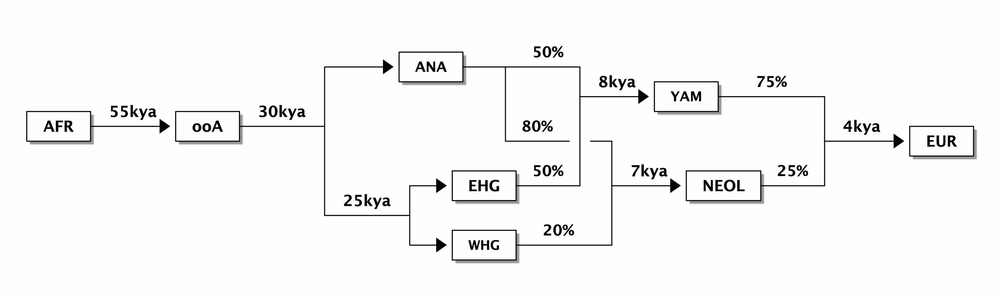
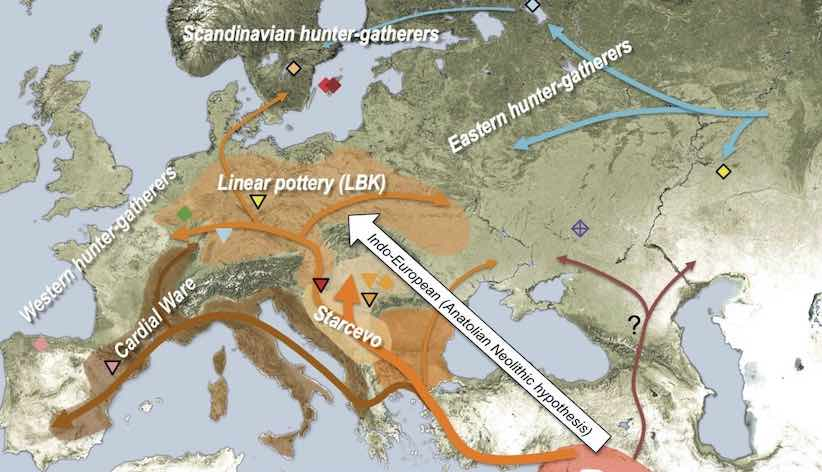
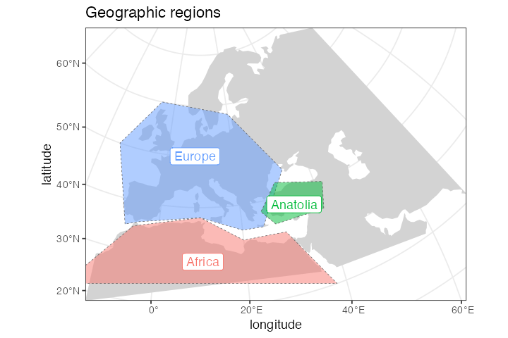
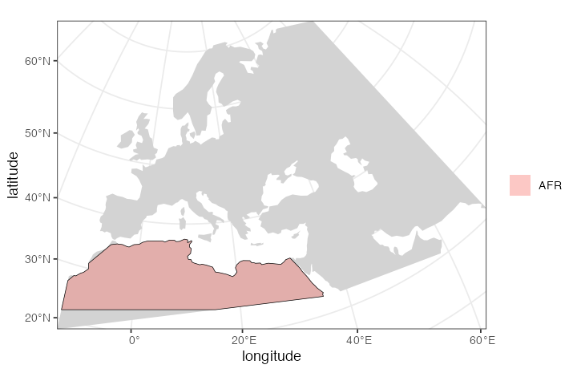
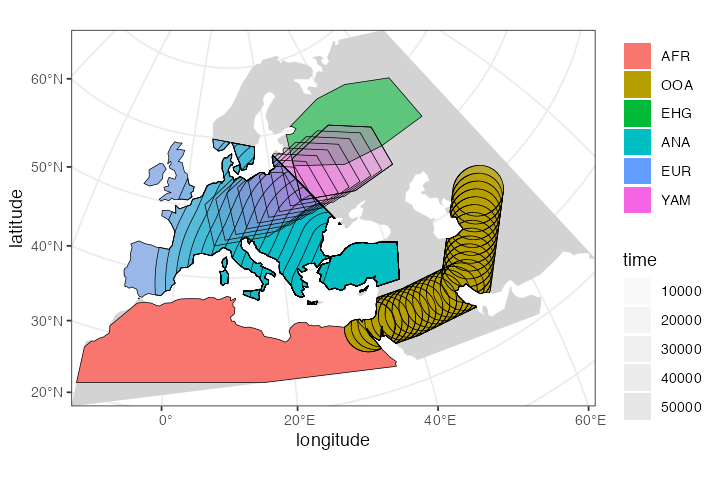
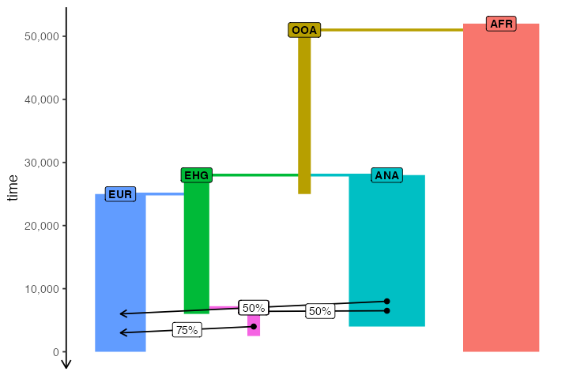

# Introduction and basic tutorial

## Motivation

Our motivation for starting this project was to create a programmable
simulation framework which would add an explicit spatial dimension to
population genetics models. Specifically, the original idea was to be
able to take models such as the one here—



representing a very simplified view of the history of anatomically
modern humans (AMH) in West Eurasia over the last ~50 thousand years (a
comprehensive overview can be found in a review by
[Lazaridis](https://arxiv.org/abs/1805.01579))—and design a tool which
makes it possible to simulate such models in an explicit geographical
context to capture processes similar to those in the following figure
(taken from a study by [Haak et
al. 2015](https://www.nature.com/articles/nature14317)):



The reason for doing this is probably clear. A lot of what we do in
studying the history of humans and other species is focused on
reconstructing population movements, expansions and gene flow events,
all of which happen in a geographic context. In fact, this geographic
component is often what we are most interested in (i.e., “Where did the
ancestors of some population come from?”, “By which route and how fast
did they migrate?”, etc.). However, this goes beyond just simulating
demographic history. For instance, selection pressure driving adaptation
can often be spatially heterogeneous: members of a population occupying
one part of the continent could be exposed to a different environmental
pressure than individuals elsewhere, and allele frequency distributions
shaped by the adaptation process would reflect this spatial
heterogeneity accordingly. Having a framework that enables the
simulation of explicitly spatial genomic data in such situations would
allow us to build more realistic models and test more specific
hypotheses, goals that are simply not possible using non-spatial
simulation methods.

The R package *slendr* introduced in this vignette presents such a
framework. Internally, the package has two independent but tightly
interconnected units:

1.  An **R interface** which provides a set of functional primitives (a
    “mini-language” of sorts) for encoding various features of
    spatio-temporal models: population migrations, expansions and gene
    flow, all happening on a real geographic landscape defined by freely
    available cartographic data. Populations are represented as simple R
    objects with easily visualized spatial boundaries, making it
    possible to build very complex models interactively from a set of
    small and simple building blocks.

2.  A **SLiM simulation back end** represented by a built-in generic
    SLiM script designed to read all the spatio-temporal model
    configuration parameters and objects established in step 1. above,
    and tailor the simulation run to the user-defined model.
    Alternatively, *slendr* also supports executing standard population
    genetics models in a random-mating setting. This means that models
    do not need an explicit geographic map and can be simulated either
    with the same built-in SLiM back end script, or with a more
    efficient [*msprime* back
    end](https://slendr.net/articles/vignette-07-backends.html) which is
    also provided with the package.

The most important design objective was to make the integration of
parts 1. and 2. appear completely seamless. Even for extremely complex
models, the model building and execution (i.e., simulation) can be
performed without leaving the convenience of an R interface such as
RStudio. All the simulation complexities happen automatically under the
hood and knowledge of SLiM is not required. In fact, the motto of the
*slendr* package is “Write complex spatiotemporal population genetics
models as a simple R script.”

## Geospatial data

Geospatial analysis is a deep and complex topic, with dozens of
libraries and programs designed to deal with the fact that the Earth is
a three-dimensional object but we are forced to plot geographical
objects (and, in our case, simulate data) on a two-dimensional plane.

Luckily, most of the technical issues with [Coordinate Reference
Systems](https://en.wikipedia.org/wiki/Spatial_reference_system),
transformations between them and manipulation of geometric objects
(shifting of population boundaries, expansions, etc.) are pretty much
solved now. Unfortunately, dealing with these issues in practice is
quite challenging and requires a non-trivial degree of domain expertise.
Programming even a very simple task in geospatial data analysis also
often requires a lot of code.

This R package is designed to provide a collection of primitives (a
[“mini-language”](https://en.wikipedia.org/wiki/Domain-specific_language)
of sorts) for programming population dynamics (splits, movement, gene
flow, and expansion of spatial boundaries) across space and time
*without having to explicitly deal with any of the challenges inherent
to geospatial analyses*.

## Installation and setup

The *slendr* R package is available on CRAN and can be installed simply
by running `install.packages("slendr")`. If you need to run the latest
development version (for instance, if you need the latest bugfixes), you
can get it via R package *devtools* by executing
`devtools::install_github("bodkan/slendr")` in your R terminal. You can
find more detailed installation instructions in [this
vignette](https://slendr.net/articles/vignette-00-installation.md).

Once you get *slendr* installed, you just need to load it:

``` r

library(slendr)

# activate the internal Python environment needed for simulation and
# tree-sequence processing
init_env()
```

    #> The interface to all required Python modules has been activated.

If some of its dependencies (such as SLiM or necessary Python modules)
are missing, you will get an informative message on how to proceed.

## Defining the overall world map

Before we do anything else, we need to define a section of the map of
the world which will provide context for all downstream spatio-temporal
manipulation of population ranges.

In principle, any source of geospatial data which can be manipulated
using the [simple features (sf)](https://r-spatial.github.io/sf/)
infrastructure could be used. For now the *slendr* package implicitly
uses the [Natural Earth](https://www.naturalearthdata.com/) project data
(in its vectorized form!), which it internally loads using the
[rnaturalearth](https://CRAN.R-project.org/package=rnaturalearth)
interface.

The first *slendr* function we will look at is `map()`. This function
will load the map of the entire world in a vectorized format and zoom in
to a specified section of the world.

Note that in the call below, we specify the coordinates of the zoom in a
geographical Coordinate Reference System (CRS), longitude/latitude, but
we also specified that we want to perform all the downstream
manipulation of the spatial population maps in a projected CRS ([Lambert
Azimuthal Equal-Area projection](https://epsg.io/3035)) which is more
appropriate for representing the wider European continent used in this
tutorial. Of course, different CRS projections could be used based on
which part of the world we want to simulate. Describing the intricacies
of coordinate reference systems is beyond the scope of this tutorial,
but if you’re interested in learning more I encourage you to read
[this](https://r.geocompx.org/) freely available textbook dedicated to
this topic.

This is the approach of *slendr*: let the user specify everything in an
easy-to-understand longitude/latitude geographical CRS (which can be
read from any map, making it very easy to define spatial boundaries and
trajectories of movement), but the internal data structures and the
final exported spatial maps are internally handled in a projected CRS,
which is important to make sure that distances and proportions are not
distorted.

``` r

map <- world(
  xrange = c(-13, 70), # min-max longitude
  yrange = c(18, 65),  # min-max latitude
  crs = "EPSG:3035"    # coordinate reference system (CRS) for West Eurasia
)
```

Internally, the `map` object is currently a normal `sf` class object
without additional components. This is unlike other `slendr` objects
described below, which are also `sf` objects but which carry additional
internal components.

Note that the summary of the object says “projected CRS: ETRS89-extended
/ LAEA Europe”. This means that the world map has indeed been
transformed into the projected CRS we specified above.

``` r

map
```

    #> slendr 'map' object 
    #> ------------------- 
    #> map: internal coordinate reference system EPSG 3035 
    #> spatial limits (in degrees longitude and latitude):
    #>   - vertical -13 ... 70
    #>   - horizontal 18 ... 65

## Plotting geographic features and population ranges

The *slendr* package implements its own plotting function called
[`plot_map()`](https://slendr.net/reference/plot_map.md).

We do this in order to make it easier and more convenient to iteratively
build more complex models. The function can intelligently decide (based
on given input arguments) the right way to present the data to the user,
which helps to define models more quickly without relying on the
lower-level mechanisms of the `sf` package. You will see some examples
of [`plot_map()`](https://slendr.net/reference/plot_map.md) in action
below.

## Defining smaller geographic regions

In addition to the overall spatial map context, we can also define
smaller geographic boundaries. This is mostly useful whenever we want to
restrict a population’s movement (such as spatial population expansion)
to a smaller region of the map that has some intuitive geographic
meaning (i.e., Anatolia, West Eurasia, etc.).

``` r

africa <- region(
  "Africa", map,
  polygon = list(c(-18, 20), c(38, 20), c(30, 33),
                 c(20, 33), c(10, 38), c(-6, 35))
)
europe <- region(
  "Europe", map,
  polygon = list(
    c(-8, 35), c(-5, 36), c(10, 38), c(20, 35), c(25, 35),
    c(33, 45), c(20, 58), c(-5, 60), c(-15, 50)
  )
)
anatolia <- region(
  "Anatolia", map,
  polygon = list(c(28, 35), c(40, 35), c(42, 40),
                 c(30, 43), c(27, 40), c(25, 38))
)
```

Note that the objects created above are *not* population boundaries (not
yet anyway)! These are simply labels for some generic geographic
boundaries that can be used later. They are not attached to any
population at this point.

Again, the object returned by the
[`region()`](https://slendr.net/reference/region.md) function is
actually an `sf` object, but carries some additional annotation such as
the name of the region (here “Anatolia”):

``` r

anatolia
```

    #> slendr 'region' object 
    #> ---------------------- 
    #> name: Anatolia 
    #> 
    #> map: internal coordinate reference system EPSG 3035

However, the object also carries additional class annotations for the
purpose of internal *slendr* machinery:

``` r

class(anatolia)
```

    #> [1] "slendr"        "slendr_region" "sf"            "data.frame"

Furthermore, note that in all
[`region()`](https://slendr.net/reference/region.md) calls we specified
the `map` object that we defined at the very beginning. This object is
added as a hidden attribute to each `slendr` object and represents the
context for all geospatial transformations, expansions, and plots.

We can use the generic
[`plot_map()`](https://slendr.net/reference/plot_map.md) function to
plot these geographic regions in the context of the defined section of
the world map:

``` r

plot_map(africa, europe, anatolia, title = "Geographic regions")
```



Note that the `map` object is no longer explicitly specified. It is not
needed, because each other class of objects provided to the
[`plot_map()`](https://slendr.net/reference/plot_map.md) function must
carry it as a “map” attribute. In fact, each such object must carry the
same map context — *slendr* complains whenever this is not the case.

We can check that the component is really there, although hidden, using
the built-in `attr` function and verify that it is the same as the map
object we created at the beginning:

``` r

all(attr(europe, "map") == map)
```

    #> [1] TRUE

``` r

all(attr(anatolia, "map") == map)
```

    #> [1] TRUE

## Defining spatial population boundaries

One of the aims of the *slendr* package is to formalize the
specification of spatial population boundaries and their changes over
time. The core function for this is
[`population()`](https://slendr.net/reference/population.md), which
takes a population `name`, the `time` at which we want to enforce that
population’s boundary, the effective population size of the population
at that time, and the `map` object described above. We also have to
specify which existing population the specified population split from
(or explicitly say that it’s an ancestral population). As for specifying
the actual spatial boundaries, we have several options.

### Polygon population ranges

We can define detailed population boundaries using a polygon geometry
object or a region object created by the
[`region()`](https://slendr.net/reference/region.md) function above,
using a `polygon =` argument to
[`population()`](https://slendr.net/reference/population.md). Again, as
a reminder, note that all coordinates are described in the context of
the geographic CRS.

First, let’s create the African ancestors of modern humans. We restrict
the spatial boundary of the African population to the `africa` region
defined above:

``` r

afr <- population("AFR", time = 52000, N = 3000, map = map, polygon = africa)

plot_map(afr)
```



### Circular population ranges

If we want to simulate a more abstract and simple population boundary,
we can specify a circular range with `center` and `radius` arguments
instead of a polygon. All distance units in the *slendr* package are
specified in the coordinate system given during “world creation”. For
instance, EPSG 3035 (which we’re using here) specifies distances in
meters.

Here we define the location of the population of non-Africans right
after their split from their African ancestors:

``` r

ooa <- population(
  "OOA", parent = afr, time = 51000, N = 500, remove = 25000,
  center = c(33, 30), radius = 400e3
)
```

If we call the [`plot_map()`](https://slendr.net/reference/plot_map.md)
function on the returned object, we have the option to either plot the
population range in its “raw” form or in its “intersected” form, in
which case the raw boundary is intersected with the “background”
landscape (removing large bodies of water, etc.).

The intersected form is what is ultimately exported in a serialized
format (see below) to be loaded as a spatial map into SLiM. This is why
the [`plot_map()`](https://slendr.net/reference/plot_map.md) function
renders intersected population ranges by default.

``` r

plot_map(ooa, intersect = TRUE, title = "'Intersected' population range")
```


## Population movement across a landscape

To describe a directional population movement, we can use the function
[`move()`](https://slendr.net/reference/move.md). This accepts the
coordinates of the destination points along the way (`trajectory`) and
the `duration` of the migration, and automatically generates a number of
intermediate spatial maps along the trajectory of movement to produce a
reasonable degree of spatial continuity (this number can be also
specified manually).

``` r

ooa <- ooa %>% move(
  trajectory = list(c(40, 30), c(50, 30), c(60, 40)),
  start = 50000, end = 40000
)
```

We can inspect the object returned by the
[`move()`](https://slendr.net/reference/move.md) function and see that
it now contains not just the first YAM population range at 7000 years
ago, but also the ranges of the intermediate locations:

``` r

ooa
```

    #> slendr 'population' object 
    #> -------------------------- 
    #> name: OOA 
    #> habitat: terrestrial
    #> 
    #> number of spatial maps: 28 
    #> map: internal coordinate reference system EPSG 3035 
    #> scheduled removal at time  25000 
    #> 
    #> population history overview:
    #>   - time 51000: split from AFR (N = 500)
    #>   - time 50000-40000: movement across a landscape

Checking the result visually again, we see:

``` r

plot_map(ooa, title = "Intermediate migration maps")
```


Let’s create a population of Eastern Hunter Gatherers (EHG), which split
from the first non-Africans 28000 years ago:

``` r

ehg <- population(
  "EHG", parent = ooa, time = 28000, N = 1000, remove = 6000,
  polygon = list(
    c(26, 55), c(38, 53), c(48, 53), c(60, 53),
    c(60, 60), c(48, 63), c(38, 63), c(26, 60))
)
```

While we’re at it, let’s also create a population of Western Hunter
Gatherers (WHG). Because the people living in this region eventually
became present day Europeans after receiving gene flow from other groups
over time (see below), we will call them “EUR” to simplify the modeling
code a little bit:

``` r

eur <- population( # European population
  name = "EUR", parent = ehg, time = 25000, N = 2000,
  polygon = europe
)
```

## Spatial population expansion

We can simulate the expanding range of a population using the function
[`expand_range()`](https://slendr.net/reference/expand_range.md), which
accepts parameters specifying how many kilometers the boundary should
expand by (the `by` argument), how long should the expansion should take
(the `duration` argument) and how many intermediate spatial map
snapshots should be exported representing the expansion (the `snapshots`
argument).

For instance, let’s represent the expansion of Anatolian farmers, who
also split from the OOA population at 28000 years ago at the time of the
split of the EHG population. Note that we use an optional parameter,
`polygon`, which restricts the expansion only to Europe, instead of all
around Anatolia:

``` r

ana <- population( # Anatolian farmers
  name = "ANA", time = 28000, N = 3000, parent = ooa, remove = 4000,
  center = c(34, 38), radius = 500e3, polygon = anatolia
) %>%
  expand_range( # expand the range by 2.500 km
    by = 2500e3, start = 10000, end = 7000,
    polygon = join(europe, anatolia)
  )
```

Note that, in principle, you could specify the entire spatio-temporal
history of a population in a single pipeline using the pipe operator
`%>%`.

Again, we can inspect the object returned by the
[`expand_range()`](https://slendr.net/reference/expand_range.md)
function and see that it contains the spatial maps (“snapshots”) of the
expansion process across time:

``` r

ana
```

    #> slendr 'population' object 
    #> -------------------------- 
    #> name: ANA 
    #> habitat: terrestrial
    #> 
    #> number of spatial maps: 16 
    #> map: internal coordinate reference system EPSG 3035 
    #> scheduled removal at time  4000 
    #> 
    #> population history overview:
    #>   - time 28000: split from OOA (N = 3000)
    #>   - time 10000-7000: range expansion

We can (and should) check the results visually:

``` r

plot_map(ana, title = "Anatolian expansion into Europe")
```


To visually see what is really going on behind the scenes, you can also
plot the raw, non-intersected form of the expansion with:

``` r

plot_map(ana, title = "Anatolian expansion into Europe (not intersected)", intersect = FALSE)
```

We can see that the population of Anatolian farmers at some point
invades the spatial boundary of the EUR population. On its own, this
doesn’t imply gene flow. In the section on gene flow below, we will see
how *slendr* implements gene flow between overlapping (or
non-overlapping) populations.

Let’s add a couple more populations and migrations before we move on to
implementing gene flow between them.

Yamnaya steppe herders:

``` r

yam <- population( # Yamnaya steppe population
  name = "YAM", time = 7000, N = 500, parent = ehg, remove = 2500,
  polygon = list(c(26, 50), c(38, 49), c(48, 50),
                 c(48, 56), c(38, 59), c(26, 56))
) %>%
  move(
    trajectory = c(15, 50),
    start = 5000, end = 3000, snapshots = 8
  )

plot_map(yam)
```


## Plotting multiple *slendr* objects

In addition to plotting individual population ranges, the generic
function [`plot_map()`](https://slendr.net/reference/plot_map.md) can
handle a combination of population ranges, and can also partition them
into individual facets. This is useful for visual inspection of the
specified model, and for looking for potential issues before the export
of individual spatio-temporal maps. Obviously, this is a lot of
multi-dimensional information:

``` r

plot_map(afr, ooa, ehg, eur, ana, yam)
```



Below you will see a better way to explore a *slendr* model
interactively.

## Defining gene flow events

The way *slendr* implements gene flow events is by calling the
[`gene_flow()`](https://slendr.net/reference/gene_flow.md) function.
This function has a very straightforward interface, shown below.

One thing to note is that by default, the `from` and `to` populations
for gene flow events must have overlapping spatial ranges in order to
simulate gene flow. This is probably rather obvious, as populations
can’t mix in space-time if they don’t overlap at a given point in
space-time.

For example, if you look at the spatial boundaries plotted above, you’ll
see that the European and African populations don’t have any overlap in
population ranges. If we try to instruct *slendr* to simulate geneflow
between them, we will get an error:

``` r

gf <- gene_flow(from = eur, to = afr, rate = 0.1, start = 20000, end = 15000)
```

    Error: No overlap between population ranges of EUR and AFR at time 20000.

      Please check the spatial maps of both populations by running
      `plot_map(eur, afr)` and adjust them accordingly. Alternatively, in case
      this makes sense for your model, you can add `overlap = F` which
      will instruct slendr to simulate gene flow without spatial overlap
      between populations.

The error message instructs us to visually verify that this is the case,
which can be done by *slendr*’s
[`plot_map()`](https://slendr.net/reference/plot_map.md) function and
the optional parameter `pop_facets = F` (which is set to `TRUE` by
default).

Many models will include multiple gene flow events, which we can collect
in a simple R list:

``` r

gf <- list(
  gene_flow(from = ana, to = yam, rate = 0.5, start = 6500, end = 6400, overlap = FALSE),
  gene_flow(from = ana, to = eur, rate = 0.5, start = 8000, end = 6000),
  gene_flow(from = yam, to = eur, rate = 0.75, start = 4000, end = 3000)
)
```

The [`gene_flow()`](https://slendr.net/reference/gene_flow.md) function
simply returns a data frame collecting all the geneflow parameters for
the [`compile_model()`](https://slendr.net/reference/compile_model.md)
step below:

``` r

gf
```

    #> [[1]]
    #>   from_name to_name tstart tend rate overlap
    #> 1       ANA     YAM   6500 6400  0.5   FALSE
    #> 
    #> [[2]]
    #>   from_name to_name tstart tend rate overlap
    #> 1       ANA     EUR   8000 6000  0.5    TRUE
    #> 
    #> [[3]]
    #>   from_name to_name tstart tend rate overlap
    #> 1       YAM     EUR   4000 3000 0.75    TRUE

## Compile the whole model and load it in SLiM

The most crucial function of *slendr* is
[`compile_model()`](https://slendr.net/reference/compile_model.md). It
takes all population ranges defined across space and time, together with
a list of gene flow events (optional, since some models won’t include
gene flow), and then proceeds by converting all vectorized spatial
ranges into raster bitmaps. Furthermore, it compiles all information
about split times, $`N_e`$ values, gene flow directions, times, and
rates into a series of tables. All of that will be saved automatically
in a dedicated directory in a format that is understood by the back end
SLiM script provided by *slendr* (more on that below).

``` r

model_dir <- paste0(tempfile(), "_tutorial-model")

model <- compile_model(
  populations = list(afr, ooa, ehg, eur, ana, yam), # populations defined above
  gene_flow = gf, # gene-flow events defined above
  generation_time = 30,
  resolution = 10e3, # resolution in meters per pixel
  competition = 130e3, mating = 100e3, # spatial interaction in SLiM
  dispersal = 70e3, # how far will offspring end up from their parents
  path = model_dir
)
```

What do the files in the model directory look like? Ideally, you as a
user should never worry about that; in fact, the whole purpose of
*slendr* is to let you work at a much higher level of abstraction
without worrying about such low-level details. That said, you might find
it useful to see what things look like behind the curtain…

First of all, we can inspect the contents of the directory and see that
it does, indeed, contain all defined spatial maps (now PNG files, which
is what SLiM requires).

``` r

list.files(model_dir, pattern = "*.png")
```

    #>  [1] "1.png"  "10.png" "11.png" "12.png" "13.png" "14.png" "15.png" "16.png"
    #>  [9] "17.png" "18.png" "19.png" "2.png"  "20.png" "21.png" "22.png" "23.png"
    #> [17] "24.png" "25.png" "26.png" "27.png" "28.png" "29.png" "3.png"  "30.png"
    #> [25] "31.png" "32.png" "33.png" "34.png" "35.png" "36.png" "37.png" "38.png"
    #> [33] "39.png" "4.png"  "40.png" "41.png" "42.png" "43.png" "44.png" "45.png"
    #> [41] "46.png" "47.png" "48.png" "49.png" "5.png"  "50.png" "51.png" "52.png"
    #> [49] "53.png" "54.png" "55.png" "56.png" "57.png" "6.png"  "7.png"  "8.png" 
    #> [57] "9.png"

It also contains a series of tab-delimited configuration tables. These
tables contain summaries of the model parameters that we defined
graphically above, namely:

- the table of population splits:

``` r

read.table(file.path(model_dir, "populations.tsv"), header = TRUE)
```

    #>   pop            parent    N tsplit_gen tsplit_orig tremove_gen tremove_orig
    #> 1 AFR __pop_is_ancestor 3000          1       52000          -1           -1
    #> 2 OOA               AFR  500         34       51000         901        25000
    #> 3 EHG               OOA 1000        801       28000        1534         6000
    #> 4 ANA               OOA 3000        801       28000        1601         4000
    #> 5 EUR               EHG 2000        901       25000          -1           -1
    #> 6 YAM               EHG  500       1501        7000        1651         2500
    #>   pop_id parent_id
    #> 1      0        -1
    #> 2      1         0
    #> 3      2         1
    #> 4      3         1
    #> 5      4         2
    #> 6      5         2

- the table of geneflow events:

``` r

read.table(file.path(model_dir, "geneflow.tsv"), header = TRUE)
```

    #>   from  to rate overlap tstart_gen tstart_orig tend_gen tend_orig from_id to_id
    #> 1  ANA YAM 0.50       0       1518        6500     1521      6400       3     5
    #> 2  ANA EUR 0.50       1       1468        8000     1534      6000       3     4
    #> 3  YAM EUR 0.75       1       1601        4000     1634      3000       5     4

- and finally, the table of populations whose spatial maps will be
  updated throughout the simulation, as well as the times of those
  updates (this table is rather large, so we’re not showing it here).

The object returned by the
[`compile_model()`](https://slendr.net/reference/compile_model.md)
function (called `model` here) binds all of this information together.
In fact, for easier debugging and sanity checking, it carries the
locations of these tables (as well as other important information)
inside itself, as elements of a list: `model$splits`, `model$geneflows`,
etc.

In case you’d want to separate model specification and running into
different scripts, *slendr* includes a function
[`read_model()`](https://slendr.net/reference/read_model.md) just for
this purpose:

``` r

loaded_model <- read_model(model_dir)
```

## Visualize the entire history of splits and gene flow

With the code snippets above, we have defined a simple history of
European populations over the last 50000 years. This history includes
population splits and gene flow events, as well as other demographic
changes. While *slendr* tries to make the formal specification of
spatio-temporal population dynamics as concise as possible, it is hard
to really visualize everything that will happen on the SLiM side after
the simulation starts just from the code alone.

For this purpose, the package includes a function named
[`plot_model()`](https://slendr.net/reference/plot_model.md) which takes
in all the information about the relationships between populations
(i.e., the population and gene flow objects we defined above) and plots
it all in the form of a so-called *admixture graph* (see
[here](https://doi.org/10.1534/genetics.112.145037) for a discussion of
the admixture graph concept).

One important thing to note here is that unlike traditional admixture
graphs where each node/population is present only once, in the full
*slendr* graph a single population can participate in many gene flow
events over the course of its history. This is visualized by assigning a
color to each population, and different nodes of the same color
represent snapshots in time when a demographic event affecting that
population happens.

``` r

plot_model(model, proportions = TRUE)
```



## Interactive exploration of spatio-temporal models

A slightly fancier way to visualize models is implemented in the
function
[`explore_model()`](https://slendr.net/reference/explore_model.md). This
function accepts a compiled model as its only parameter and spawns an [R
shiny](https://shiny.posit.co/)-based browser app which makes it
possible to click through the time snapshots interactively and visualize
the spatial maps in each time point.

``` r

explore_model(model)
```


Graph of demographic history (sometimes called “admixture graph”)


Interactive explorer of the spatial dynamics

## Running the simulation

The way we feed the entire serialized model into SLiM is through the
[`slim()`](https://slendr.net/reference/slim.md) function, which
understands the format of the model directory created by the
[`compile_model()`](https://slendr.net/reference/compile_model.md)
function and generates a SLiM script (using a back end skeleton script
which is a part of this package and can be found by calling
`system.file("scripts/script.slim", package = "slendr")`, in case you’d
like to peek into its internals).

The output of a *slendr* simulation is a tree-sequence file (here
produced by the SLiM simulation behind the scenes). This tree sequence
is then automatically loaded into R and returned to the user:

``` r

ts <- slim(model, sequence_length = 100000, recombination_rate = 1e-8)
ts
```

    #> ╔═══════════════════════╗
    #> ║TreeSequence           ║
    #> ╠═══════════════╤═══════╣
    #> ║Trees          │    116║
    #> ╟───────────────┼───────╢
    #> ║Sequence Length│100,000║
    #> ╟───────────────┼───────╢
    #> ║Time Units     │  ticks║
    #> ╟───────────────┼───────╢
    #> ║Sample Nodes   │ 10,000║
    #> ╟───────────────┼───────╢
    #> ║Total Size     │2.7 MiB║
    #> ╚═══════════════╧═══════╝
    #> ╔═══════════╤══════╤═════════╤════════════╗
    #> ║Table      │Rows  │Size     │Has Metadata║
    #> ╠═══════════╪══════╪═════════╪════════════╣
    #> ║Edges      │18,665│583.3 KiB│          No║
    #> ╟───────────┼──────┼─────────┼────────────╢
    #> ║Individuals│12,810│  1.2 MiB│         Yes║
    #> ╟───────────┼──────┼─────────┼────────────╢
    #> ║Migrations │     0│  8 Bytes│          No║
    #> ╟───────────┼──────┼─────────┼────────────╢
    #> ║Mutations  │     0│  1.2 KiB│          No║
    #> ╟───────────┼──────┼─────────┼────────────╢
    #> ║Nodes      │18,345│664.5 KiB│         Yes║
    #> ╟───────────┼──────┼─────────┼────────────╢
    #> ║Populations│     6│  2.6 KiB│         Yes║
    #> ╟───────────┼──────┼─────────┼────────────╢
    #> ║Provenances│     1│ 43.6 KiB│          No║
    #> ╟───────────┼──────┼─────────┼────────────╢
    #> ║Sites      │     0│ 16 Bytes│          No║
    #> ╚═══════════╧══════╧═════════╧════════════╝

There is lots more that *slendr* allows you to do, both in terms of the
simulation itself, but also in terms of analyzing tree-sequence data.
The list below provides a list of additional resources you might want to
look at.

## More information

This vignette described only the most basic features of the *slendr*
package but it is already quite long. There is much more to *slendr*
than what we demonstrated here. For instance:

- You can tweak parameters influencing dispersal dynamics (how “clumpy”
  populations are, how far offspring can migrate from their parents,
  etc.) and change how those dynamics evolve over time. See [this
  vignette](https://slendr.net/articles/vignette-03-interactions.html)
  for more information.

- You can use *slendr* to program non-spatial models, which means that
  any standard, Wright-Fisher demographic model can be simulated with
  only a few lines of R code and, for instance, plugged into an
  [Approximate Bayesian
  Computation](https://en.wikipedia.org/wiki/Approximate_Bayesian_computation)
  pipeline or other analyses leveraging readily available R packages.
  You can find more in [this
  vignette](https://slendr.net/articles/vignette-04-nonspatial-models.html)
  and a much more detailed example in a vignette about [SLiM and
  *msprime* back
  ends](https://slendr.net/articles/vignette-07-backends.html).

- You can build complex spatial models which are still abstract (not
  assuming any real geographic location), including traditional
  simulations of demes in a lattice structure. A complete example is
  shown [in this
  vignette](https://slendr.net/articles/vignette-02-grid-model.html).

- Because SLiM saves data in the `.trees` tree-sequence file format,
  thanks to the R package
  [*reticulate*](https://rstudio.github.io/reticulate/index.html) for
  interfacing with Python code you have the incredible power of
  [*tskit*](https://tskit.dev/) and
  [*pyslim*](https://tskit.dev/pyslim/docs/latest/introduction.html) to
  process simulated data at a massive scale right at your fingertips,
  all within the convenient environment of R. See a much more detailed
  example in a vignette about [this
  vignette](https://slendr.net/articles/vignette-07-backends.html) for
  an extensive tutorial of this feature.
