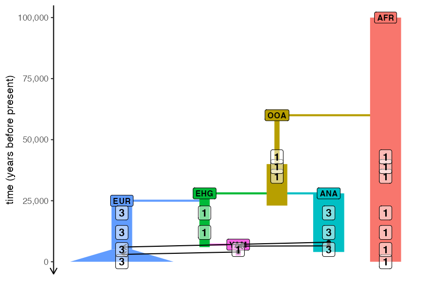

# Traditional, non-spatial models

The biggest selling point of the *slendr* package is that you can
program spatiotemporal population genetics models in R and have them
execute automatically in SLiM. However, there are several reasons why
you might be interested in using *slendr* even for non-spatial models.
First, R is a language that many scientists already know, and being able
to simulate data from the comfort of an R interface significantly lowers
the barrier of entry. Second, because *slendr* makes SLiM appear almost
as if it were just another R library, running simulations (spatial *and*
non-spatial), fitting models, exploring parameter grids, calculating
statistics, and visualization of results can be all be performed without
leaving the R interface.

In this vignette, we will demonstrate how to program non-spatial models
in *slendr*. However, we should start by noting that there is almost no
difference between code for non-spatial and spatial models in *slendr*.
The only visible difference is that spatial models include a `map =`
argument in the
[`population()`](https://bodkan.net/slendr/reference/population.md) constructor
function of ancestral population(s), and non-spatial models do not.
That’s it, that’s the difference. Switching between spatial and
non-spatial models is performed internally by the package, without any
user intervention.

To make the comparison clearer, we will use the example from the
*slendr* [landing page](https://github.com/bodkan/slendr), but we will
implement it in a non-spatial context (i.e., as a traditional random
mating simulation).

First, let’s define population objects, splits, and other demographic
events (note the missing `map` argument, which is set to `FALSE` by
default):

``` r

library(slendr)

init_env()
```

    #> The interface to all required Python modules has been activated.

``` r

# African ancestral population
afr <- population("AFR", time = 100000, N = 3000)

# first migrants out of Africa
ooa <- population("OOA", parent = afr, time = 60000, N = 500, remove = 23000) %>%
  resize(N = 2000, time = 40000, how = "step")

# Eastern hunter-gatherers
ehg <- population("EHG", parent = ooa, time = 28000, N = 1000, remove = 6000)

# European population
eur <- population("EUR", parent = ehg, time = 25000, N = 2000) %>%
  resize(N = 10000, how = "exponential", time = 5000, end = 0)

# Anatolian farmers
ana <- population("ANA", time = 28000, N = 3000, parent = ooa, remove = 4000)

# Yamnaya steppe population
yam <- population("YAM", time = 7000, N = 500, parent = ehg, remove = 2500)
```

We can define gene flow events in the same way as we did for the spatial
model:

``` r

gf <- list(
  gene_flow(from = ana, to = yam, rate = 0.5, start = 6500, end = 6400),
  gene_flow(from = ana, to = eur, rate = 0.5, start = 8000, end = 6000),
  gene_flow(from = yam, to = eur, rate = 0.75, start = 4000, end = 3000)
)
```

The compilation step is also the same. The only (internal) difference is
that we skip the rasterization of vector maps that is performed for
spatial models in order to control and restrict population boundaries:

``` r

model <- compile_model(
  populations = list(afr, ooa, ehg, eur, ana, yam),
  gene_flow = gf, generation_time = 30,
  time_units = "years before present"
)
```

Using the [`plot_map()`](https://bodkan.net/slendr/reference/plot_map.md)
function doesn’t make sense, as there are no spatial maps to plot.
However, we can still plot the demographic graph, verifying that the
model has been specified correctly using the function
[`plot_model()`](https://bodkan.net/slendr/reference/plot_model.md) as shown
below.

Let’s say we also want to schedule specific sampling events at specific
times (which record only specified individuals in a tree sequence). We
can use
[`schedule_sampling()`](https://bodkan.net/slendr/reference/schedule_sampling.md)
to do just that:

``` r

samples <- schedule_sampling(
  model,
  times = c(0, 5000, 12000, 20000, 35000, 39000, 43000),
  list(eur, 3), list(ehg, 1), list(yam, 1), list(ana, 3), list(ooa, 1), list(afr, 1)
)
```

Because it’s not just the model itself that’s useful to visually verify
(which is the main purpose of
[`plot_model()`](https://bodkan.net/slendr/reference/plot_model.md)) but also
the sampling scheme, *slendr* makes it possible to overlay the numbers
of individuals scheduled for tree-sequence recording from each lineage
at each timepoint:

``` r

plot_model(model, samples = samples)
```



Even the final step—execution of the model in SLiM—is the same, using
the built-in [`slim()`](https://bodkan.net/slendr/reference/slim.md) function:

``` r

ts_slim <- slim(model, sequence_length = 100000, recombination_rate = 0)
```

Even for non-spatial models, this function still uses the same SLiM back
end script used for spatial models. The only difference is that all
spatial features are switched off, making the model run as a simple
random-mating simulation.

Given that we are running a non-spatial simulation, you might wonder if
it wouldn’t be more efficient to use a coalescent simulator. Indeed,
*slendr* also provides an alternative *msprime* back end just for this
purpose. We could run the exact same simulation with *msprime* like
this:

``` r

ts_msprime <- msprime(model, sequence_length = 100000, recombination_rate = 0)
```

In fact, because both SLiM and *msprime* back ends save outputs in a
tree sequence format, we can analyse them using the same tools. See
[this
vignette](https://bodkan.net/slendr/articles/vignette-05-tree-sequences.html)
for more information about tree sequence analysis with *slendr*, and for
more discussion on alternative simulation back ends and more extensive
examples of data analysis with tree sequences you can read [this
tutorial](https://bodkan.net/slendr/articles/vignette-07-backends.html).

## Extracting parameters from a model or tree sequences

In some situations (such as when model parameters are drawn from random
distributions and we need to know which parameters had been used *after*
the simulations), function
[`extract_parameters()`](https://bodkan.net/slendr/reference/extract_parameters.md)
can be used. This function peeks into a *slendr* tree sequence object
and extract parameters of the original *slendr* model:

``` r

extract_parameters(ts_msprime)
```

    #> $splits
    #>   pop parent    N   time remove
    #> 1 AFR   <NA> 3000 100000     NA
    #> 2 OOA    AFR  500  60000  23000
    #> 3 EHG    OOA 1000  28000   6000
    #> 5 ANA    OOA 3000  28000   4000
    #> 4 EUR    EHG 2000  25000     NA
    #> 6 YAM    EHG  500   7000   2500
    #> 
    #> $gene_flows
    #>   from  to start  end rate
    #> 1  ANA YAM  6500 6400 0.50
    #> 2  ANA EUR  8000 6000 0.50
    #> 3  YAM EUR  4000 3000 0.75
    #> 
    #> $resizes
    #>   pop         how     N  time end
    #> 1 OOA        step  2000 40000  NA
    #> 2 EUR exponential 10000  5000   0

For completeness, although this isn’t relevant in this example either,
the function can also get parameters from any compiled model. For
instance, we can check which parameters were used to compile the
built-in *slendr* introgression model by running:

``` r

introgression_model <- read_model(path = system.file("extdata/models/introgression", package = "slendr"))

extract_parameters(introgression_model)
```

    #> $splits
    #>   pop parent    N    time remove
    #> 1  CH   <NA>   10 6500000     NA
    #> 2 AFR     CH   10 6000000     NA
    #> 3 NEA    AFR   10  600000  40000
    #> 4 EUR    AFR 5000   70000     NA
    #> 
    #> $gene_flows
    #>   from  to start   end rate
    #> 1  NEA EUR 55000 45000 0.03

As we can see,
[`extract_parameters()`](https://bodkan.net/slendr/reference/extract_parameters.md)
returns a list of data frames, one data frame for each aspect of a
demographic model (where applicable).

## Named samples

As an addendum, it is worth mentioning that in addition to automatically
naming recorded samples according to the format of
`"<population>_<number>"`, *slendr* supports uniquely named samples. For
instance, imagine that we want to record an ancient individual
representing a 45.000 years old hunter gatherer known as Ust’-Ishim (Fu,
\_et al., Nature, 2014). We could include this sample among our other,
generically named, samples like this:

``` r

schedule_amh <- schedule_sampling(
  model,
  times = c(0, 5000, 12000, 20000, 35000, 39000, 43000),
  list(eur, 3), list(ehg, 1), list(yam, 1), list(ana, 3), list(ooa, 1), list(afr, 1)
)

schedule_ui <- schedule_sampling(model, times = 45000, list(ooa, 1, "Ust_Ishim"))

# bind the two tables together into a single schedule
schedule <- rbind(schedule_amh, schedule_ui)
```

Then we would simulate just like before:

``` r

ts <- msprime(model, sequence_length = 100000, recombination_rate = 0, samples = schedule)
```

When we inspect the table of all recorded individuals, we can see that
the Ust’-Ishim individual is stored under its proper symbolic name:

``` r

ts_samples(ts)
```

    #>         name  time pop
    #> 1  Ust_Ishim 45000 OOA
    #> 2      AFR_1 43000 AFR
    #> 3      OOA_1 43000 OOA
    #> 4      AFR_2 39000 AFR
    #> 5      OOA_2 39000 OOA
    #> 6      AFR_3 35000 AFR
    #> 7      OOA_3 35000 OOA
    #> 8      AFR_4 20000 AFR
    #> 9      ANA_1 20000 ANA
    #> 10     ANA_2 20000 ANA
    #> 11     ANA_3 20000 ANA
    #> 12     EHG_1 20000 EHG
    #> 13     EUR_1 20000 EUR
    #> 14     EUR_2 20000 EUR
    #> 15     EUR_3 20000 EUR
    #> 16     AFR_5 12000 AFR
    #> 17     ANA_4 12000 ANA
    #> 18     ANA_5 12000 ANA
    #> 19     ANA_6 12000 ANA
    #> 20     EHG_2 12000 EHG
    #> 21     EUR_4 12000 EUR
    #> 22     EUR_5 12000 EUR
    #> 23     EUR_6 12000 EUR
    #> 24     AFR_6  5000 AFR
    #> 25     ANA_7  5000 ANA
    #> 26     ANA_8  5000 ANA
    #> 27     ANA_9  5000 ANA
    #> 28     EUR_7  5000 EUR
    #> 29     EUR_8  5000 EUR
    #> 30     EUR_9  5000 EUR
    #> 31     YAM_1  5000 YAM
    #> 32     AFR_7     0 AFR
    #> 33    EUR_10     0 EUR
    #> 34    EUR_11     0 EUR
    #> 35    EUR_12     0 EUR

When we later compute summary statistics on tree sequences, this makes
referring to specific individuals even more convenient:

``` r

ts_f3(ts, A = "AFR_1", B = "EUR_1", C = "Ust_Ishim", mode = "branch")
```

    #> # A tibble: 1 × 4
    #>   A     B     C            f3
    #>   <chr> <chr> <chr>     <dbl>
    #> 1 AFR_1 EUR_1 Ust_Ishim 1210.
