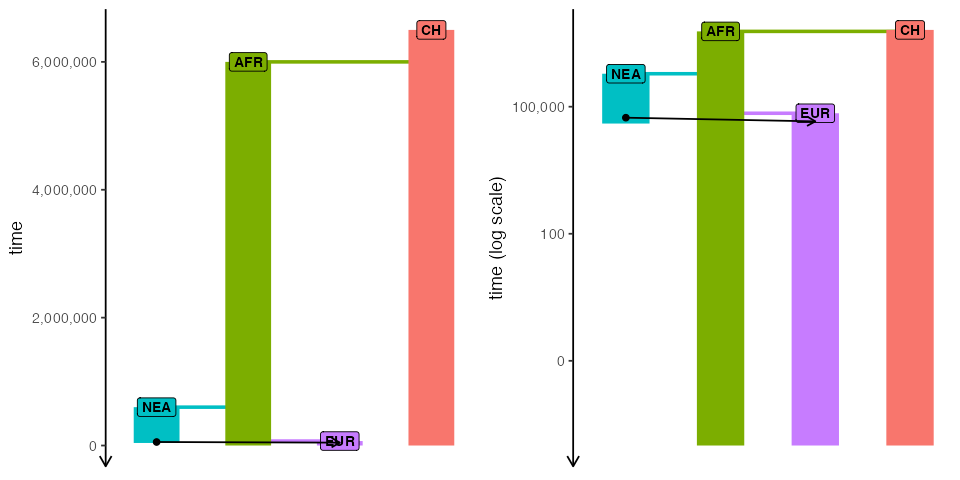
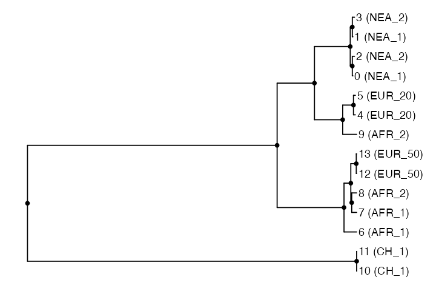
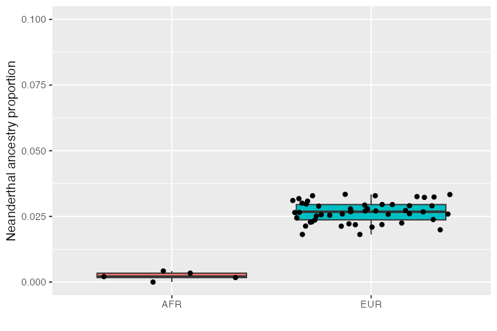

# Tree-sequence processing and statistics

In this vignette, we will show how to specify sampling events to record
individuals in the tree-sequence output file (a procedure which is
called “remembering” of individuals in the SLiM context) and how to
perform simple analyses using *slendr*’s interface to the
[*tskit*](https://tskit.dev) Python library. We will demonstrate these
features on a simulation of Neanderthal introgression into anatomically
modern humans. Specifically, we will show how to estimate the amount of
Neanderthal ancestry using $`f`$-statistics calculated directly on the
tree-sequence data structure generated by a *slendr* model, all entirely
from R.

``` r

library(slendr)
```

## Setting up Python environment

First, in order to be able to interface with *tskit* and *pyslim* using
the *reticulate* package (and run simulations using `msprime`, as we do
below), we will need a working Python environment with the required
Python modules `pyslim`, `tskit` and `msprime` already installed.

Because setting up Python environments can be quite a
[hassle](https://xkcd.com/1987/), *slendr* provides a single function
[`setup_env()`](https://bodkan.net/slendr/reference/setup_env.md) to make
things easier. If you call it without any arguments, *slendr* will
automatically download, install, and setup a **completely separate**
Python environment (based on the “miniconda” distribution) just for
*slendr* and activate it in the background.

It is important to stress that
[`setup_env()`](https://bodkan.net/slendr/reference/setup_env.md) will not
interfere in any way with any of the Python installations you might
already have on your computer. The Python installation and environment
will be entirely isolated and used just for the purpose of *slendr*
workflows.

``` r

setup_env()
```

Once we have the Python environment set up, we can activate it by
calling:

``` r

init_env()
```

    #> The interface to all required Python modules has been activated.

We can use another built-in function
[`check_env()`](https://bodkan.net/slendr/reference/check_env.md) to make sure
that *slendr* installed and configured the correct environment for us:

``` r

check_env()
```

    #> Summary of the currently active Python environment:
    #> 
    #> Python binary: /Users/mp/Library/r-miniconda-arm64/envs/Python-3.13_msprime-1.3.4_tskit-0.6.4_pyslim-1.1.0_tspop-0.0.2/bin/python 
    #> Python version: 3.13.9 | packaged by conda-forge | (main, Oct 22 2025, 23:38:18) [Clang 19.1.7 ] 
    #> 
    #> slendr requirements:
    #>  - tskit: version 0.6.4 ✓ 
    #>  - msprime: version 1.3.4 ✓ 
    #>  - pyslim: version 1.1.0 ✓ 
    #>  - tspop: present ✓

Now we’re good to go and ready to simulate and analyse tree sequence
outputs in R!

### Model of Neanderthal introgression into Eurasians

First, let’s set up a simple *non-spatial* model of Neanderthal
introgression using *slendr.* This is essentially the same procedure
which we have shown in another vignette introducing [non-spatial
*slendr*
models](https://bodkan.net/slendr/articles/vignette-04-nonspatial-models.md).
This is no different from a spatial model, except that we left out the
`map` argument in calling
[`population()`](https://bodkan.net/slendr/reference/population.md).

``` r

library(ggplot2)
library(dplyr)
```

    #> 
    #> Attaching package: 'dplyr'

    #> The following objects are masked from 'package:stats':
    #> 
    #>     filter, lag

    #> The following objects are masked from 'package:base':
    #> 
    #>     intersect, setdiff, setequal, union

``` r

set.seed(314159)

# create the ancestor of everyone and a chimpanzee outgroup
# (we set both N = 1 to reduce the computational time for this model)
chimp <- population("CH", time = 6.5e6, N = 1000)

# two populations of anatomically modern humans: Africans and Europeans
afr <- population("AFR", parent = chimp, time = 6e6, N = 10000)
eur <- population("EUR", parent = afr, time = 70e3, N = 5000)

# Neanderthal population splitting at 600 ky ago from modern humans
# (becomes extinct by 40 ky ago)
nea <- population("NEA", parent = afr, time = 600e3, N = 1000, remove = 40e3)

# 3% Neanderthal introgression into Europeans between 55-50 ky ago
gf <- gene_flow(from = nea, to = eur, rate = 0.03, start = 55000, end = 45000)

model <- compile_model(
  populations = list(chimp, nea, afr, eur), gene_flow = gf,
  generation_time = 30,
  path = paste0(tempfile(), "_introgression")
)
```

Here’s our toy model visualized as a “demographic graph” of sorts (i.e.,
a tree-like structure specifying population splits with additional edges
representing gene flow events). Not particularly illuminating in this
simple example, but it’s always worth keeping in mind that such graph is
embedded within every *slendr* model and can be always invoked to make
sure the model you’re setting up is correct:

``` r

cowplot::plot_grid(
  plot_model(model, sizes = FALSE),
  plot_model(model, sizes = FALSE, log = TRUE),
  nrow = 1
)
```



## Scheduling of sampling events

Now that we have defined a model, how do we sample data from it?
Ideally, we would like to to schedule sampling events at a given time,
sampling a defined number of individuals from a given population. This
is why *slendr* provides a function
[`schedule_sampling()`](https://bodkan.net/slendr/reference/schedule_sampling.md)
which serves to define such sampling schedule automatically and enforces
that only populations which are already (i.e. after their appearance in
the simulation) or still (before they are removed from the simulation)
present will be sampled from.

In our example, we want to sample two Neanderthal individuals (the older
one being the Altai Neanderthal published by Pruefer *et al.* 2014, the
younger one Vindija Neanderthal published by Pruefer *et al.*, 2017).
These two genomes are what we need to estimate Neanderthal ancestry
proportion using a so-called $`f_4`$-ratio statistic (more on that
below, but also see Petr *et al.*, PNAS 2019):

``` r

nea_samples <- schedule_sampling(model, times = c(70000, 40000), list(nea, 1))
nea_samples
```

    #> # A tibble: 2 × 8
    #>    time pop       n name  y_orig x_orig y     x    
    #>   <int> <chr> <int> <lgl> <lgl>  <lgl>  <lgl> <lgl>
    #> 1 40000 NEA       1 NA    NA     NA     NA    NA   
    #> 2 70000 NEA       1 NA    NA     NA     NA    NA

As you can see, the
[`schedule_sampling()`](https://bodkan.net/slendr/reference/schedule_sampling.md)
function simply accepts the vector of times at which remembering should
be schedule, and then a list of pairs
`(<slendr population>, <number of individuals>)` encoding from which
populations should how many individuals be remembered at time points
given in the `times` vector.

Next, we want to sample some present-day individuals: an outgroup
representing a chimpanzee, and a couple of Africans and Europeans:

``` r

present_samples <- schedule_sampling(model, times = 0, list(chimp, 1), list(afr, 5), list(eur, 10))
present_samples
```

    #> # A tibble: 3 × 8
    #>    time pop       n name  y_orig x_orig y     x    
    #>   <int> <chr> <int> <lgl> <lgl>  <lgl>  <lgl> <lgl>
    #> 1     0 CH        1 NA    NA     NA     NA    NA   
    #> 2     0 AFR       5 NA    NA     NA     NA    NA   
    #> 3     0 EUR      10 NA    NA     NA     NA    NA

As you can see above, the
[`schedule_sampling()`](https://bodkan.net/slendr/reference/schedule_sampling.md)
function returns a plain old data frame with a very simple structure
with three columns: time, population name, and the number of
individuals. This means that you can define sampling events using
whatever input data you might already have available (such as
radiocarbon-dated ancient DNA samples from an Excel sheet from some
publication). For instance, there has been a
[lot](https://www.nature.com/articles/nature17993) of interest to
estimate the trajectory of Neanderthal ancestry in Europe over time
using ancient DNA data from anatomically modern human individuals (also
called early modern humans, EMH) across the last couple of tens of
thousands of years. We can simulate something close to the available
[EMH ancient DNA data set](https://www.nature.com/articles/nature17993)
over the last 50 thousand years by running doing this:

``` r

emh_samples <- schedule_sampling(model, times = runif(n = 40, min = 10000, max = 40000), list(eur, 1))
emh_samples
```

    #> # A tibble: 40 × 8
    #>     time pop       n name  y_orig x_orig y     x    
    #>    <int> <chr> <int> <lgl> <lgl>  <lgl>  <lgl> <lgl>
    #>  1 10320 EUR       1 NA    NA     NA     NA    NA   
    #>  2 11188 EUR       1 NA    NA     NA     NA    NA   
    #>  3 11396 EUR       1 NA    NA     NA     NA    NA   
    #>  4 11529 EUR       1 NA    NA     NA     NA    NA   
    #>  5 11927 EUR       1 NA    NA     NA     NA    NA   
    #>  6 12675 EUR       1 NA    NA     NA     NA    NA   
    #>  7 13689 EUR       1 NA    NA     NA     NA    NA   
    #>  8 13744 EUR       1 NA    NA     NA     NA    NA   
    #>  9 14775 EUR       1 NA    NA     NA     NA    NA   
    #> 10 16362 EUR       1 NA    NA     NA     NA    NA   
    #> # ℹ 30 more rows

This samples a single ancient European individuals at randomly chosen
times between 40 and 10 ky ago.

One nice feature of the
[`schedule_sampling()`](https://bodkan.net/slendr/reference/schedule_sampling.md)
function is that it only schedules sampling events for a population, if
that population is present in the simulation at a given time. This makes
it possible to simply take a wide time range for sampling, specify all
populations and sizes of the samples, and let the function generate
sampling events only for populations present at each time. If for some
reason a stricter control over sampling is required, this behavior can
be switched off by setting `strict = TRUE` like this:

``` r

# this attempts to sample a Neanderthal individual at a point when Neanderthals
# are already extinct, resulting in an error
schedule_sampling(model, times = 10000, list(nea, 1), strict = TRUE)
```

    Error: Cannot schedule sampling for 'NEA' at time 10000 because the population will not be present in the simulation at that point. Consider running this function with `strict = FALSE` which will automatically retain only valid sampling events.

Now that we already have the `model` object ready, we can simulate data
from it, sampling individuals according to our sampling schedule.
Although we could use the
[`slim()`](https://bodkan.net/slendr/reference/slim.md) function shown in
previous vignettes, in this case we will run the simulation with the
[`msprime()`](https://bodkan.net/slendr/reference/msprime.md) coalescent back
end. After all, our model is non-spatial and using a coalescent
simulator will be much more efficient than the forward simulation.
Switching between the msprime and SLiM back ends of slendr is
demonstrated in much more detail in a [dedicated
vignette](https://bodkan.net/slendr/articles/vignette-07-backends.html).

The simulation back end utilized by the
[`msprime()`](https://bodkan.net/slendr/reference/msprime.md) function (as well
as the [`slim()`](https://bodkan.net/slendr/reference/slim.md) function)
produces a tree-sequence output which is immediately loaded and ready
for a downstream analysis.

``` r

ts <- msprime(
  model, sequence_length = 100e6, recombination_rate = 1e-8,
  samples = rbind(nea_samples, present_samples, emh_samples),
  random_seed = 314159, verbose = TRUE
)

ts
```

    #> ╔═══════════════════════════╗
    #> ║TreeSequence               ║
    #> ╠═══════════════╤═══════════╣
    #> ║Trees          │    240,041║
    #> ╟───────────────┼───────────╢
    #> ║Sequence Length│      1e+08║
    #> ╟───────────────┼───────────╢
    #> ║Time Units     │generations║
    #> ╟───────────────┼───────────╢
    #> ║Sample Nodes   │        116║
    #> ╟───────────────┼───────────╢
    #> ║Total Size     │   40.0 MiB║
    #> ╚═══════════════╧═══════════╝
    #> ╔═══════════╤═══════╤═════════╤════════════╗
    #> ║Table      │Rows   │Size     │Has Metadata║
    #> ╠═══════════╪═══════╪═════════╪════════════╣
    #> ║Edges      │916,588│ 28.0 MiB│          No║
    #> ╟───────────┼───────┼─────────┼────────────╢
    #> ║Individuals│     58│  1.6 KiB│          No║
    #> ╟───────────┼───────┼─────────┼────────────╢
    #> ║Migrations │      0│  8 Bytes│          No║
    #> ╟───────────┼───────┼─────────┼────────────╢
    #> ║Mutations  │      0│ 16 Bytes│          No║
    #> ╟───────────┼───────┼─────────┼────────────╢
    #> ║Nodes      │189,654│  5.1 MiB│          No║
    #> ╟───────────┼───────┼─────────┼────────────╢
    #> ║Populations│      4│338 Bytes│         Yes║
    #> ╟───────────┼───────┼─────────┼────────────╢
    #> ║Provenances│      1│  7.1 KiB│          No║
    #> ╟───────────┼───────┼─────────┼────────────╢
    #> ║Sites      │      0│ 16 Bytes│          No║
    #> ╚═══════════╧═══════╧═════════╧════════════╝

Note that we bind the individual sampling schedule data frames using the
`rbind` function provided by base R (as we show above, the sampling
schedule really is just a data frame and we can manipulate it as such).

## Named samples

In addition to automatically named symbolic names, *slendr* also
supports fully customized sample names (see
[here](https://bodkan.net/slendr/articles/vignette-04-nonspatial-models.html)
and [here](https://bodkan.net/slendr/reference/schedule_sampling.html) for a
bit more detail). This is particularly convenient for referring to
simulated individuals by their “real-world names”.

## R interface for *tskit* and *pyslim*

Tree-sequences are one of the most revolutionary developments in
population genetics in the last couple of decades for a number of
reasons. One of them is the possibility to store extremely large data
sets succinctly by encoding the entire evolutionary history of a sample
of individuals as a series of correlated tree genealogies along the
genome.

Going into too much detail on this topic is clearly beyond the scope of
this tutorial, especially because everything is explain much better
[elsewhere](https://tskit.dev/learn/). Instead, what we will demonstrate
in the rest of this vignette is how you can access and manipulate
tree-sequence outputs generated by *slendr* models and perform various
statistics on them using Python modules
[*tskit*](https://tskit.dev/tskit/docs/stable/) and
[*pyslim*](https://pyslim.readthedocs.io/en/latest/index.html) directly
from *slendr,* without having to leave R! The key is a magical R package
[*reticulate*](https://rstudio.github.io/reticulate/index.html) which
creates a seamless binding of Python modules with R. This means that
even if you don’t know Python, *slendr* allows you to do do quite a lot
with tree-sequences in R.

Of course, if you are a proficient Python user, it needs to be said that
once you have the tree-sequence file generated by *slendr* & SLiM, you
can easily perform every conceivable analysis directly using *tskit*.
The intention here is to show how you can continue working on the
tree-sequence files in R even after you have run the entire *slendr*
simulation.

## Loading and processing tree-sequence output files

By default, any [`msprime()`](https://bodkan.net/slendr/reference/msprime.md)
or [`slim()`](https://bodkan.net/slendr/reference/slim.md) run will produce a
tree-sequence object (saved to a temporary file) and immediately load
it. Thus, in most use-cases, explicit loading of a simulated tree
sequence is not needed. That said, for the sake of completeness, let’s
run the simulation again but save the tree-sequence file ourselves.

``` r

output_file <- tempfile()

ts <- msprime(
  model, sequence_length = 100e6, recombination_rate = 1e-8,
  samples = rbind(nea_samples, present_samples, emh_samples),
  random_seed = 314159
)

ts_write(ts, output_file)

output_file
```

    #> [1] "/var/folders/lq/bl36db_s6w908hnjkntdp4140000gn/T//RtmprT5j85/fileb46b4872f1a5"

In case have the tree-sequence output saved in a custom location on
disk, we can load the tree sequence using the *slendr* function
[`ts_read()`](https://bodkan.net/slendr/reference/ts_read.md). If we’re dealing
with a tree sequence produced by the SLiM back end (which is not the
case here), we can also instruct this function to simplify the
tree-sequence to only the individuals that we explicitly sampled (recall
the sampling schedule we set up with the
[`schedule_sampling()`](https://bodkan.net/slendr/reference/schedule_sampling.md)
function above). Note that we have to provide the `model` object
generated by
[`compile_model()`](https://bodkan.net/slendr/reference/compile_model.md) above
in order to have all model annotation information for the simulated
tree-sequence data (we have to do this only once, and only during
loading):

``` r

ts <- ts_read(output_file, model)
ts
```

    #> ╔═══════════════════════════╗
    #> ║TreeSequence               ║
    #> ╠═══════════════╤═══════════╣
    #> ║Trees          │    240,041║
    #> ╟───────────────┼───────────╢
    #> ║Sequence Length│      1e+08║
    #> ╟───────────────┼───────────╢
    #> ║Time Units     │generations║
    #> ╟───────────────┼───────────╢
    #> ║Sample Nodes   │        116║
    #> ╟───────────────┼───────────╢
    #> ║Total Size     │   40.0 MiB║
    #> ╚═══════════════╧═══════════╝
    #> ╔═══════════╤═══════╤═════════╤════════════╗
    #> ║Table      │Rows   │Size     │Has Metadata║
    #> ╠═══════════╪═══════╪═════════╪════════════╣
    #> ║Edges      │916,588│ 28.0 MiB│          No║
    #> ╟───────────┼───────┼─────────┼────────────╢
    #> ║Individuals│     58│  1.6 KiB│          No║
    #> ╟───────────┼───────┼─────────┼────────────╢
    #> ║Migrations │      0│  8 Bytes│          No║
    #> ╟───────────┼───────┼─────────┼────────────╢
    #> ║Mutations  │      0│ 16 Bytes│          No║
    #> ╟───────────┼───────┼─────────┼────────────╢
    #> ║Nodes      │189,654│  5.1 MiB│          No║
    #> ╟───────────┼───────┼─────────┼────────────╢
    #> ║Populations│      4│338 Bytes│         Yes║
    #> ╟───────────┼───────┼─────────┼────────────╢
    #> ║Provenances│      1│  7.1 KiB│          No║
    #> ╟───────────┼───────┼─────────┼────────────╢
    #> ║Sites      │      0│ 16 Bytes│          No║
    #> ╚═══════════╧═══════╧═════════╧════════════╝

Not surprisingly, we get the same output which we got above when we
printed the tree sequence returned by the
[`msprime()`](https://bodkan.net/slendr/reference/msprime.md) function. This
shows that under normal circumstances, loading the output manually via
[`ts_read()`](https://bodkan.net/slendr/reference/ts_read.md) is not needed.

If we try to simplify an *msprime*-generated tree sequence, we get a
warning. This is because such tree sequence is already in a simplified
form, by definition coming from a coalescent simulator.

``` r

ts_simplify(ts)
```

    #> ╔═══════════════════════════╗
    #> ║TreeSequence               ║
    #> ╠═══════════════╤═══════════╣
    #> ║Trees          │    238,681║
    #> ╟───────────────┼───────────╢
    #> ║Sequence Length│      1e+08║
    #> ╟───────────────┼───────────╢
    #> ║Time Units     │generations║
    #> ╟───────────────┼───────────╢
    #> ║Sample Nodes   │        116║
    #> ╟───────────────┼───────────╢
    #> ║Total Size     │   36.7 MiB║
    #> ╚═══════════════╧═══════════╝
    #> ╔═══════════╤═══════╤═════════╤════════════╗
    #> ║Table      │Rows   │Size     │Has Metadata║
    #> ╠═══════════╪═══════╪═════════╪════════════╣
    #> ║Edges      │864,772│ 26.4 MiB│          No║
    #> ╟───────────┼───────┼─────────┼────────────╢
    #> ║Individuals│     58│  1.6 KiB│          No║
    #> ╟───────────┼───────┼─────────┼────────────╢
    #> ║Migrations │      0│  8 Bytes│          No║
    #> ╟───────────┼───────┼─────────┼────────────╢
    #> ║Mutations  │      0│ 16 Bytes│          No║
    #> ╟───────────┼───────┼─────────┼────────────╢
    #> ║Nodes      │139,203│  3.7 MiB│          No║
    #> ╟───────────┼───────┼─────────┼────────────╢
    #> ║Populations│      4│338 Bytes│         Yes║
    #> ╟───────────┼───────┼─────────┼────────────╢
    #> ║Provenances│      2│  7.7 KiB│          No║
    #> ╟───────────┼───────┼─────────┼────────────╢
    #> ║Sites      │      0│ 16 Bytes│          No║
    #> ╚═══════════╧═══════╧═════════╧════════════╝

By default, simplification trims the tree sequence down to only
remembered individuals (i.e. those we explicitly scheduled for
sampling), which is true for every *msprime* tree sequence.
Alternatively, we can also narrow down the simplification to a defined
set of individuals using the `simplify_to =` argument. Internally,
simplification is implemented in a dedicated function
[`ts_simplify()`](https://bodkan.net/slendr/reference/ts_simplify.md) which we
can always call explicitly, like this:

``` r

ts_small <- ts_simplify(ts, simplify_to = c("CH_1", "NEA_1", "NEA_2", "AFR_1", "AFR_2", "EUR_20", "EUR_50"))
ts_small
```

    #> ╔═══════════════════════════╗
    #> ║TreeSequence               ║
    #> ╠═══════════════╤═══════════╣
    #> ║Trees          │    132,496║
    #> ╟───────────────┼───────────╢
    #> ║Sequence Length│      1e+08║
    #> ╟───────────────┼───────────╢
    #> ║Time Units     │generations║
    #> ╟───────────────┼───────────╢
    #> ║Sample Nodes   │         14║
    #> ╟───────────────┼───────────╢
    #> ║Total Size     │   19.0 MiB║
    #> ╚═══════════════╧═══════════╝
    #> ╔═══════════╤═══════╤═════════╤════════════╗
    #> ║Table      │Rows   │Size     │Has Metadata║
    #> ╠═══════════╪═══════╪═════════╪════════════╣
    #> ║Edges      │441,206│ 13.5 MiB│          No║
    #> ╟───────────┼───────┼─────────┼────────────╢
    #> ║Individuals│      7│220 Bytes│          No║
    #> ╟───────────┼───────┼─────────┼────────────╢
    #> ║Migrations │      0│  8 Bytes│          No║
    #> ╟───────────┼───────┼─────────┼────────────╢
    #> ║Mutations  │      0│ 16 Bytes│          No║
    #> ╟───────────┼───────┼─────────┼────────────╢
    #> ║Nodes      │ 79,249│  2.1 MiB│          No║
    #> ╟───────────┼───────┼─────────┼────────────╢
    #> ║Populations│      4│338 Bytes│         Yes║
    #> ╟───────────┼───────┼─────────┼────────────╢
    #> ║Provenances│      2│  7.7 KiB│          No║
    #> ╟───────────┼───────┼─────────┼────────────╢
    #> ║Sites      │      0│ 16 Bytes│          No║
    #> ╚═══════════╧═══════╧═════════╧════════════╝

Similarly, *slendr* provides a function
[`ts_recapitate()`](https://bodkan.net/slendr/reference/ts_recapitate.md) which
performs
\[recapitation\]<https://tskit.dev/pyslim/docs/latest/tutorial.html#recapitation>).
Again, this is not needed for an *msprime* tree sequence, which is fully
coalesced (and recapitated) by definition. If we do this on our current
tree sequence object, we simply get a warning informing us that we’re
attempting to do something that has no effect:

``` r

ts <- ts_recapitate(ts, recombination_rate = 1e-8, Ne = 10000)
```

We can make sure that our tree sequence is fully coalesced by calling
another *slendr* function
[`ts_coalesced()`](https://bodkan.net/slendr/reference/ts_coalesced.md). This
is useful when dealing with
[`slim()`](https://bodkan.net/slendr/reference/slim.md)-produced tree
sequences:

``` r

ts_coalesced(ts)
```

    #> [1] TRUE

You might have noticed that we did not simulate any mutations during the
SLiM run. This is for computational efficiency. Luckily, the
tree-sequence contains the complete history of a sample of individuals
which makes it very easy to sprinkle mutations on the genealogies after
this simulation is over. We can add mutations a given rate by running:

``` r

ts <- ts_mutate(ts, mutation_rate = 1e-8, random_seed = 314159)
ts
```

    #> ╔═══════════════════════════╗
    #> ║TreeSequence               ║
    #> ╠═══════════════╤═══════════╣
    #> ║Trees          │    240,041║
    #> ╟───────────────┼───────────╢
    #> ║Sequence Length│      1e+08║
    #> ╟───────────────┼───────────╢
    #> ║Time Units     │generations║
    #> ╟───────────────┼───────────╢
    #> ║Sample Nodes   │        116║
    #> ╟───────────────┼───────────╢
    #> ║Total Size     │   76.8 MiB║
    #> ╚═══════════════╧═══════════╝
    #> ╔═══════════╤═══════╤═════════╤════════════╗
    #> ║Table      │Rows   │Size     │Has Metadata║
    #> ╠═══════════╪═══════╪═════════╪════════════╣
    #> ║Edges      │916,588│ 28.0 MiB│          No║
    #> ╟───────────┼───────┼─────────┼────────────╢
    #> ║Individuals│     58│  1.6 KiB│          No║
    #> ╟───────────┼───────┼─────────┼────────────╢
    #> ║Migrations │      0│  8 Bytes│          No║
    #> ╟───────────┼───────┼─────────┼────────────╢
    #> ║Mutations  │623,249│ 22.0 MiB│          No║
    #> ╟───────────┼───────┼─────────┼────────────╢
    #> ║Nodes      │189,654│  5.1 MiB│          No║
    #> ╟───────────┼───────┼─────────┼────────────╢
    #> ║Populations│      4│338 Bytes│         Yes║
    #> ╟───────────┼───────┼─────────┼────────────╢
    #> ║Provenances│      2│  7.9 KiB│          No║
    #> ╟───────────┼───────┼─────────┼────────────╢
    #> ║Sites      │621,331│ 14.8 MiB│          No║
    #> ╚═══════════╧═══════╧═════════╧════════════╝

Having processed the simulated tree sequence, we can calculate some
basic statistics on our simulated data.

However, before we do that, we would first like to note that everything
that we do in the rest of this vignette (i.e. whenever we call a
function with the prefix `ts_*()` in *slendr*), we are interfacing with
the *tskit* Python module under the hood. Our goal is to capture most of
the analyses one might want to perform on tree-sequences in R and wrap
them in a neat interface indistinguishable from any other R
function—this is, after all, the reason why *reticulate* has been
created in the first place (making various Python data science modules
appear as if they were regular R packages).

## Visualisation of trees and tree-sequences

Now we introduce a function
[`ts_phylo()`](https://bodkan.net/slendr/reference/ts_phylo.md) which can be
used to extract one tree from the tree-sequence (either an *i*-th tree
in the sequence, or a tree overlapping an *i*-th position of the
simulated genome, depending on the value of its `mode` argument) and
convert it to a `phylo` class, which is a standard format for
phylogenetic trees in the R world. For more on the `phylo` format, see
packages [ape](https://cran.r-project.org/package=ape),
[phangorn](https://cran.r-project.org/package=phangorn), and
[phytools](https://cran.r-project.org/package=phytools).

``` r

# extract the 42nd tree in the tree sequence
tree <- ts_phylo(ts_small, 42 - 1)
```

    #> Starting checking the validity of tree...
    #> Found number of tips: n = 14 
    #> Found number of nodes: m = 13 
    #> Done.

When we type the tree object to an R console, we can verify that we got
an ordinary `phylo` object:

``` r

tree
```

    #> 
    #> Phylogenetic tree with 14 tips and 13 internal nodes.
    #> 
    #> Tip labels:
    #>   13 (EUR_50), 12 (EUR_50), 11 (CH_1), 10 (CH_1), 9 (AFR_2), 8 (AFR_2), ...
    #> Node labels:
    #>   77386, 70, 2699, 5175, 5199, 6642, ...
    #> 
    #> Rooted; includes branch length(s).

This means that we have the whole R phylogenetic ecosystem at our
disposal to analyze such trees. For instance we can use the powerful
package *ggtree* to plot the tree we have just extracted:

``` r

library(ggtree)
```

    #> ggtree v4.0.1 Learn more at https://yulab-smu.top/contribution-tree-data/
    #> 
    #> Please cite:
    #> 
    #> Guangchuang Yu.  Data Integration, Manipulation and Visualization of
    #> Phylogenetic Trees (1st edition). Chapman and Hall/CRC. 2022,
    #> doi:10.1201/9781003279242, ISBN: 9781032233574

``` r

ggtree(tree) +
  geom_point2(aes(subset = !isTip)) + # points for internal nodes
  geom_tiplab() + # sample labels for tips
  hexpand(0.1)    # make more space for the tip labels
```



``` r

library(ape)
plot(tree)
nodelabels()
```

## Accessing *tskit* functionality directly

As we mentioned in the previous section, the goal of this vignette is to
show how to use *slendr* to perform the main tree-sequence operations
using a convenient R interface to *tskit*. However, you should always
keep in mind that you are not restricted to a subset of *tskit*
functionality that *slendr* translated to R (i.e. [all
functions](https://bodkan.net/slendr/reference/index.md) with the prefix
`ts_`). Thanks to the incredible R package
[*reticulate*](https://rstudio.github.io/reticulate/index.html), you can
access Python methods and object variables directly, using the `$`
operator.

As an example, instead of calling the function
[`ts_coalesced()`](https://bodkan.net/slendr/reference/ts_coalesced.md) on the
tree-sequence as we did above, we could check that all trees are
coalesced by running the following snippet instead (note that this is
very inefficient and we’re only doing the operation for the first one
hundred trees):

``` r

# iterate over all trees in the tree-sequence and check if each
# has only one root (i.e. is fully coalesced) - note that Python
# lists are 0-based, which is something we need to take care of
all(sapply(seq_len(ts$num_trees)[1:100],
           function(i) ts$at_index(i - 1)$num_roots == 1))
```

We believe it makes sense to use the R interface whenever possible (even
if only because it makes many operations a little bit more convenient).
However, if there is some functionality in *slendr* missing, you can
always resort to accessing the Python objects directly as we have just
demonstrated. You can verify that all [methods and
attributes](https://tskit.dev/tskit/docs/stable/python-api.html#tskit.TreeSequence)
of a Python tree-sequence object is still accessible in R:

``` r

names(ts)
```

    #>   [1] "alignments"                      "allele_frequency_spectrum"      
    #>   [3] "as_fasta"                        "as_nexus"                       
    #>   [5] "as_vcf"                          "aslist"                         
    #>   [7] "at"                              "at_index"                       
    #>   [9] "breakpoints"                     "check_index"                    
    #>  [11] "coiterate"                       "concatenate"                    
    #>  [13] "count_topologies"                "decapitate"                     
    #>  [15] "delete_intervals"                "delete_sites"                   
    #>  [17] "diffs"                           "discrete_genome"                
    #>  [19] "discrete_time"                   "divergence"                     
    #>  [21] "divergence_matrix"               "diversity"                      
    #>  [23] "draw_svg"                        "draw_text"                      
    #>  [25] "dump"                            "dump_tables"                    
    #>  [27] "dump_text"                       "edge"                           
    #>  [29] "edge_diffs"                      "edges"                          
    #>  [31] "edges_child"                     "edges_left"                     
    #>  [33] "edges_metadata"                  "edges_parent"                   
    #>  [35] "edges_right"                     "edgesets"                       
    #>  [37] "equals"                          "extend_haplotypes"              
    #>  [39] "f2"                              "f3"                             
    #>  [41] "f4"                              "file_uuid"                      
    #>  [43] "first"                           "Fst"                            
    #>  [45] "genealogical_nearest_neighbours" "general_stat"                   
    #>  [47] "genetic_relatedness"             "genetic_relatedness_matrix"     
    #>  [49] "genetic_relatedness_vector"      "genetic_relatedness_weighted"   
    #>  [51] "genotype_matrix"                 "get_ll_tree_sequence"           
    #>  [53] "get_num_mutations"               "get_num_nodes"                  
    #>  [55] "get_num_records"                 "get_num_sites"                  
    #>  [57] "get_num_trees"                   "get_pairwise_diversity"         
    #>  [59] "get_population"                  "get_sample_size"                
    #>  [61] "get_samples"                     "get_sequence_length"            
    #>  [63] "get_time"                        "haplotypes"                     
    #>  [65] "has_reference_sequence"          "ibd_segments"                   
    #>  [67] "impute_unknown_mutations_time"   "indexes_edge_insertion_order"   
    #>  [69] "indexes_edge_removal_order"      "individual"                     
    #>  [71] "individual_locations"            "individual_populations"         
    #>  [73] "individual_times"                "individuals"                    
    #>  [75] "individuals_flags"               "individuals_location"           
    #>  [77] "individuals_metadata"            "individuals_nodes"              
    #>  [79] "individuals_population"          "individuals_time"               
    #>  [81] "kc_distance"                     "keep_intervals"                 
    #>  [83] "last"                            "ld_matrix"                      
    #>  [85] "ll_tree_sequence"                "load"                           
    #>  [87] "load_tables"                     "ltrim"                          
    #>  [89] "map_to_vcf_model"                "max_root_time"                  
    #>  [91] "max_time"                        "mean_descendants"               
    #>  [93] "metadata"                        "metadata_schema"                
    #>  [95] "migration"                       "migrations"                     
    #>  [97] "migrations_dest"                 "migrations_left"                
    #>  [99] "migrations_metadata"             "migrations_node"                
    #> [101] "migrations_right"                "migrations_source"              
    #> [103] "migrations_time"                 "min_time"                       
    #> [105] "mutation"                        "mutations"                      
    #> [107] "mutations_metadata"              "mutations_node"                 
    #> [109] "mutations_parent"                "mutations_site"                 
    #> [111] "mutations_time"                  "nbytes"                         
    #> [113] "newick_trees"                    "node"                           
    #> [115] "nodes"                           "nodes_flags"                    
    #> [117] "nodes_individual"                "nodes_metadata"                 
    #> [119] "nodes_population"                "nodes_time"                     
    #> [121] "num_edges"                       "num_individuals"                
    #> [123] "num_migrations"                  "num_mutations"                  
    #> [125] "num_nodes"                       "num_populations"                
    #> [127] "num_provenances"                 "num_samples"                    
    #> [129] "num_sites"                       "num_trees"                      
    #> [131] "pair_coalescence_counts"         "pair_coalescence_quantiles"     
    #> [133] "pair_coalescence_rates"          "pairwise_diversity"             
    #> [135] "parse_positions"                 "parse_sites"                    
    #> [137] "parse_windows"                   "pca"                            
    #> [139] "population"                      "populations"                    
    #> [141] "populations_metadata"            "provenance"                     
    #> [143] "provenances"                     "records"                        
    #> [145] "reference_sequence"              "rtrim"                          
    #> [147] "sample_count_stat"               "sample_nodes_by_ploidy"         
    #> [149] "sample_size"                     "samples"                        
    #> [151] "segregating_sites"               "sequence_length"                
    #> [153] "shift"                           "simplify"                       
    #> [155] "site"                            "sites"                          
    #> [157] "sites_metadata"                  "sites_position"                 
    #> [159] "split_edges"                     "subset"                         
    #> [161] "table_metadata_schemas"          "tables"                         
    #> [163] "tables_dict"                     "Tajimas_D"                      
    #> [165] "time_units"                      "to_macs"                        
    #> [167] "to_nexus"                        "trait_correlation"              
    #> [169] "trait_covariance"                "trait_linear_model"             
    #> [171] "trait_regression"                "trees"                          
    #> [173] "trim"                            "union"                          
    #> [175] "variants"                        "write_fasta"                    
    #> [177] "write_nexus"                     "write_vcf"                      
    #> [179] "Y1"                              "Y2"                             
    #> [181] "Y3"

In fact, you will recognize some of the elements in the output above
from examples involving `ts_` functions in this vignette! In short,
there is no blackbox—*slendr* only provides a slightly more convenient
layer over *tskit* for R users.

## Calculating *f*-statistics

In addition to being a revolutionary breakthrough in terms of
computation efficiency, many statistics that we are often interested in
population genetics are a natural consequence of having a direct access
to tree sequence genealogies, simply because those genealogies capture
the true demographic history of a sample. Again, we can’t go into too
much detail here but we encourage you to take a look at a paper by
[Ralph *et al.*](https://doi.org/10.1534/genetics.120.303253) on the
duality between statistics expressed in terms of branch lengths and the
traditional summaries based on samples of genetic variation.

For instance, we have functions such as
[`ts_f2()`](https://bodkan.net/slendr/reference/ts_f4ratio.md),
[`ts_f3()`](https://bodkan.net/slendr/reference/ts_f4ratio.md),
[`ts_f4()`](https://bodkan.net/slendr/reference/ts_f4ratio.md) and
[`ts_f4ratio()`](https://bodkan.net/slendr/reference/ts_f4ratio.md) which
calculate the well-known set of Patterson’s $`f`$-statistics:

``` r

# f2 is a measure of the branch length connecting A and B
ts_f2(ts, A = "EUR_1", B = "AFR_1")
```

    #> # A tibble: 1 × 3
    #>   A     B            f2
    #>   <chr> <chr>     <dbl>
    #> 1 EUR_1 AFR_1 0.0000448

``` r

# f4 is a measure of the drift shared between A and B after their split from C
ts_f3(ts, A = "EUR_1", B = "AFR_1", C = "CH_1")
```

    #> # A tibble: 1 × 4
    #>   A     B     C            f3
    #>   <chr> <chr> <chr>     <dbl>
    #> 1 EUR_1 AFR_1 CH_1  0.0000130

``` r

# this value should be very close to zero (no introgression in Africans)
ts_f4(ts, "AFR_1", "AFR_2", "NEA_1", "CH_1", mode = "branch")
```

    #> # A tibble: 1 × 5
    #>   W     X     Y     Z        f4
    #>   <chr> <chr> <chr> <chr> <dbl>
    #> 1 AFR_1 AFR_2 NEA_1 CH_1  -118.

``` r

# this value should be significantly negative (many more ABBA sites
# compared to BABA site due to the introgression into Europeans)
ts_f4(ts, "AFR_1", "EUR_1", "NEA_1", "CH_1", mode = "branch")
```

    #> # A tibble: 1 × 5
    #>   W     X     Y     Z        f4
    #>   <chr> <chr> <chr> <chr> <dbl>
    #> 1 AFR_1 EUR_1 NEA_1 CH_1  -741.

These functions accept a `mode =` argument, specifying whether the
statistics should be calculated using mutation site patterns
(`mode = "site"`, the default), branch lengths (`mode = "branch"`), or
for each node (`mode = "node"`), as well as the `windows` argument,
similarly to other “multiway” statistics implemented by tskit. See the
[relevant](https://tskit.dev/tskit/docs/stable/stats.html#sec-stats-mode)
[sections](https://tskit.dev/tskit/docs/stable/stats.html#sec-stats-sample-sets-multi-way)
of the official *tskit* documentation for more on this topic.

Note that in the previous chunk we referred to individuals by their
names (not numeric IDs of nodes as you would do it with *tskit* in
Python). We allow this for readability and to make it easier to see
which individuals are which based on the specified sampling schedule
(the names are assigned to individuals based on the order of their
sampling). We can get an overview of the individuals scheduled for
sampling (i.e. permanently remembered) and their names with a helper
function [`ts_samples()`](https://bodkan.net/slendr/reference/ts_samples.md):

``` r

ts_samples(ts)
```

    #> # A tibble: 58 × 3
    #>    name   time pop  
    #>    <chr> <dbl> <chr>
    #>  1 NEA_1 70000 NEA  
    #>  2 NEA_2 40000 NEA  
    #>  3 EUR_1 39171 EUR  
    #>  4 EUR_2 39134 EUR  
    #>  5 EUR_3 37739 EUR  
    #>  6 EUR_4 36531 EUR  
    #>  7 EUR_5 36362 EUR  
    #>  8 EUR_6 35945 EUR  
    #>  9 EUR_7 33900 EUR  
    #> 10 EUR_8 33854 EUR  
    #> # ℹ 48 more rows

That said, if you would like to run some statistics on nodes rather than
on individuals, you can do it simply by using integer IDs instead of
character names in each function’s interface.

## Estimating Neanderthal ancestry proportions

Let’s try to put these new tools to practice and estimate the proportion
of Neanderthal ancestry in Africans and Europeans in our simulated data.
We can do this using the Patterson’s $`f_4`$-ratio statistic implemented
in the [`ts_f4ratio()`](https://bodkan.net/slendr/reference/ts_f4ratio.md)
function in *slendr* (you can find more information about this
particular version of the statistic in Petr *et al.*, PNAS 2019):

``` r

# first get a table of simulated African and European individuals in the tree-sequence
inds <- ts_samples(ts) %>% dplyr::filter(pop %in% c("AFR", "EUR"))

# estimate the amounts of Neanderthal ancestry in these individuals and add
# these values to the table
inds$ancestry <- ts_f4ratio(ts, X = inds$name, "NEA_1", "NEA_2", "AFR_1", "CH_1")$alpha
```

If we now summarise the inferred Neanderthal distribution in both
populations, we see that there is no Neanderthal ancestry in Africans
(as expected by our model–Africans did not receive a Neanderthal
introgression pulse) but there is a small proportion of Neanderthal
ancestry in Europeans (consistent with the 3% introgression pulse we
simulated between):

``` r

ggplot(inds, aes(pop, ancestry, fill = pop)) +
  geom_boxplot() +
  geom_jitter() +
  labs(y = "Neanderthal ancestry proportion", x = "") +
  theme(legend.position = "none") +
  coord_cartesian(ylim = c(0, 0.1))
```



This is exactly as we specified in the model configuration above,
suggesting that our simulations work as they should. You can see that
there is quite a bit of noise but that’s because we simulated only a
small amount of sequence.

We can also plot the trajectory of Neanderthal ancestry in Europe during
the time-window for which we have simulated ancient and present-day DNA
samples:

``` r

dplyr::filter(inds, pop == "EUR") %>%
  ggplot(aes(time, ancestry)) +
  geom_point() +
  geom_smooth(method = "lm", linetype = 2, color = "red", linewidth = 0.5) +
  xlim(40000, 0) + coord_cartesian(ylim = c(0, 0.1)) +
  labs(x = "time [years ago]", y = "Neanderthal ancestry proportion")
```

    #> `geom_smooth()` using formula = 'y ~ x'


Again, this is a result consistent with empirical estimates of
Neanderthal ancestry using ancient DNA data (see Petr *et al.*, PNAS
2019).

## ADMIXTOOLS analyses

In case you would like to verify some *f*-statistics results using the
venerable [ADMIXTOOLS](https://doi.org/10.1534/genetics.112.145037)
software (see the linked paper which formally introduced these
statistics in the first place), you can convert the tree-sequence data
to a file format called EIGENSTRAT using the
[`ts_eigenstrat()`](https://bodkan.net/slendr/reference/ts_eigenstrat.md)
function. The file conversion is internally handled by the R package
[*admixr*](https://bodkan.net/admixr/) and returns an `EIGENSTRAT`
object which ties all individual `EIGENSTRAT` file components together
(see the
[tutorial](https://bodkan.net/admixr/articles/vignette-01-tutorial.html)
to *admixr* for an extensive overview). *admixr* is an R package for
running automated ADMIXTOOLS analyses entirely from R and makes these
types of analyses very convenient.

``` r

snps <- ts_eigenstrat(ts, prefix = file.path(tempdir(), "eigenstrat", "data"))
```

    #> 1282 multiallelic sites (0.206% out of 621331 total) detected and removed

Running an *admixr* analysis is then as easy as plugging the object into
an *admixr* function. For instance, we can estimate the proportion of
Neanderthal ancestry in a couple of individuals $`X`$ like this
(*admixr* calls this proportion `alpha`):

``` r

library(admixr)

f4ratio(data = snps, X = c("EUR_1", "EUR_2", "AFR_2"),
        A = "NEA_1", B = "NEA_2", C = "AFR_1", O = "CH_1")
```

    #> Rows: 3 Columns: 12
    #> ── Column specification ────────────────────────────────────────────────────────
    #> Delimiter: " "
    #> chr (8): X1, X2, X3, X4, X5, X6, X7, X8
    #> dbl (4): X9, X10, X11, X12
    #> 
    #> ℹ Use `spec()` to retrieve the full column specification for this data.
    #> ℹ Specify the column types or set `show_col_types = FALSE` to quiet this message.

    #> # A tibble: 3 × 8
    #>   A     B     X     C     O       alpha  stderr Zscore
    #>   <chr> <chr> <chr> <chr> <chr>   <dbl>   <dbl>  <dbl>
    #> 1 NEA_1 NEA_2 EUR_1 AFR_1 CH_1  0.0218  0.00506   4.30
    #> 2 NEA_1 NEA_2 EUR_2 AFR_1 CH_1  0.0328  0.00788   4.16
    #> 3 NEA_1 NEA_2 AFR_2 AFR_1 CH_1  0.00408 0.00208   1.96

In fact, lets compare the values obtained by both *tskit* and
*admixr*/ADMIXTOOLS for all individuals:

``` r

europeans <- inds[inds$pop == "EUR", ]$name

# tskit result
result_ts <- ts_f4ratio(ts, X = europeans, A = "NEA_1", B = "NEA_2", C = "AFR_1", O = "CH_1") %>% select(alpha_ts = alpha)

# result obtained by admixr/ADMIXTOOLS
result_admixr <- f4ratio(snps, X = europeans, A = "NEA_1", B = "NEA_2", C = "AFR_1", O = "CH_1") %>% select(alpha_admixr = alpha)
```

    #> Rows: 50 Columns: 12
    #> ── Column specification ────────────────────────────────────────────────────────
    #> Delimiter: " "
    #> chr (8): X1, X2, X3, X4, X5, X6, X7, X8
    #> dbl (4): X9, X10, X11, X12
    #> 
    #> ℹ Use `spec()` to retrieve the full column specification for this data.
    #> ℹ Specify the column types or set `show_col_types = FALSE` to quiet this message.

``` r

bind_cols(result_admixr, result_ts) %>%
  ggplot(aes(alpha_ts, alpha_admixr)) +
  geom_point() +
  geom_abline(slope = 1, linetype = 2, color = "red", linewidth = 0.5) +
  labs(x = "f4-ratio statistic calculated with admixr/ADMIXTOOLS",
       y = "f4-ratio statistic calculated with tskit")
```


The correspondence between the two looks good! 🎉 Again, note that the
large amount of variance around the expected value of 3% ancestry is due
to an extremely small amount of sequence data simulated here.

## VCF output

In case you need to process simulated data in some other software, you
can use the function
[`ts_vcf()`](https://bodkan.net/slendr/reference/ts_vcf.md) to save the
simulated genotypes in a VCF format:

``` r

ts_vcf(ts, path = file.path(tempdir(), "output.vcf.gz"))
```

You can also specify only a subset of individuals to be saved in the
VCF:

``` r

ts_vcf(ts, path = file.path(tempdir(), "output_subset.vcf.gz"),
       individuals = c("CH_1", "NEA_1", "EUR_1", "AFR_1"))
```

## Other statistics

What follows is a very brief overview of other statistics which are
implemented in *tskit* and for which *slendr* provides an easy-to-use R
interface. As you will see, the goal of these functions is to get you to
a result using a single function call, making them very convenient for
quick interactive exploratory analyses on the simulated data right in
the R console.

We will continue to use our simulated Neanderthal introgression
tree-sequence data for these examples.

### $`F_{st}`$

The $`F_{st}`$ statistic is implemented by the function
[`ts_fst()`](https://bodkan.net/slendr/reference/ts_fst.md).

If a single genome-wide $`F_{st}`$ is to be calculated (i.e. not a
window-based calculation), the
[`ts_fst()`](https://bodkan.net/slendr/reference/ts_fst.md) returns a simple
three-column data frame

``` r

ts_fst(ts, sample_sets = list(afr = c("AFR_1", "AFR_2", "AFR_3"), eur = c("EUR_1", "EUR_2")))
```

    #> # A tibble: 1 × 3
    #>   x     y        Fst
    #>   <chr> <chr>  <dbl>
    #> 1 afr   eur   0.0495

In case a non-named list of sample sets was provided, set names are
generated automatically:

``` r

ts_fst(ts, sample_sets = list(c("AFR_1", "AFR_2", "AFR_3"), c("EUR_1", "EUR_2")))
```

    #> # A tibble: 1 × 3
    #>   x     y        Fst
    #>   <chr> <chr>  <dbl>
    #> 1 set_1 set_2 0.0495

Of course, this is much less readable and we encourage you to name the
sample sets appropriately.

In case more than two sample sets are specified, all pairwise statistics
are computed:

``` r

ts_fst(ts, sample_sets = list(afr = c("AFR_1", "AFR_2", "AFR_3"),
                              eur = c("EUR_1", "EUR_2"),
                              nea = c("NEA_1", "NEA_2")))
```

    #> # A tibble: 3 × 3
    #>   x     y        Fst
    #>   <chr> <chr>  <dbl>
    #> 1 afr   eur   0.0495
    #> 2 afr   nea   0.555 
    #> 3 eur   nea   0.541

As with many other statistics implemented by
[*tskit*](https://tskit.dev/tskit/docs/stable/python-api.html)*,*
[`ts_fst()`](https://bodkan.net/slendr/reference/ts_fst.md) accepts a `windows`
argument, specifying the breakpoints between windows. In this case, the
`Fst` column in the resulting data frame is a so called “list-column”,
with each item in the column being a vector of $`F_{st}`$ values, one
per each window. List-columns can be a little confusing for new R users,
but we highly encourage you to get used to them as they allow extremely
concise and elegant handling of structured data within normal data
frames (you can start with
[this](https://jennybc.github.io/purrr-tutorial/ls13_list-columns.html)
introduction).

``` r

# define breakpoints between 20 windows
breakpoints <- seq(0, ts$sequence_length, length.out = 21)

# calculate window-based Fst statistic
win_fst <- ts_fst(
  ts, windows = breakpoints,
  sample_sets = list(afr = c("AFR_1", "AFR_2", "AFR_3"),
                     eur = c("EUR_1", "EUR_2"),
                     nea = c("NEA_1", "NEA_2"))
)

# we get 20 values for each parwise calculation
win_fst
```

    #> # A tibble: 3 × 3
    #>   x     y     Fst         
    #>   <chr> <chr> <named list>
    #> 1 afr   eur   <dbl [20]>  
    #> 2 afr   nea   <dbl [20]>  
    #> 3 eur   nea   <dbl [20]>

For instance, here are window-based $`F_st`$ values for the `afr-vs-eur`
calculation (first row of the table above):

``` r

win_fst[1, ]$Fst
```

    #> $`1`
    #>  [1] 0.04241163 0.06803338 0.04129167 0.06031210 0.05516414 0.03059425
    #>  [7] 0.03320629 0.05755971 0.05271680 0.04346970 0.03659568 0.05432308
    #> [13] 0.05913699 0.05905198 0.04119386 0.04389669 0.05086942 0.06181126
    #> [19] 0.03929837 0.06373172

### Tajima’s $`D`$

The function [`ts_tajima()`](https://bodkan.net/slendr/reference/ts_tajima.md)
has nearly the same interface as
[`ts_fst()`](https://bodkan.net/slendr/reference/ts_fst.md) shown above.

If a non-window version is to be calculated, we get a single genome-wide
values for each sample set (named or non-named list of character vectors
with individual names):

``` r

ts_tajima(ts, list(afr = c("AFR_1", "AFR_2", "AFR_3"), eur = c("EUR_1", "EUR_2")))
```

    #> # A tibble: 2 × 2
    #>   set           D
    #>   <chr>     <dbl>
    #> 1 afr   -0.000701
    #> 2 eur   -0.0140

For window-based version, the function returns the `D` column as a list
column of vectors with $`i`$-th element being the Tajima’s D value for
the $`i`$-th window:

``` r

ts_tajima(ts, list(afr = c("AFR_1", "AFR_2"), eur = c("EUR_1", "EUR_2")), windows = breakpoints)
```

    #> # A tibble: 2 × 2
    #>   set   D           
    #>   <chr> <named list>
    #> 1 afr   <dbl [20]>  
    #> 2 eur   <dbl [20]>

### Diversity

We can calculate diversity within given groups of individuals with the
function
[`ts_diversity()`](https://bodkan.net/slendr/reference/ts_diversity.md). For
instance, even in our extremely simplified example, we would expect the
highest levels of diversity in Africans, followed by Europeans,
Neanderthals and the “degenerate” single individual outgroup
“chimpanzee”. Is this true? Let’s find out.

First we extract individuals from all populations, creating a list of
character vectors for each group (which is what functions such as
[`ts_diversity()`](https://bodkan.net/slendr/reference/ts_diversity.md) expects
as an input):

``` r

# get sampled individuals from all populations
sample_sets <- ts_samples(ts) %>%
  split(., .$pop) %>%
  lapply(function(pop) pop$name)

sample_sets
```

    #> $AFR
    #> [1] "AFR_1" "AFR_2" "AFR_3" "AFR_4" "AFR_5"
    #> 
    #> $CH
    #> [1] "CH_1"
    #> 
    #> $EUR
    #>  [1] "EUR_1"  "EUR_2"  "EUR_3"  "EUR_4"  "EUR_5"  "EUR_6"  "EUR_7"  "EUR_8" 
    #>  [9] "EUR_9"  "EUR_10" "EUR_11" "EUR_12" "EUR_13" "EUR_14" "EUR_15" "EUR_16"
    #> [17] "EUR_17" "EUR_18" "EUR_19" "EUR_20" "EUR_21" "EUR_22" "EUR_23" "EUR_24"
    #> [25] "EUR_25" "EUR_26" "EUR_27" "EUR_28" "EUR_29" "EUR_30" "EUR_31" "EUR_32"
    #> [33] "EUR_33" "EUR_34" "EUR_35" "EUR_36" "EUR_37" "EUR_38" "EUR_39" "EUR_40"
    #> [41] "EUR_41" "EUR_42" "EUR_43" "EUR_44" "EUR_45" "EUR_46" "EUR_47" "EUR_48"
    #> [49] "EUR_49" "EUR_50"
    #> 
    #> $NEA
    #> [1] "NEA_1" "NEA_2"

Now we can calculate diversity in each population and sort the results
in an increasing order of diversity:

``` r

ts_diversity(ts, sample_sets) %>% dplyr::arrange(diversity)
```

    #> # A tibble: 4 × 2
    #>   set   diversity
    #>   <chr>     <dbl>
    #> 1 CH    0.0000431
    #> 2 NEA   0.0000455
    #> 3 EUR   0.000394 
    #> 4 AFR   0.000400

Great! This matches our expectations. We simulated chimp “population” as
only one individual, so we expect essentially no diversity after
millions of years of evolution.

### Divergence

We can calculate pairwise divergence between groups of individuals using
the function
[`ts_divergence()`](https://bodkan.net/slendr/reference/ts_divergence.md).
Given our model, we would expect the lowest divergence between the two
modern human groups `AFR` and `EUR`, then between Neanderthals and the
two modern humans, and all three groups (`AFR`, `EUR` and `NEA`) should
have equal, much deeper divergence from the outgroup chimpanzee `CH`.

``` r

ts_divergence(ts, sample_sets) %>% arrange(divergence)
```

    #> # A tibble: 6 × 3
    #>   x     y     divergence
    #>   <chr> <chr>      <dbl>
    #> 1 AFR   EUR     0.000449
    #> 2 EUR   NEA     0.000757
    #> 3 AFR   NEA     0.000780
    #> 4 CH    NEA     0.00401 
    #> 5 CH    EUR     0.00402 
    #> 6 AFR   CH      0.00402

After sorting the table based on the value in the divergence column, we
can see the results fit our expectations.

## More information

These were only a couple of examples of statistical functions
implemented in *tskit* for which we provide a native R interface in
*slendr*. You can find more tree-sequence statistics in the [reference
manual](https://bodkan.net/slendr/reference/index.html#section-tree-sequence-statistics)
on the project website. Not [all
statistics](https://tskit.dev/tskit/docs/stable/stats.html#available-statistics)
from the *tskit* library are implemented, but we intend to expand the
selection provided by *slendr* in the near future. If there is some
functionality that you would like to use in your project missing in
*slendr*, please don’t hesitate to let us now by creating an issue on
our [GitHub page](https://github.com/bodkan/slendr/issues).

Finally, if you would like to see more examples of *tskit* interface in
action, take a look at the vignette which describes [switching between
the SLiM and *msprime* back
ends](https://bodkan.net/slendr/articles/vignette-07-backends.html) of the
*slendr* package.
