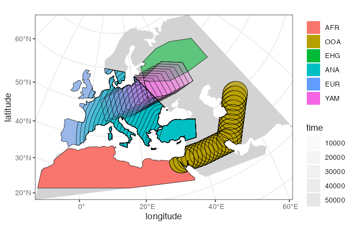
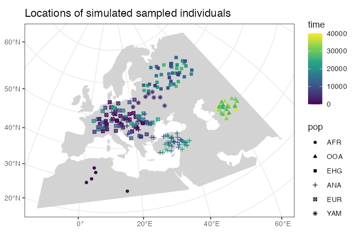
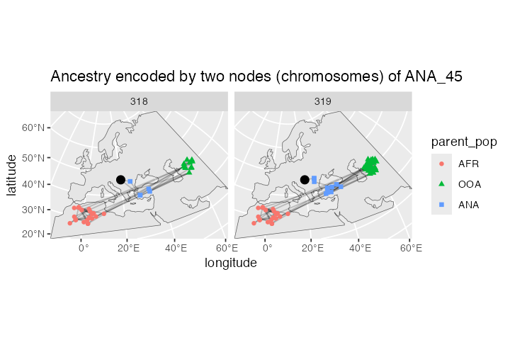
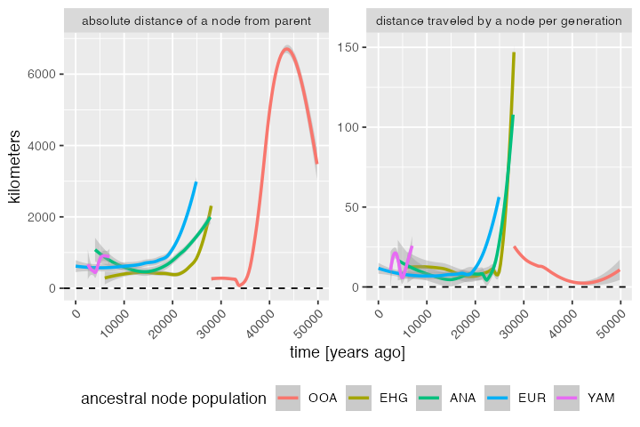

# Spatially annotated tree sequences

## Introduction

The main selling point of the *slendr* R package is programming complex
*spatially explicit* population genetic models. Because we use SLiM as
the simulation engine, we can store simulated data efficiently in a tree
sequence format which allows us to run large population-scale
simulations. In the previous vignettes, we described how you can specify
spatial population dynamics and how you can access tree sequence data
and calculate population genetic statistics on it (focusing on
[non-spatial
models](https://bodkan.net/slendr/articles/vignette-05-tree-sequences.md)
for simplicity). Now it’s time to show you how to work with simulated
tree sequence in a spatial context.

## Model specification

Let’s first load all required R libraries:

``` r

library(slendr)

library(dplyr)
library(ggplot2)

init_env()

seed <- 314159
set.seed(seed)
```

We begin by specifying our spatial model. We will use the same
demographic model of modern human history in West Eurasia, which we
extensively discussed in the [introductory
tutorial](https://bodkan.net/slendr/articles/vignette-01-tutorial.md)
and on the main [landing page](https://bodkan.net/slendr/index.md). Here
is a complete model definition script, without further comments:

``` r

# simulated world map
map <- world(
  xrange = c(-13, 70), # min-max longitude
  yrange = c(18, 65),  # min-max latitude
  crs = "EPSG:3035"    # coordinate reference system (CRS) for West Eurasia
)

# couple of broad geographic regions
africa <- region(
  "Africa", map,
  polygon = list(c(-18, 20), c(38, 20), c(30, 33),
                 c(20, 33), c(10, 38), c(-6, 35))
)
europe <- region(
  "Europe", map,
  polygon = list(
    c(-8, 35), c(-5, 36), c(10, 38), c(20, 35), c(25, 35),
    c(33, 45), c(20, 58), c(-5, 60), c(-15, 50)
  )
)
anatolia <- region(
  "Anatolia", map,
  polygon = list(c(28, 35), c(40, 35), c(42, 40),
                 c(30, 43), c(27, 40), c(25, 38))
)

# define population histories

# African ancestral population
afr <- population(
  "AFR", time = 52000, N = 3000,
  map = map, polygon = africa
)

# population of the first migrants out of Africa
ooa <- population(
  "OOA", parent = afr, time = 51000, N = 500, remove = 25000,
  center = c(33, 30), radius = 400e3
) %>%
  move(
    trajectory = list(c(40, 30), c(50, 30), c(60, 40)),
    start = 50000, end = 40000, snapshots = 20
  )

# Eastern hunter-gatherers
ehg <- population(
  "EHG", parent = ooa, time = 28000, N = 1000, remove = 6000,
  polygon = list(
    c(26, 55), c(38, 53), c(48, 53), c(60, 53),
    c(60, 60), c(48, 63), c(38, 63), c(26, 60))
)

# European population
eur <- population(name = "EUR", parent = ehg, time = 25000, N = 2000, polygon = europe)

# Anatolian farmers
ana <- population(
  name = "ANA", time = 28000, N = 3000, parent = ooa, remove = 4000,
  center = c(34, 38), radius = 500e3, polygon = anatolia
) %>%
  expand_range(
    by = 2500e3, start = 10000, end = 7000,
    polygon = join(europe, anatolia), snapshots = 20
  ) # expand the range by 2.500 km

# Yamnaya steppe population
yam <- population(
  name = "YAM", time = 7000, N = 500, parent = ehg, remove = 2500,
  polygon = list(c(26, 50), c(38, 49), c(48, 50),
                 c(48, 56), c(38, 59), c(26, 56))
) %>%
  move(trajectory = list(c(15, 50)), start = 5000, end = 3000, snapshots = 10)

# geneflow events
gf <- list(
  gene_flow(from = ana, to = yam, rate = 0.5, start = 6000, end = 5000, overlap = FALSE),
  gene_flow(from = ana, to = eur, rate = 0.5, start = 8000, end = 6000),
  gene_flow(from = yam, to = eur, rate = 0.75, start = 4000, end = 3000)
)

# compile the spatial model
model <- compile_model(
  populations = list(afr, ooa, ehg, eur, ana, yam),
  gene_flow = gf,
  generation_time = 30, resolution = 10e3,
  competition = 150e3, mating = 120e3, dispersal = 90e3
)
```

As a sanity check that we defined the demography correctly, you can plot
a graph summarizing population divergences and geneflow events by
calling `plot_model(model)`:

``` r

plot_model(model)
```


And for completeness, here is a (slightly busy) overview of the spatial
population ranges that we defined above:

``` r

plot_map(afr, ooa, ehg, eur, ana, yam)
```



## Scheduling sampling events and simulation

Now we will schedule the sampling of a single individual from each
population every two thousand years, starting from 40 thousand years ago
all the way to the present (this is a feature discussed in the basic
[tree sequence
overview](https://bodkan.net/slendr/articles/vignette-05-tree-sequences.html#scheduling-of-sampling-events-1)):

``` r

# one ancient individual every two thousand years
ancient <- schedule_sampling(model,
                    times = seq(40000, 1, by = -500),
                    list(ooa, 1), list(ehg, 1), list(eur, 1),
                    list(ana, 1), list(yam, 1))

# present-day Africans and Europeans
present <- schedule_sampling(model, times = 0, list(afr, 5), list(eur, 30))

samples <- rbind(ancient, present)
```

Finally, we can simulate data from our model and process the output tree
sequence (recapitate and simplify it):

``` r

ts <- slim(
  model, sequence_length = 100e3, recombination_rate = 1e-8, burnin = 200e3,
  samples = samples, method = "batch", random_seed = 314159, max_attempts = 1
) %>%
  ts_recapitate(recombination_rate = 1e-8, Ne = 10000, random_seed = seed) %>%
  ts_simplify()

ts
```

    #> ╔═════════════════════════╗
    #> ║TreeSequence             ║
    #> ╠═══════════════╤═════════╣
    #> ║Trees          │      101║
    #> ╟───────────────┼─────────╢
    #> ║Sequence Length│  100,000║
    #> ╟───────────────┼─────────╢
    #> ║Time Units     │    ticks║
    #> ╟───────────────┼─────────╢
    #> ║Sample Nodes   │      432║
    #> ╟───────────────┼─────────╢
    #> ║Total Size     │222.4 KiB║
    #> ╚═══════════════╧═════════╝
    #> ╔═══════════╤═════╤════════╤════════════╗
    #> ║Table      │Rows │Size    │Has Metadata║
    #> ╠═══════════╪═════╪════════╪════════════╣
    #> ║Edges      │1,241│38.8 KiB│          No║
    #> ╟───────────┼─────┼────────┼────────────╢
    #> ║Individuals│  730│73.1 KiB│         Yes║
    #> ╟───────────┼─────┼────────┼────────────╢
    #> ║Migrations │    0│ 8 Bytes│          No║
    #> ╟───────────┼─────┼────────┼────────────╢
    #> ║Mutations  │    0│ 1.2 KiB│          No║
    #> ╟───────────┼─────┼────────┼────────────╢
    #> ║Nodes      │  948│35.8 KiB│         Yes║
    #> ╟───────────┼─────┼────────┼────────────╢
    #> ║Populations│    7│ 2.7 KiB│         Yes║
    #> ╟───────────┼─────┼────────┼────────────╢
    #> ║Provenances│    3│46.8 KiB│          No║
    #> ╟───────────┼─────┼────────┼────────────╢
    #> ║Sites      │    0│16 Bytes│          No║
    #> ╚═══════════╧═════╧════════╧════════════╝

## Extracting spatial tree sequence information

As we showed in the [basic
tutorial](https://bodkan.net/slendr/articles/vignette-05-tree-sequences.md),
the most important function for data exploration is
[`ts_nodes()`](https://bodkan.net/slendr/reference/ts_nodes.md). This
function extracts all information about individuals and nodes recorded
in a tree sequence object loaded and annotated by *slendr* :

``` r

data <- ts_nodes(ts)
```

For completeness, we have also functions such as `ts_individuals()`,
[`ts_nodes()`](https://bodkan.net/slendr/reference/ts_nodes.md) and
[`ts_edges()`](https://bodkan.net/slendr/reference/ts_edges.md) which
extract [tree sequence
tables](https://tskit.dev/tskit/docs/stable/data-model.html#table-definitions)
in their “raw” unprocessed form, but
[`ts_nodes()`](https://bodkan.net/slendr/reference/ts_nodes.md) is much
more convenient for data exploration and analyses. First, it combined
information in the low-level tables of individuals and nodes into a
single table but more importantly, if the model which generated this
data was a spatial model,
[`ts_nodes()`](https://bodkan.net/slendr/reference/ts_nodes.md)
automatically annotates the node/individual tables with the position of
each node in space (in real projected coordinates) and time. This means
that we can do spatial data analysis directly on the table returned by
[`ts_nodes()`](https://bodkan.net/slendr/reference/ts_nodes.md).

Even better, although we can see below that the returned object belongs
to *slendr*’s own class `slendr_ts_nodes`, it is internally stored as a
spatial `sf` object. This means that we can use all the functionality of
the powerful [R package *sf*](https://r-spatial.github.io/sf/) as well
as many other packages for geospatial analyses *directly on the data*:

``` r

class(data)
```

    #> [1] "slendr"       "slendr_nodes" "sf"           "tbl_df"       "tbl"         
    #> [6] "data.frame"

Typing the object into the R console presents a user-friendly summary of
the spatio-temporal data extracted from the tree sequence:

``` r

data
```

    #> Simple feature collection with 948 features and 12 fields (with 2 geometries empty)
    #> Geometry type: POINT
    #> Dimension:     XY
    #> Bounding box:  xmin: 2721964 ymin: 428651.3 xmax: 8613304 ymax: 4959957
    #> Projected CRS: ETRS89-extended / LAEA Europe
    #> # A tibble: 948 × 13
    #>    name  pop   node_id  time time_tskit           location sampled
    #>    <chr> <fct>   <int> <dbl>      <dbl>        <POINT [m]> <lgl>  
    #>  1 AFR_1 AFR       362     0          0 (3665253 847038.2) TRUE   
    #>  2 AFR_1 AFR       363     0          0 (3665253 847038.2) TRUE   
    #>  3 AFR_2 AFR       364     0          0 (4877281 428651.3) TRUE   
    #>  4 AFR_2 AFR       365     0          0 (4877281 428651.3) TRUE   
    #>  5 AFR_3 AFR       366     0          0 (3491753 724345.8) TRUE   
    #>  6 AFR_3 AFR       367     0          0 (3491753 724345.8) TRUE   
    #>  7 AFR_4 AFR       368     0          0  (3754934 1216666) TRUE   
    #>  8 AFR_4 AFR       369     0          0  (3754934 1216666) TRUE   
    #>  9 AFR_5 AFR       370     0          0  (3806357 1063276) TRUE   
    #> 10 AFR_5 AFR       371     0          0  (3806357 1063276) TRUE   
    #> # ℹ 938 more rows
    #> # ℹ 6 more variables: remembered <lgl>, retained <lgl>, alive <lgl>,
    #> #   pedigree_id <dbl>, ind_id <dbl>, pop_id <int>

In the first part of the summary, we see how many individuals (sampled
or retained) and nodes are present in the tree sequence together with
additional useful information, including a section of the internally
stored `sf` object. And this is a crucial point—\*\*we can always use
the internal `sf` object with the [spatial
data](https://r-spatial.github.io/sf/articles/sf1.html#how-simple-features-in-r-are-organized-1)
directly\*.

Because the data returned by
[`ts_nodes()`](https://bodkan.net/slendr/reference/ts_nodes.md) is
internally transformed to the projected CRS used by the model, we can
use the returned object as any other data of the class `sf`. For
instance, at the beginning of this vignette, we specified the world map
of the model to be represented in projected CRS (EPSG 3035) which we can
verify by typing:

``` r

map
```

    #> slendr 'map' object 
    #> ------------------- 
    #> map: internal coordinate reference system EPSG 3035 
    #> spatial limits (in degrees longitude and latitude):
    #>   - vertical -13 ... 70
    #>   - horizontal 18 ... 65

The fact that the
[`ts_nodes()`](https://bodkan.net/slendr/reference/ts_nodes.md) result
is just another `sf` object makes it easy to visualize overlay contents
on this map, as we will see below.

## Using the *simple features* interface

It’s hard to overstate how powerful the [R ecosystem around the *sf*
package](https://r-spatial.github.io/sf/) is. However, getting familiar
with this package and geospatial analysis in general can be a bit of a
hurdle, especially for novice users because it takes time to get
familiar with many new concepts.

Although many *slendr* features for encoding and programming spatial
models and handling simulated tree sequence data discussed so far are
designed to abstract away most of the complexities of the underlying
low-level details to let you focus on the problem at hand, spatial data
analysis is unfortunately whole another matter. Luckily, because the
data generated by *slendr* is no different from any other source of
spatial data out there and you have great [free
resources](https://r.geocompx.org/) at your disposal.

The bottom line is: the spatio-temporal data extracted from tree
sequences by *slendr* is no different than an any other normal
[`sf`](https://r-spatial.github.io/sf/) object. Any resource that you
find for manipulating, plotting, and analysing `sf` data can be applied
to *slendr* results as well.

In the remainder of this vignette we will look at a couple of examples.

## Plotting locations of simulated sampled individuals

Every spatial object in *slendr* is internally of the class `sf`. The
flexibility of of [*ggplot2*](https://ggplot2.tidyverse.org) and
[*sf*](https://r-spatial.github.io/sf/) packages means that we can
overlay the locations of sampled individuals (saved in a `sf` format by
[`ts_nodes()`](https://bodkan.net/slendr/reference/ts_nodes.md)) on top
of our world map (also an `sf` object):

``` r

sampled_data <- ts_nodes(ts) %>% filter(sampled)

ggplot() +
  geom_sf(data = map, fill = "lightgray", color = NA) +
  geom_sf(data = sampled_data, aes(shape = pop, color = time)) +
  ggtitle("Locations of simulated sampled individuals") +
  scale_color_continuous(type = "viridis") +
  theme_bw()
```



Because `sf` *simple features* objects (and, by extension, even
`slendr_spatial` objects) are internally stored as [normal data
frames](https://r-spatial.github.io/sf/articles/sf1.html#how-simple-features-in-r-are-organized)
with couple more bells and whistles on top of them, we have all the
[powerful tools](https://tidyverse.org) for manipulating tabular data at
our disposal.

As an example, let’s say we wanted to split the sampled individuals in
the tree sequence into epochs and plot those individually using standard
*ggplot2* features. We could simply first do this, adding a new column
specifying to which epoch does each simulated individual belong:

``` r

epochs <- sampled_data %>%
  mutate(epoch = cut(time, breaks = c(40000, 30000, 10000, 4000, 0)),
         epoch = ifelse(is.na(epoch), 0, epoch),
         epoch = factor(epoch, labels = c("present", "(present, 4 ky]", "(4 ky, 10 ky]",
                                          "(10 ky, 30 y]", "(30 ky, 40 ky]")))
```

This chunk of code simply adds a new column `epoch` to the `sf` spatial
data frame object called `epochs` here.

Then we can use the *ggplot2* function `geom_sf` to plot the locations
of sampled individuals on the map, with each facet corresponding to one
epoch (the warning can be safely ignored):

``` r

ggplot() +
  geom_sf(data = map, fill = "lightgray", color = NA) +
  geom_sf(data = epochs, aes(shape = pop, color = pop)) +
  facet_wrap(~ epoch) +
  ggtitle("Locations of simulated sampled individuals in different epochs") +
  theme_bw()
```


We hope this little excursion to handling *slendr* spatial objects (and,
by extension, `sf` objects) with standard data frame manipulation
functions and *ggplot2* visualisation convinced you that you have a
great flexibility in analysing spatial *slendr* data. For best
introduction into so-called “tidy” data analysis, we encourage you to
read the freely-available book [R for Data
Science](https://r4ds.had.co.nz).

## Extracting spatio-temporal ancestral relationships

Perhaps even more useful than plotting the locations of simulated
individuals is accessing the locations (and times) of *all ancestors* of
a particular tree sequence node (a “focal node”). Starting from the
focal node or individual, we can trace the geographical location of
nodes in its lineage going back all the way to the root with the
function
[`ts_ancestors()`](https://bodkan.net/slendr/reference/ts_ancestors.md).

Because we record the time and the location of every individual that
happens to be the ancestor of at least one sampled individual, this
means that we know the true location of every node of the tree sequence.

The simplest use case is determining the locations and times of every
single node in the genealogical history of an individual along the tree
sequence (it is possible to recover ancestral relationships for multiple
samples at once too):

``` r

ind <- "EUR_67"

lineages <- ts_ancestors(ts, ind, verbose = TRUE)
```

    #> Collecting ancestors of EUR_67 [1/1]...

    #> 
    #> Generating data about spatial relationships of nodes...

The function starts at a given node (or, if a name of a sampled diploid
individual is provided, two nodes), extracts information about all the
parent nodes of that node in the entire tree sequence, records their
locations and times, then proceeds one level “higher” in the
genealogical history to gather information about the parents of those
parent nodes, etc., until it reaches a root node. The result of this
process is another `sf` object in which each row of the table encodes
information about single branch in the genealogy of the “focal” node or
individual (in our example, `"EUR_25"`):

``` r

lineages
```

    #> Simple feature collection with 134 features and 12 fields
    #> Active geometry column: connection
    #> Geometry type: LINESTRING
    #> Dimension:     XY
    #> Bounding box:  xmin: 2721964 ymin: 546923.8 xmax: 8506059 ymax: 4652439
    #> Projected CRS: ETRS89-extended / LAEA Europe
    #> # A tibble: 134 × 15
    #>    name  pop   node_id level child_id parent_id child_time parent_time child_pop
    #>  * <chr> <fct>   <int> <fct>    <int>     <int>      <dbl>       <dbl> <fct>    
    #>  1 EUR_… EUR       406 1          406       446          0        1300 EUR      
    #>  2 EUR_… EUR       406 2          446       469       1300        3550 EUR      
    #>  3 EUR_… EUR       406 3          469       488       3550        5890 EUR      
    #>  4 EUR_… EUR       406 4          488       494       5890        6970 EUR      
    #>  5 EUR_… EUR       406 4          488       570       5890       13690 EUR      
    #>  6 EUR_… EUR       406 5          494       570       6970       13690 EUR      
    #>  7 EUR_… EUR       406 5          570       675      13690       21370 EUR      
    #>  8 EUR_… EUR       406 6          675       750      21370       25960 EUR      
    #>  9 EUR_… EUR       406 7          750       756      25960       26230 EHG      
    #> 10 EUR_… EUR       406 8          756       792      26230       28000 EHG      
    #> # ℹ 124 more rows
    #> # ℹ 6 more variables: parent_pop <fct>, child_location <POINT [m]>,
    #> #   parent_location <POINT [m]>, connection <LINESTRING [m]>, left_pos <dbl>,
    #> #   right_pos <dbl>

In each row of the table, two columns `location` and `parent_location`
carry the spatial location of a node (`node_id`) and its parent node
(`parent_id`), respectively, same with the columns `time` and
`parent_time` (times of nodes) and `pop` and `parent_pop` (populations
to which the nodes belong). The column `connection` contains an `sf`
geometry object of the line connecting the two nodes in the coordinate
reference system of the “model world”. The column `focal_id` tells us to
which focal node’s genealogy the rows of the table belong to, and the
`level` column shows how deep in the genealogical past does each branch
(i.e. row of the table) belong to.

This table contains a complete information about spatio-temporal
relationships between the nodes in the genealogy of the given focal
sample. In the spirit of demonstrating of *slendr* tree sequence tables
interact with the *sf* and *ggplot2* environments, let’s look at the
most immediate parent nodes of the two nodes in the sampled individual
(i.e. nodes at the level 1) using the `filter` function from the R
package
[dplyr](https://r4ds.had.co.nz/transform.html#filter-rows-with-filter):

``` r

filter(lineages, level == 1)
```

    #> Simple feature collection with 2 features and 12 fields
    #> Active geometry column: connection
    #> Geometry type: LINESTRING
    #> Dimension:     XY
    #> Bounding box:  xmin: 3898723 ymin: 2562183 xmax: 4274254 ymax: 2895750
    #> Projected CRS: ETRS89-extended / LAEA Europe
    #> # A tibble: 2 × 15
    #>   name   pop   node_id level child_id parent_id child_time parent_time child_pop
    #> * <chr>  <fct>   <int> <fct>    <int>     <int>      <dbl>       <dbl> <fct>    
    #> 1 EUR_67 EUR       406 1          406       446          0        1300 EUR      
    #> 2 EUR_67 EUR       407 1          407       503          0        7810 EUR      
    #> # ℹ 6 more variables: parent_pop <fct>, child_location <POINT [m]>,
    #> #   parent_location <POINT [m]>, connection <LINESTRING [m]>, left_pos <dbl>,
    #> #   right_pos <dbl>

As we mentioned above, there are three columns encoding spatial
information: `location` and `parent_location` carry information about
the location of the child and parent node (`POINT` class), and the
`connection` object (`LINESTRING` class) contains the line connecting
the two nodes (both a branch in the tree sequence and also the spatial
connection). We can plot all three spatial features (two points and a
line) individually on a map:

``` r

level1_branches <- ts_ancestors(ts, "EUR_67") %>% filter(level == 1)

ggplot() +
  geom_sf(data = map, fill = "lightgray", color = NA) +
  geom_sf(data = level1_branches[, ]$child_location, shape = 13, size = 3, color = "red") +
  geom_sf(data = level1_branches[, ]$connection, linetype = 3) +
  geom_sf(data = level1_branches[, ]$parent_location, shape = 20, color = "blue") +
  theme_bw() +
  ggtitle("Parent nodes (blue) of a focal individual (red)")
```


In the figure above we can see the red focal node and its immediate
parents in the tree sequence genealogy (in the coalescent sense, not
immediate parents of that individual!). In case you’re surprised to see
more than two parents, recall that recombination events make the history
encoded by a sample more complicated as it can involve more ancestors as
we “move up” a tree from a sample, not just two ancestors. Looking at
our example in more detail, we can see that one node (chromosome) of the
individual “EUR_67” has two ancestors, each covering a portion of that
individuals chromosome, with the other chromosome being covered by a
single ancestor (columns `left_pos` and `right_pos`):

``` r

as_tibble(level1_branches)[, c("name", "node_id", "child_id", "parent_id", "left_pos", "right_pos")]
```

    #> # A tibble: 2 × 6
    #>   name   node_id child_id parent_id left_pos right_pos
    #>   <chr>    <int>    <int>     <int>    <dbl>     <dbl>
    #> 1 EUR_67     406      406       446        0    100000
    #> 2 EUR_67     407      407       503        0    100000

A more convenient way to do this analysis is a companion function to
[`ts_ancestors()`](https://bodkan.net/slendr/reference/ts_ancestors.md)
called `plot_ancestors()`. This function accepts an `sf` object with the
spatial branching data created by
[`ts_ancestors()`](https://bodkan.net/slendr/reference/ts_ancestors.md)
and plots the paths between nodes on a map leading from a focal node up
to the root(s) of the tree sequence (instead of just paths to immediate
parents shown in the previous figure). In this case, because we are
working with a single diploid individual, we get two sets of paths for
each of its nodes (chromosomes) and plot them in two facets:

``` r

ggplot() +
  geom_sf(data = map) +
  geom_sf(data = lineages, size = 0.5, alpha = 0.2) +
  geom_sf(data = sf::st_set_geometry(lineages, "parent_location"),
          aes(shape = parent_pop, color = parent_pop)) +
  geom_sf(data = filter(ts_nodes(ts), name == ind), size = 3) +
  guides(alpha = "none") +
  coord_sf(expand = 0) +
  labs(x = "longitude", y = "latitude") +
  facet_grid(. ~ node_id) +
  ggtitle("Ancestry encoded by two nodes (chromosomes) of EUR_67")
```


You can compare this result to the animation which recapitulates the
simulation, presented in [the first
vignette](https://bodkan.net/slendr/articles/vignette-01-tutorial.md).

After comparing our spatial tree sequence figure with the animation, we
can immediately notice several things:

1.  All spatial tree sequence paths trace the ancestry of our single
    European individual back to Africa. In fact, we also see a cluster
    of past ancestral nodes (i.e. concentrated coalescent events) in the
    place where the Out of Africa (OOA) migrant population settled
    around 40,000 thousand years ago (yellow population in the the
    animation).

2.  One chromosome traces its ancestry to an EHG population indicated by
    a green square This is expected because we programmed a Yamnaya
    migration (descending from EHG) from east to central Europe to
    contribute significant part of ancestry to present-day Europeans
    (compare to the demographic graph on top of this vignette).

3.  We also see that the other chromosome traces of its ancestry to the
    Anatolia (blue crosses). This makes sense, because we have simulated
    European ancestry as being part Anatolian.

Let’s look at the spatial ancestry of another sample. For instance, we
know that the simulated history of the Anatolian population in our model
is much simpler. According to the demographic graph above, Anatolians
split from the ancestral population of Eurasians in Anatolia and then
expanded in a wave to Europe. We have sampled the following individuals:

``` r

ts_samples(ts) %>% filter(pop == "ANA")
```

    #> # A tibble: 48 × 3
    #>    name    time pop  
    #>    <chr>  <int> <chr>
    #>  1 ANA_1  27500 ANA  
    #>  2 ANA_2  27000 ANA  
    #>  3 ANA_3  26500 ANA  
    #>  4 ANA_4  26000 ANA  
    #>  5 ANA_5  25500 ANA  
    #>  6 ANA_6  25000 ANA  
    #>  7 ANA_7  24500 ANA  
    #>  8 ANA_8  24000 ANA  
    #>  9 ANA_9  23500 ANA  
    #> 10 ANA_10 23000 ANA  
    #> # ℹ 38 more rows

Can we see a hint of the spatial dynamics of Anatolians in the
spatio-temporal distribution of ancestral node locations of one of the
sampled individuals? Let’s pick the last individual and immediately plot
its spatial ancestry tidyverse-style using the pipe operator `%>%`:

``` r

lineages <- ts_ancestors(ts, "ANA_45")

ggplot() +
  geom_sf(data = map) +
  geom_sf(data = lineages, size = 0.5, alpha = 0.2) +
  geom_sf(data = sf::st_set_geometry(lineages, "parent_location"),
          aes(shape = parent_pop, color = parent_pop)) +
  geom_sf(data = filter(ts_nodes(ts), name == "ANA_45"), size = 3) +
  guides(alpha = "none") +
  coord_sf(expand = 0) +
  labs(x = "longitude", y = "latitude") +
  facet_grid(. ~ node_id) +
  ggtitle("Ancestry encoded by two nodes (chromosomes) of ANA_45")
```



As we might expect given the late age of the sample, its position in the
map above (red crossed circle) is not in Anatolia but in Europe because
it represents one of the descendants of migrants who moved from Anatolia
into Europe. This can be clearly seen in the position of its parental
nodes in the tree sequence: these nodes represent real individuals who
lived at some point in the past, and we can see that they did, indeed,
lived in Anatolia.

## Calculating distances and other statistics using the *sf* package

How can we summarise the spatial ancestral dynamics in the figures using
some statistics?

Lets take one more look at the `sf` object with the locations and times
of ancestral nodes of sampled individuals, focusing on the following
subset of columns:

``` r

lineages <-
  ts_samples(ts) %>%
  pull(name) %>%
  ts_ancestors(ts, x = .)

select(lineages, connection, child_time, parent_time)
```

    #> Simple feature collection with 23928 features and 2 fields
    #> Geometry type: LINESTRING
    #> Dimension:     XY
    #> Bounding box:  xmin: 2721964 ymin: 428651.3 xmax: 8613304 ymax: 4959957
    #> Projected CRS: ETRS89-extended / LAEA Europe
    #> # A tibble: 23,928 × 3
    #>                             connection child_time parent_time
    #>                       <LINESTRING [m]>      <dbl>       <dbl>
    #>  1  (8103641 3334456, 7956278 3180199)      40000       40330
    #>  2  (7956278 3180199, 8036310 1911729)      40330       43900
    #>  3  (7956278 3180199, 8031610 2059804)      40330       44020
    #>  4  (8036310 1911729, 8031610 2059804)      43900       44020
    #>  5  (8031610 2059804, 7687313 1689532)      44020       45970
    #>  6  (7687313 1689532, 7175192 1476174)      45970       47740
    #>  7  (7687313 1689532, 6867500 1338048)      45970       48730
    #>  8  (7175192 1476174, 6867500 1338048)      47740       48730
    #>  9  (6867500 1338048, 6754277 1091742)      48730       49810
    #> 10 (6754277 1091742, 3290558 497125.8)      49810       60400
    #> # ℹ 23,918 more rows

We can use standard *dplyr* table manipulation functions to compute the
distances between connected notes and the times that separate them
(i.e. branch lengths in the traditional phylogenetic sense). We can then
use those two quantities to compute how fast (if any at all) was the
movement between ancestral individuals in different time periods of the
history of a sample:

``` r

distances <- lineages %>%
  mutate(branch_length = abs(parent_time - child_time) / model$generation_time,
         distance = sf::st_length(connection) %>% units::set_units(km) %>% as.numeric(),
         speed = distance / branch_length,
         epoch = cut(parent_time, breaks = c(Inf, seq(60000, 0, by = -3000)), dig.lab = 10, include.lowest = TRUE)) %>%
  as_tibble() %>% # strip away the spatial annotation
  select(name, pop, node_id, branch_length, distance, speed, parent_pop, parent_time, child_pop, child_time, epoch)
```

Let’s also convert the data (absolute distances or distance per
generation – i.e., the “speed”) into a long format for easier plotting
side by side:

``` r

distances_long <- distances %>%
  filter(child_time < 60000) %>%
  filter(!pop %in% c("AFR", "OOA")) %>%
  tidyr::pivot_longer(cols = c(distance, speed),
                      names_to = "stat",
                      values_to = "value") %>%
  mutate(facet = case_when(
    stat == "distance" ~ "absolute distance of a node from parent",
    stat == "speed" ~ "distance traveled by a node per generation"))
```

Let’s try to summarise the information about distances “traveled” by
nodes in different time period by fitting a spline (rather than plotting
the raw data with individual nodes):

``` r

distances_long %>%
  ggplot(aes(child_time, value, color = child_pop)) +
  geom_smooth(method = "loess", aes(group = child_pop)) +
  geom_hline(yintercept = 0, linetype = 2, linewidth = 0.5) +
  labs(y = "kilometers", x = "time [years ago]") +
  theme(axis.text.x = element_text(hjust = 1, angle = 45),
        legend.position = "bottom") +
  facet_wrap(~ facet, scales = "free_y") +
  guides(color = guide_legend("ancestral node population"))
```

    #> `geom_smooth()` using formula = 'y ~ x'


