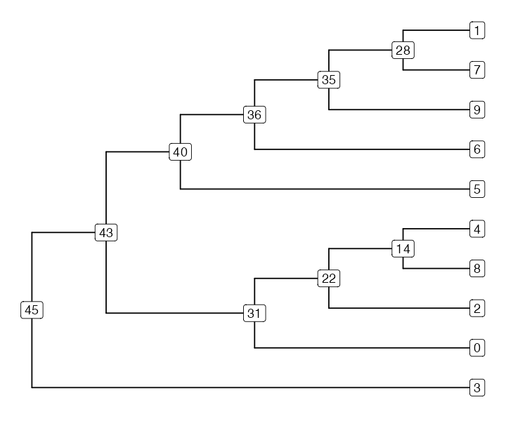
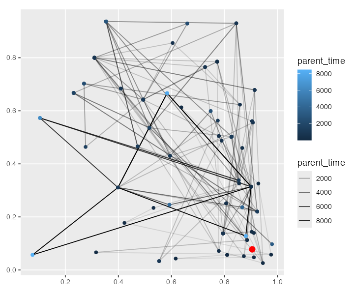

# Analyzing non-slendr tree sequences

In previous vignettes we have demonstrated the *slendr* R interface for
defining and executing msprime and SLiM population genetic models. We
have also provided an overview for its interface to the tree-sequence
processing library [tskit](https://tskit.dev).

However, although its model-definition interface is quite convenient,
*slendr* cannot (and never will) support *every* possible msprime or
SLiM. model The array of features provided by these simulation
frameworks is simply to big and implementing an R interface to every
single one of them would not make much sense.

That said, the tree-sequence outputs produced by “pure”
(i.e. non-slendr) msprime and SLiM scripts are no different from those
generated by *slendr* models themselves. For users who would rather use
their own simulation scripts but find *slendr*’s tskit R interface (not
its simulation interface) appealing, the R package provides a
possibility to load, process, visualize and analyze standard tree
sequences which were not generated by *slendr* itself.

In this vignette we give a brief overview of how this works, using
example tree sequences produced by two very simple simulation scripts
written in pure SLiM and msprime (i.e. scripts which don’t utilize
*slendr*’s spatial features, symbolic names of simulated individuals,
and automated translation of time units). We won’t be going into detail
explaining how those scripts work, because we assume this functionality
will be used by those already familiar with msprime or SLiM. Similarly,
we won’t cover the R-tskit functionality of *slendr* in detail either,
simply because the contents of this vignette is already covered by
[other tutorials provided by
*slendr*](https://bodkan.net/slendr/articles/index.md).

``` r

library(slendr)

library(dplyr)
library(magrittr)
library(ggplot2)

init_env()

SEED <- 42
set.seed(SEED)
```

#### Non-spatial SLiM tree sequences

Consider the following SLiM script, which creates a couple of
populations (with different $`N_e`$) splitting from an ancestral
population `p1` (lets save it to `/tmp/nonspatial.slim`):

    initialize() {
        setSeed(42);
        initializeTreeSeq();
        initializeMutationRate(0);
        initializeMutationType("m1", 0.5, "f", 0.0);
        initializeGenomicElementType("g1", m1, 1.0);
        initializeGenomicElement(g1, 0, 1e6);
        initializeRecombinationRate(1e-8);
    }

    1 early() {
        sim.addSubpop("p1", 10);
    }

    1000 early() {
        sim.addSubpopSplit("p2", 500, p1);
    }

    3000 early() {
        sim.addSubpopSplit("p3", 2500, p1);
    }

    5000 early() {
        sim.addSubpopSplit("p4", 10000, p1);
    }

    6000 late() {
        sim.treeSeqOutput("/var/folders/lq/bl36db_s6w908hnjkntdp4140000gn/T//RtmpMH77Q5/filee81225dbf6f9");
    }

After we run this script in SLiM, we can use *slendr* to load the output
tree sequence (saved to `/tmp/nonspatial-slim.trees`), simplify it, and
overlay mutations on it using the [standard
functionality](https://bodkan.net/slendr/articles/vignette-05-tree-sequences.html#loading-and-processing-tree-sequence-output-files)
originally developed for *slendr* tree sequences. Note that this is the
same command we would use for loading *slendr* tree sequences, except we
direct the [`ts_read()`](https://bodkan.net/slendr/reference/ts_read.md)
function straight to the tree-sequence output file rather than using the
`ts_read(<model-object>)` format used when working with standard
*slendr* simulations. This way, *slendr*

``` r

ts <- ts_read(nonspatial_trees_file) %>%
  ts_simplify() %>%
  ts_mutate(mutation_rate = 1e-7, random_seed = SEED)
```

We can extract information about individual’s names, nodes, population
assignments, etc. just as with any *slendr* tree sequence with the
function [`ts_nodes()`](https://bodkan.net/slendr/reference/ts_nodes.md). As
with standard *slendr* models, this function loads the “raw” node and
individual [tree-sequences
tables](https://tskit.dev/tutorials/tables_and_editing.html), performs a
couple of join operations, and presents the whole thing in a nice
unified form for interactive data analysis (which can also include
spatial information—see below):

``` r

data <- ts_nodes(ts) %>% dplyr::filter(sampled)
data
#> # A tibble: 26,020 × 11
#>    pop   node_id  time time_tskit sampled remembered retained alive pedigree_id
#>    <chr>   <int> <dbl>      <dbl> <lgl>   <lgl>      <lgl>    <lgl>       <dbl>
#>  1 p1          0     0          0 TRUE    FALSE      FALSE    TRUE     20073000
#>  2 p1          1     0          0 TRUE    FALSE      FALSE    TRUE     20073000
#>  3 p1          2     0          0 TRUE    FALSE      FALSE    TRUE     20073001
#>  4 p1          3     0          0 TRUE    FALSE      FALSE    TRUE     20073001
#>  5 p1          4     0          0 TRUE    FALSE      FALSE    TRUE     20073002
#>  6 p1          5     0          0 TRUE    FALSE      FALSE    TRUE     20073002
#>  7 p1          6     0          0 TRUE    FALSE      FALSE    TRUE     20073003
#>  8 p1          7     0          0 TRUE    FALSE      FALSE    TRUE     20073003
#>  9 p1          8     0          0 TRUE    FALSE      FALSE    TRUE     20073004
#> 10 p1          9     0          0 TRUE    FALSE      FALSE    TRUE     20073004
#> # ℹ 26,010 more rows
#> # ℹ 2 more variables: ind_id <dbl>, pop_id <int>
```

Moving on to tskit statistics, we can use the data table above to
extract a list of nodes belonging to each population (this is what
various tskit tree-sequence statistics operate on, and *slendr* follows
that design). Here we are computing the nucleotide diversity in each of
the four populations using the
[`ts_diversity()`](https://bodkan.net/slendr/reference/ts_diversity.md)
function, by first creating a list of lists with node IDs
(i.e. chromosomes) of individuals in each population:

``` r

sample_sets <- split(data$node_id, data$pop)

# compute nucleotide diversity in each population
# (any other ts_*() tskit R interface function should work)
ts_diversity(ts, sample_sets)
#> # A tibble: 4 × 2
#>   set    diversity
#>   <chr>      <dbl>
#> 1 p1    0.00000755
#> 2 p2    0.000241  
#> 3 p3    0.000463  
#> 4 p4    0.000201
```

Just as with *slendr* tree sequences (as demonstrated in our
[paper](https://bodkan.net/slendr/articles/vignette-09-paper.html#example-4-figure-5))
we can get a individual trees too, extracted in the in the phylogenetic
format provided by the [ape](https://CRAN.R-project.org/package=ape) R
package. Here we first simplify the tree sequence even further to just
10 nodes to make things manageable:

``` r

samples <- sample(data$node_id, 10)
ts_small <- ts_simplify(ts, simplify_to = samples)

# extract the 42nd tree in the genealogy to an R 'phylo' format
tree <- ts_phylo(ts_small, 42 - 1)
#> Starting checking the validity of tree...
#> Found number of tips: n = 10 
#> Found number of nodes: m = 9 
#> Done.
tree
#> 
#> Phylogenetic tree with 10 tips and 9 internal nodes.
#> 
#> Tip labels:
#>   1, 0, 9, 4, 8, 7, ...
#> Node labels:
#>   45, 28, 22, 31, 35, 36, ...
#> 
#> Rooted; includes branch length(s).
```

Once we have that R tree object, we can use packages like
[ggtree](https://yulab-smu.top/treedata-book/) to visualize the tree
(any other phylogenetic package would work too). Note that because nodes
of ‘ape phylo’ trees must conform to a strict format (they must be
labelled `1...N`), we will extract the information about the node IDs in
the tskit tree-sequence data to be able to plot them in the tree.

``` r

library(ggtree)
#> ggtree v4.0.1 Learn more at https://yulab-smu.top/contribution-tree-data/
#> 
#> Please cite:
#> 
#> Guangchuang Yu.  Data Integration, Manipulation and Visualization of
#> Phylogenetic Trees (1st edition). Chapman and Hall/CRC. 2022,
#> doi:10.1201/9781003279242, ISBN: 9781032233574
#> 
#> Attaching package: 'ggtree'
#> The following object is masked from 'package:magrittr':
#> 
#>     inset

labels <- ts_nodes(tree) %>% select(node = phylo_id, tskit_id = node_id)

ggtree(tree, branch.length = "none") %<+% labels +
  geom_label(aes(label = tskit_id))
```



``` r

library(ape)
plot(tree, show.tip.label = FALSE)
nodelabels()
tiplabels()
```

#### msprime (non-slendr) tree sequences

The same as above applies also to msprime tree sequences (which is
really not that surprising, given that it’s all tskit under the hood).

We can start with Python:

``` python
import msprime
ts = msprime.sim_ancestry(100)
ts.dump(<trees file>)
```

And then we can proceed with loading the msprime tree sequence into R
and analyze it with the slendr functionality:

``` r

ts <- ts_read(msprime_trees_file)

ts_nodes(ts)
#> # A tibble: 199 × 7
#>    pop   ind_id node_id  time time_tskit sampled pop_id
#>    <chr>  <dbl>   <int> <dbl>      <dbl> <lgl>    <int>
#>  1 0         NA       0     0          0 TRUE         0
#>  2 0         NA       1     0          0 TRUE         0
#>  3 0         NA       2     0          0 TRUE         0
#>  4 0         NA       3     0          0 TRUE         0
#>  5 0         NA       4     0          0 TRUE         0
#>  6 0         NA       5     0          0 TRUE         0
#>  7 0         NA       6     0          0 TRUE         0
#>  8 0         NA       7     0          0 TRUE         0
#>  9 0         NA       8     0          0 TRUE         0
#> 10 0         NA       9     0          0 TRUE         0
#> # ℹ 189 more rows
```

#### Spatial SLiM (non-slendr) tree sequences

Furthermore, the generalized interface also supports *slendr*’s [spatial
tree-sequence
features](https://bodkan.net/slendr/articles/vignette-06-locations.html), with
all the [bells and
whistles](https://bodkan.net/slendr/articles/vignette-09-paper.html#example-4-figure-5).

For instance, lets take the following spatial SLiM script (modified from
the SLiM manual) and execute it with SLiM the usual way:

    initialize() {
        setSeed(42);
          initializeSLiMOptions(keepPedigrees=T, dimensionality="xy");
          initializeTreeSeq();
          initializeMutationRate(1e-7);
          initializeMutationType("m1", 0.5, "f", 0.0);
          initializeGenomicElementType("g1", m1, 1.0);
          initializeGenomicElement(g1, 0, 1e6);
          initializeRecombinationRate(1e-8);
    }
    1 early() {
        sim.addSubpop("p1", 500);

        // initial positions are random in ([0,1], [0,1])
        p1.individuals.x = runif(p1.individualCount);
          p1.individuals.y = runif(p1.individualCount);
    }
    modifyChild() {
          // draw a child position near the first parent, within bounds
          do child.x = parent1.x + rnorm(1, 0, 0.02);
          while ((child.x < 0.0) | (child.x > 1.0));

          do child.y = parent1.y + rnorm(1, 0, 0.02);
          while ((child.y < 0.0) | (child.y > 1.0));

          return T;
    }
    1: late() {
        sim.treeSeqRememberIndividuals(sim.subpopulations.individuals, permanent = F);
    }

    10000 late() {
        sim.treeSeqOutput("/var/folders/lq/bl36db_s6w908hnjkntdp4140000gn/T//RtmpMH77Q5/filee812328c678");
    }

We can then load and simplify the output tree sequence in just as we did
above in this vignette (or anywhere in the *slendr* documentation):

``` r

ts <- ts_read(spatial_trees_file) %>% ts_simplify()
```

Finally, we can access the spatio-temporal data embedded in the output
tree sequence in the standard *slendr* way (note the spatial
[*sf*](https://r-spatial.github.io/sf/) column `location` with the
`POINT` data type):

``` r

data <- ts_nodes(ts)
data
#> Simple feature collection with 1955 features and 11 fields
#> Geometry type: POINT
#> Dimension:     XY
#> Bounding box:  xmin: 0.07649281 ymin: 0.0006142841 xmax: 0.9984433 ymax: 0.9892587
#> CRS:           NA
#> # A tibble: 1,955 × 12
#>    pop   node_id  time time_tskit               location sampled remembered
#>    <chr>   <int> <dbl>      <dbl>                <POINT> <lgl>   <lgl>     
#>  1 p1          0     0          0   (0.904485 0.0777489) TRUE    FALSE     
#>  2 p1          1     0          0   (0.904485 0.0777489) TRUE    FALSE     
#>  3 p1          2     0          0   (0.668828 0.5246381) TRUE    FALSE     
#>  4 p1          3     0          0   (0.668828 0.5246381) TRUE    FALSE     
#>  5 p1          4     0          0  (0.7707701 0.1518462) TRUE    FALSE     
#>  6 p1          5     0          0  (0.7707701 0.1518462) TRUE    FALSE     
#>  7 p1          6     0          0  (0.7617792 0.2616453) TRUE    FALSE     
#>  8 p1          7     0          0  (0.7617792 0.2616453) TRUE    FALSE     
#>  9 p1          8     0          0 (0.9807475 0.04223008) TRUE    FALSE     
#> 10 p1          9     0          0 (0.9807475 0.04223008) TRUE    FALSE     
#> # ℹ 1,945 more rows
#> # ℹ 5 more variables: retained <lgl>, alive <lgl>, pedigree_id <dbl>,
#> #   ind_id <dbl>, pop_id <int>
```

Because we get the tree sequence converted to the spatial
[*sf*](https://r-spatial.github.io/sf/) data format, we can use standard
geospatial packages to use any spatial data analysis methods that those
packages provide.

To briefly demonstrate what this means, we can trivially plot the
location of each recorded node:

``` r

ggplot() + geom_sf(data = data, aes(color = time), alpha = 0.5)
```


We can also collect spatio-temporal ancestry information of a particular
node (i.e. the times and locations of all of its ancestors all the way
to the root, with each “link” in the plot signifying parent-child edge
somewhere along the tree sequence) and plot it on a 2D surface (x and y
dimensions \[0, 1\]). The plot is a little chaotic, but hopefully
conveys the idea (the “focal node” 0 is highlighted in red). This is
essentially the same plot we have in [the last figure of our
paper](https://bodkan.net/slendr/articles/vignette-09-paper.html#example-4-figure-5).

``` r

ancestral_links <- ts_ancestors(ts, 0)

ggplot() +
    geom_sf(data = ancestral_links, size = 0.5, aes(alpha = parent_time)) +
    geom_sf(data = sf::st_set_geometry(ancestral_links, "parent_location"), aes(color = parent_time)) +
    geom_sf(data = data[data$node_id == 0, ], size = 3, color = "red")
```



## Conclusion

In this vignette we gave a brief overview of using *slendr*’s [R-tskit
interface](https://bodkan.net/slendr/reference/index.html#tree-sequence-loading-and-processing)
for loading, processing, and analyzing “pure” non-*slendr* tree
sequences produced by msprime and SLiM scripts.

Although we have only touched upon the most basic features of its
R-tskit interface for standard tree sequences, it is important to note
that as far as *slendr* is concerned, it does not matter how a tree
sequence was produced, as long as it conforms to the tskit
specification. This means that regardless of the source of your tree
sequence data, you should be able to use *slendr*’s tskit functionality
to run your analyses.
