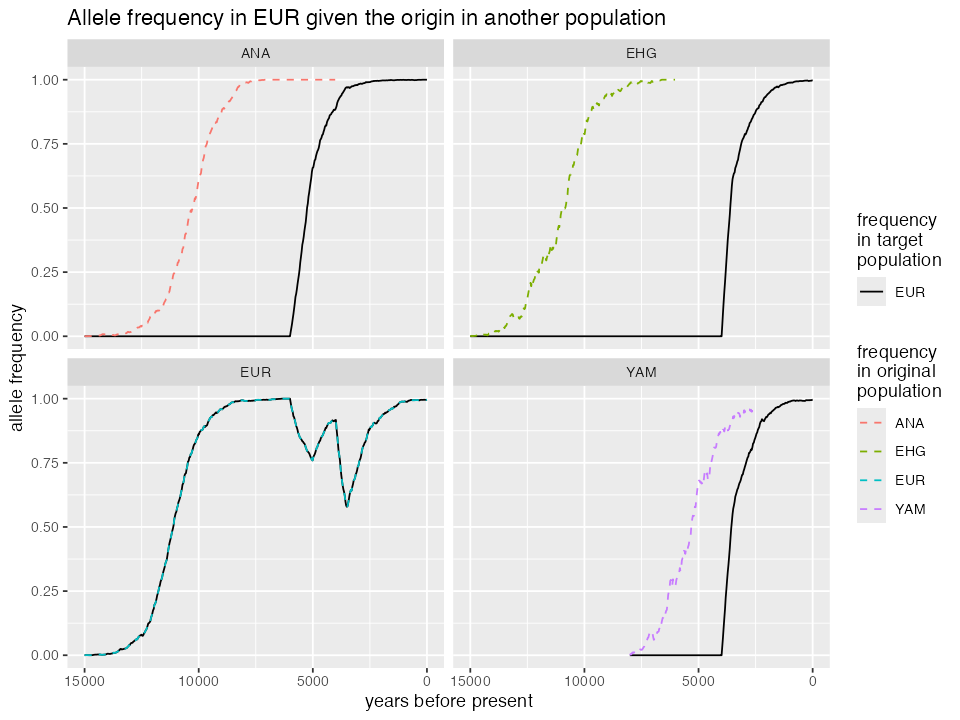

# Extending models with custom SLiM code

### Introduction

*slendr* has been designed specifically for the purpose of making it as
easy as possible to program population genetic simulations of
spatio-temporal demographic histories using SLiM. Our primary goal was
to have the means to simulate arbitrarily complex spatial scenarios and
simulate data which could be used for development of new spatial
inference population genetic methods (and benchmarking of current
methods). This functionality is briefly described in [vignette
\#1](https://bodkan.net/slendr/articles/vignette-01-tutorial.html) and in more
detail in [vignette
\#6](https://bodkan.net/slendr/articles/vignette-06-locations.html).

After the spatial simulation features have been implemented, it turned
out to be trivial to support also “traditional”, non-spatial demographic
models, such as those described in [vignette
\#4](https://bodkan.net/slendr/articles/vignette-04-nonspatial-models.html) and
[vignette
\#5](https://bodkan.net/slendr/articles/vignette-05-tree-sequences.html) –
tree-like models with population divergences, gene-flow events, and
popularion resize events, like you can see in any evolutionary biology
textbook. Because non-spatial models can be often implemented (and
executed) more efficient in a coalescent setting, we added the
possibility to run any compiled *slendr* model not through SLiM but
through a back-end script implemented in *msprime*, hidden behind the
*slendr* function
[`msprime()`](https://bodkan.net/slendr/reference/msprime.md).

Throughout all this time, *slendr* models were purely neutral, without
much planning to extend simulations toward non-neutral scenarios.
However, **with the easy specification of non-spatial demographic models
and their simulation with the *slendr*/SLiM engine, many users have been
asking about the possibility to simulate non-neutral scenarios or, more
generally, customization of the simplified genome architecture assumed
by *slendr* by default (a single chromosome with uniform recombination
and purely neutral mutations).**

This vignette describes how this can be done with *slendr*.

**Why even do this if SLiM can do these things on its own? Fair
question!** After all, SLiM can obviously simulate nearly any kind of
conceivable evolutionary model.

One motivation for supporting non-neutral customized genomic
architecture and mutation models in *slendr* is from users who find it
easier to program complex “base” demographic models in R (such as models
with complex history of population divergences, gene-flow events,
resizes), let *slendr* take care of demographic history . You only have
to provide custom SLiM code for non-neutral evolution.\*\*

### Disclaimers and caveats

If you want to use the *slendr*/SLiM extension functionality described
in this vignette, you should be aware of the following restrictions and
guidelines:

- The extension functionality is primarily design to support complex
  selection models using customized SLiM snippets while still using
  *slendr* for handling the basic demographic modeling scaffold
  (population splits, resizes, gene flows, etc.). Because the handling
  of these demographic events remains unchanged even for
  [`slim()`](https://bodkan.net/slendr/reference/slim.md) models, the
  coalescent [`msprime()`](https://bodkan.net/slendr/reference/msprime.md)
  engine of *slendr* (which implements the coalescent, neutral
  counterpart of *slendr* models) has not changed and there is no means
  to customize it.

- It is assumed that the [SLiM script bundled with
  *slendr*](https://github.com/bodkan/slendr/blob/main/inst/scripts/script.slim)
  stays unmodified. Any extension *SLiM* code customization snippets
  will be added on top of it – customizing mutation types, genomic
  element types, recombination maps, custom fitness callbacks, etc.
  Functionality involving demographic events (splits, gene-flow, etc.)
  will stay in place as it is. User-provided custom code is not allowed
  to change how this functionality operates.

- Related to the above point – *slendr* models assume (and will always
  assume) Wright-Fisher (WF) dynamics. Although perhaps not necessarily
  a problem for simulating non-spatial selection models (i.e. *slendr*
  models which don’t include a map), adding selection to spatial models
  in SLiM WF setting is unlikely to lead to very meaningful results. If
  you need non-WF models, you will have to use pure SLiM. *slendr* will
  not be useful for you.

- The built-in SLiM engine of *slendr* provides several utility Eidos
  functions which make it easy to extend the engine with custom
  callbacks, and give the possibility to refer to some *slendr*-specific
  model information. See the list in the section below.

### *slendr* / SLiM “API”

Below we will describe the following slendr / SLiM “API” functions and
constants you can use to customize the default SLiM script that comes
bundled with *slendr*:

- [`population()`](https://bodkan.net/slendr/reference/population.md)

- `tick()` and `model_time()`

- `save_state()` and `reset_state()`

- `write_log()`

- `SIMULATION_START` and `SIMULATION_END`

- `SEQUENCE_LENGTH`

- `PATH`

Let’s first load all required R libraries before we dive in:

``` r

library(slendr)
init_env()

library(dplyr)
library(ggplot2)
library(readr)

seed <- 42
set.seed(seed)
```

#### Referring to populations: `population()` Eidos function

As a recap, when we program a *slendr* model, we can refer to
populations using symbolic names such as “AFR” or “EUR” in a *slendr* R
script in the following way:

``` r

afr <- population("AFR", time = 100000, N = 20000)
eur <- population("EUR", time = 60000, N = 2000, parent = afr)

# <... compile model and simulate a tree sequence `ts` ...>
```

Similarly, after a simulation is finished and we need to analyze the
tree-sequence produced by a *slendr* model, we can refer to populations
(or individuals sampled from those populations) using the same symbolic
names like this:

``` r

# compute heterozygosity in the individual "EUR"
ts_diversity(ts, "EUR_1")

# compute genetic divergence between selected Africans and Europeans
afr_samples <- c("AFR_1", "AFR_2", "AFR_3")
eur_samples <- c("EUR_1", "EUR_2", "EUR_3")
ts_divergence(ts, list(afr = afr_samples, eur = eur_samples))
```

Along the same lines, when you’re customizing a *slendr*/SLiM
simulation, you can get a `Subpopulation` SLiM object corresponding to a
symbolic name of a *slendr* population (as used on the R side of things)
using the Eidos function
[`population()`](https://bodkan.net/slendr/reference/population.md) provided by
the built-in SLiM script of *slendr.* For instance, let’s assume we
compiled a toy model of human demography from the [vignette
\#4](https://bodkan.net/slendr/articles/vignette-04-nonspatial-models.html) and
ran it in the SLiMgui using `slim(..., method = "gui")`. We can then
open an Eidos console in the GUI and type the following:

    > // get a SLiM object corresponding to the "AFR" population
    > population("AFR")
    Subpopulation<p0>
    >
    > // get the number of genomes in the population
    > length(population("AFR").haplosomes)
    6000
    >
    > // get both "AFR" and "OOA" subpopulation objects
    > population(c("AFR", "OOA"))
    Subpopulation<p0> Subpopulation<p1>

This way, if we name our populations with symbolic names such as “AFR”
or “OOA”, we can refer to those population in a SLiM extension code
using these symbolic names (*i.e.*, we don’t have to know whether this
or that population is called `p0` or `p2` on the SLiM side of things).
The symbolic names are the same for R and SLiM parts of *slendr.*

Additionally, the
[`population()`](https://bodkan.net/slendr/reference/population.md) Eidos
function provides some helpful error checking. For instance, if we try
to get a SLiM `Subpopulation` object corresponding to a *slendr*
population which will exist at some point but doesn’t yet exist in a
running SLiM simulation at a particular time, we will get an informative
error:

    > population("YAM")
    The following populations not present in tick 81 (slendr model time 97600): YAM

If we make a typo and try to access a population which doesn’t exist in
a *slendr* model at all, we get another informative error message:

    > population("asdf")
    Not all provided population identifiers are present in the model.
    Check your code to make sure that all of these are defined: asdf

**How is this function useful in practice, though?** Because the purpose
of this vignette is to show how to extend *slendr* to non-neutral
scenarios, we could, as an example, select a random chromosome from a
given population using the
[`population()`](https://bodkan.net/slendr/reference/population.md) function
like this (maybe to add a beneficial mutation). We use this bit of code
in the more elaborate complete examples below.

    target_genome = sample(population("AFR").haplosomes, 1);

    target_genome.addNewMutation(m0, selectionCoeff = 0.05, position = 1000000);

Again, the point of the
[`population()`](https://bodkan.net/slendr/reference/population.md) Eidos
function provided by *slendr* in its SLiM codebase is to make it easier
to refer to the components of a *slendr* model defined in your SLiM
extension code.

#### Referring to times: `tick()` Eidos function

Another useful feature of *slendr* is its ability to use arbitrary time
units in model definition. For instance, when creating a “EUR”
population in the snippet above, we wrote this:

``` r

afr <- population("AFR", time = 90000, N = 20000)
eur <- population("EUR", time = 60000, N = 2000, parent = afr)
```

The numbers 100000 and 60000 in the split time are not meaningful by
themselves, but if we compile and run the *slendr* model like this (we
run it in SLiMgui here to be able to demonstrate various Eidos
functions)

``` r

model <- compile_model(populations = list(afr, eur), generation_time = 30)

slim(model, sequence_length = 100000, recombination_rate = 1e-8, method = "gui")
```

we can then interpret 90000 and 60000 as “years before present”, which
can be quite convenient when we’re building models using
radiocarbon-dated or fossil-dated ages, rather than using traditional
units of generations (forward in time as in SLiM, backwards in time as
in \_msprime).

However, any time we would want to refer to these “absolute time units”
in a SLiM code, we would have to do a bit of numerical conversion to
translate times from “years before present” to SLiM’s “generations going
forward”. Depending on a complexity of a model, this can get tricky
particularly with burn-in times, etc.

The `tick()` Eidos function makes it possible to use *slendr* model
“natural time units” even on the SLiM side, without having to convert
years before present into generations forward in time, similarly to how
[`population()`](https://bodkan.net/slendr/reference/population.md) function in
Eidos allows us to refer to *slendr* population symbolic names in a
consistent way between R and SLiM itself.

This function takes in a time in *slendr* time units – years before
present, generations backwards in time, whatever you used in your
*slendr* R script – and translates those to SLiM’s “ticks”. For
instance, in our example model of modern human history, we could get the
tick number corresponding to the time of 40 thousand years ago by
calling:

    > tick(40000) # what does time 40000 in a slendr model correspond to in SLiM ticks?
    1668

Similarly to the consistency check performed by the
[`population()`](https://bodkan.net/slendr/reference/population.md) Eidos
function, `tick()` also makes sure that the time given lies within the
time window expected for the running simulation. For instance, our
AFR-EUR toy model above only starts at 90 thousand years ago, so if we
try to get the tick number corresponding to a million years ago, we get
this:

    > tick(1e6)
    Some of the times fall outside of the range of the slendr model:
      - oldest possible event: 90000
      - youngest possible event: 0

    The offending times were: 1000000

Indeed, the tick-based time boundaries of the model are:

    > // the very first time point of the simulation
    > tick(90e3)
    1
    > // the very last time point of the simulation
    > tick(0)
    3001

As with [`population()`](https://bodkan.net/slendr/reference/population.md), we
can also perform the *slendr*-time-to-tick conversion in a vectorized
manner:

    > tick(c(90000, 0))
    1 3001

Naturally, if our model does not use any special time units (for
instance, if all times are encoded in generations, even forward in
time), the `tick()` function becomes effectively an identity function:

``` r

pop <- population("pop", time = 1, N = 1000)
simple_model <- compile_model(pop, generation_time = 1, simulation_length = 1000)

slim(simple_model, sequence_length = 1000, recombination_rate = 0, method = "gui")
```

Indeed, if we pop up the Eidos console in SLiMgui for this model, we can
verify this:

    > // no conversion needed for forward-time models expressed in units of generations
    > tick(1)
    1
    > tick(1001)
    1001

Our model starts with the population “pop” being created at time point 1
and it’s programmed to run for 1000 generations, meaning that the last
generation of the simulation will be 1001.

Still, the `tick()` function can be useful even for *slendr* models
which use the same time units as SLiM itself (generations forward in
time) because it provides useful boundary checking. For instance, this
is what happens if we try to get the tick number in a model above (which
only runs from generation 1 to generation 1 + 1000):

    > tick(c(0, 1e6))
    Some of the times fall outside of the range of the slendr model:
      - oldest possible event: 1
      - youngest possible event: 1001

    The offending times were: 0, 1000000

In this case, time point 0 is invalid because it would “predate” the
first generation of our toy model (which is 1) and time point 1000000 is
invalid because it would “postdate” the last generation of our model
(1001).

Additionally, **the `tick()` function automatically takes care of
offsetting the tick count when a burn-in period was specified for the
simulation:**

``` r

pop <- population("pop", time = 1, N = 1000)
simple_model <- compile_model(pop, generation_time = 1, simulation_length = 1000)

slim(simple_model, sequence_length = 1000, recombination_rate = 0, burnin = 100, method = "gui")
```

    > tick(1) // model time at 1 generation is shifted by 100 burnin
    101
    > tick(1001) // same for the final time point of 1001 generations
    1101

Below we’ll see that thanks to the possibility of using arbitrary
integer expressions in SLiM 4.2, we can use the `tick()` Eidos function
for easy and straightforward scheduling of custom callbacks.

#### Referring to model times: `model_time()` Eidos function

This function is an inverse to the `tick()` function. For instance, if
we want to write out information associated with a time stamp using a
time context of a *slendr* model (like “years before present”
demonstrated above) and not tick numbers.

As an example, this gives us the model time (in years ago) corresponding
to the first tick in the EUR-AFR model above:

    > model_time(1)
    90000

This gives us model time corresponding to the very last tick of the
simulation (i.e. the present-day at “0 years before present”):

    > model_time(3001)
    0

#### Logging: `write_log()` Eidos function

`write_log()` is a tiny helper function provided by *slendr*’s SLiM
back-end script which serves to print out a given string to the SLiM log
output together with the appropriate tick number at that time. This
produces result of the following kind:

    > write_log("hello from the current event")
    tick 18 (model time 89490):
      - hello from the current event

#### Saving and re-starting simulation state: `save_state()` and `reset_state()`

Whenever we’re dealing with simulations of, say, trajectories of
beneficial alleles, we usually have to take care of situations in which
the allele of interest gets lost before the simulation finishes running.
In such cases, we usually need to reset the simulation to a state just
before the mutation was added and try again. Section 9.2 of the
venerable SLiM manual (“Making sweeps conditional on fixation”) is a
great example on how to solve this with base SLiM.

Although it would be quite easy to use the same approach in the
*slendr*/SLiM extension snippets described here, there’s one issue with
this approach: SLiM’s own `sim.outputFull()` and
`sim.readFromPopulationFile()` methods do not preserve some important
internal *slendr* tags which are assigned using
`<Subpopulation>.{set,get}Value()` methods. Doing so would require
poking into *slendr*’s SLiM codebase, which would be confusing for any
user.

To circumvent the problem, *slendr*’s SLiM back-end script provides the
following functions:

- `save_state()`: saves the full state of the SLiM simulation (just as
  `sim.outputFull()` does), while also saving those few
  *slendr*-specific values;
- `reset_state()`: restores the full SLiM simulation state (including
  *slendr* specific tags and values), and chooses a new random seed. The
  latter is performed because restarting a simulation using the
  `save_state()` - `reset_state()` tandem is practically always done in
  order to change the outcome of a simulation.

To demonstrate how these two functions might be used in practice, let’s
say we wanted to build on the (by default purely neutral!) model of
African and Eurasian history from [this
vignette](https://bodkan.net/slendr/articles/vignette-04-nonspatial-models.html)
discussed above, and say that we want to add a beneficial mutation to
the “EUR” population at time 15 ky ago. We could utilize the few bits of
Eidos code introduced so far to define the following *slendr* extension
snippet (for now let’s ignore the question of how to actually add this
to a *slendr* simulation and focus on the SLiM extension code in
isolation):

    function (void) add_mutation(s pop_name, f selection_coef) {
      // sample the first target carrier chromosome of the new mutation...
      target = sample(population(pop_name).haplosomes, 1);
      // ... and add the mutation to it
      mutation = target.addNewDrawnMutation(m0, position = 1);

      defineGlobal("BACKGROUND", target.mutations);
      defineGlobal("FOCAL", mutation);

      write_log("adding beneficial mutation to population " + pop_name);
    }

    tick(15000) late() {
      // save simulation state in case we need to restart if the mutation is lost
      save_state();

      add_mutation("pop", s);
    }

    tick(15000):SIMULATION_END late() {
      segregating = sim.countOfMutationsOfType(m0) > 0;
      fixed = sum(sim.substitutions.mutationType == m0) == 1;

      // the mutation is not segregating and is not fixed either -- we must restart
      if (!segregating & !fixed) {
        write_log("mutation lost -- restarting");

        reset_state();

        add_mutation("EUR");
      }
    }

**Note that for simplicity we don’t define our own mutation types, and
simply re-use the `m0` mutation type used by *slendr* by default. This
is unlikely to be very useful for more complex simulations and below we
will look at a more general solution which defines a custom mutation
type for this purpose.** The point of this example is to show the use of
`save_state()` and `reset_state()` in practice.

#### Global constants

By inspecting the built-in SLiM simulation script of *slendr*, you will
find that it contains a number of global constants. Most of them should
be considered internal and users shouldn’t rely on them in their code.
However, one useful constant which you can see being used in the snippet
above is `SEQUENCE_LENGTH` – this is the total amount of sequence
simulated (i.e., the number passed as
`slim(<model>, sequence_length = <SEQUENCE_LENGTH>, ...)` in your R
code).

Of course, specifying your own `initialize() {...}` callback with your
own genomic elements will give you more flexibility and you might want
to skip specifying `sequence_length =` entirely, as we also show below.

Another very useful pair of *slendr* constants are `SIMULATION_START`
and `SIMULATION_END`, which specify at which time points (in ticks!)
does a given *slendr* model start and end.

Even more relevant to writing customized SLiM extension scripts for
*slendr* is the constant `PATH`, which contains the path to a directory
where all files with SLiM simulation results (such as a tree-sequence
file) will be saved. This can be specified by setting the parameter
`path` in calls to the [`slim()`](https://bodkan.net/slendr/reference/slim.md)
function like `slim(..., path = <directory>)`. This means that if you
want to save custom files (various tables of allele frequencies, *etc.*,
*i.e.* not just a tree-sequence file), you don’t have to organize the
plumbing between a *slendr* R script and your own SLiM extension code
yourself – you can specify `path =` in R and then use it inside the SLiM
code as the `PATH` constant.

## Practical examples

### Putting it all together: running a customized *slendr* simulation

The above examples show how you can refer to a *slendr* population with
its symbolic name on the SLiM side using the
[`population()`](https://bodkan.net/slendr/reference/population.md) Eidos
function provided by the *slendr* built-in SLiM script, and how you can
convert between *slendr*-specific time units and SLiM’s internal ticks
using the functions `tick()` and `model_time()`. You’ve also learned how
to save and reset the SLiM state of a *slendr* simulation using
functions `save_state()` and `reset_state()` and how to write out
logging information using the function `write_log()`.

We will now demonstrate all of this by defining a snippet of SLiM code
which will be used to customize a complete *slendr* simulation. Of
course, the example we’ve chosen is extremely trivial – you can, in
principle, use any feature available for SLiM (as long as it’s
compatible with Wright-Fisher models, which *slendr* assumes as a basis
for its models).

How do we use this customization in practice? One way to do this would
be to edit the built-in *slendr* SLiM script and manually add your own
SLiM code, but that would be brittle and not reproducible. There’s a
much better way to do this that’s directly supported by *slendr*’s R
interface.

Let’s say that we defined the following model of modern human
demographic history in slendr. This is exactly the same example as the
one we show in [vignette
\#4](https://bodkan.net/slendr/articles/vignette-04-nonspatial-models.html):

``` r

library(slendr)
init_env()
```

    #> The interface to all required Python modules has been activated.

``` r

# African ancestral population
afr <- population("AFR", time = 90000, N = 3000)

# first migrants out of Africa
ooa <- population("OOA", parent = afr, time = 60000, N = 500, remove = 23000) %>%
  resize(N = 2000, time = 40000, how = "step")

# Eastern hunter-gatherers
ehg <- population("EHG", parent = ooa, time = 28000, N = 1000, remove = 6000)

# European population
eur <- population("EUR", parent = ehg, time = 25000, N = 5000)

# Anatolian farmers
ana <- population("ANA", time = 28000, N = 3000, parent = ooa, remove = 4000)

# Yamnaya steppe population
yam <- population("YAM", time = 8000, N = 500, parent = ehg, remove = 2500)

# define gene-flow events
gf <- list(
  gene_flow(from = ana, to = yam, rate = 0.4, start = 7900, end = 7800),
  gene_flow(from = ana, to = eur, rate = 0.5, start = 6000, end = 5000),
  gene_flow(from = yam, to = eur, rate = 0.65, start = 4000, end = 3500)
)
```


Let’s also assume we have the following “SLiM snippet file” (this line
gets the path to an example SLiM extension packaged with *slendr*):

``` r

extension_path <- system.file("extdata", "extension_trajectory.txt", package = "slendr")
```

    // Because we want to simulate non-neutral evolution, we have to provide a
    // custom initialization callback -- slendr will use it to replace its default
    // neutral genomic architecture (i.e. the initialize() {...} callback it uses
    // by default for neutral simulations). Note that we can refer to slendr's
    // constants SEQUENCE_LENGTH and RECOMBINATION_RATE, which will carry values
    // passed through from R via slendr's slim() R function.
    initialize() {
        // define some parameters of the model
        defineConstant("s", 0.1);
        defineConstant("onset_time", 15000);
        defineConstant("target_pop", "EUR");

        initializeMutationType("m1", 0.5, "f", s);

        initializeGenomicElementType("g1", m1, 1.0);
        initializeGenomicElement(g1, 0, SEQUENCE_LENGTH - 1);

        initializeMutationRate(0);
        initializeRecombinationRate(RECOMBINATION_RATE);

        defineConstant("traj_file", paste0(PATH, "trajectory.tsv"));
    }

    function (void) add_mutation(void) {
        // sample one target carrier of the new mutation...
        target = sample(population(target_pop).haplosomes, 1);
        // ... and add the mutation in the middle of it
        mut = target.addNewDrawnMutation(m1, position = asInteger(SEQUENCE_LENGTH / 2));

        // save the mutation for later reference
        defineGlobal("MUTATION", mut);

        write_log("adding beneficial mutation to population " + target_pop);

        // write the header of the output file
        writeFile(traj_file, "time\tfrequency");
    }

    tick(onset_time) late() {
        // save simulation state in case we need to restart if the mutation is lost
        // (save_state() is a built-in function provided by slendr for customization)
        save_state();

        add_mutation();
    }

    tick(onset_time):SIMULATION_END late() {
        // the mutation is not segregating and is not fixed either -- we must restart
        if (!MUTATION.isSegregating & !MUTATION.isFixed) {
            write_log("mutation lost -- restarting");

            // reload the simulation state from just before we added the beneficial
            // mutation above (reset_state() is another built-in slendr function)
            reset_state();

            add_mutation();
        }

        // compute the frequency of the mutation of interest
        frequency = population("EUR").haplosomes.mutationFrequenciesInHaplosomes();

        // save the current frequency to the output file
        writeFile(traj_file,
                  model_time(community.tick) + "\t" +
                  frequency, append = T);
    }

We can include the extension snippet into the standard *slendr* engine
SLiM script by providing a path to it in
[`compile_model()`](https://bodkan.net/slendr/reference/compile_model.md):

``` r

model <- compile_model(
  populations = list(afr, ooa, ehg, eur, ana, yam),
  gene_flow = gf, generation_time = 30,
  extension = extension_path  # <--- include the SLiM extension snippet
)
```

You can check that the extension snippet was really appended to the
built-in SLiM engine script by running
[`slim()`](https://bodkan.net/slendr/reference/slim.md) function and setting
`method = "gui"` (look towards the end of the script!):

``` r

slim(model, sequence_length = 1e6, recombination_rate = 0, method = "gui")
```

So far we’re primarily interested in saving the frequency trajectory of
the beneficial allele to `<tempdir()>/trajectory.tsv`.

Checking the file produced by the customized
[`slim()`](https://bodkan.net/slendr/reference/slim.md) simulation shows that
the frequency trajectories were indeed saved correctly:

    time    frequency
    15000   0.0001
    14970   0.0005
    14940   0.0007
    14910   0.0008
    14880   0.0005
    14850   0.0007
    14820   0.0009
    14790   0.001
    14760   0.0013

Speaking of which: one thing that’s a little annoying about the
[extension
snippet](https://github.com/bodkan/slendr/blob/main/inst/extdata/extension_trajectory.txt)
used in this example is that all the parameters are hard-coded
(selection coefficient, target population, and even the path to the
frequency trajectory file). If we wanted to run the *slendr* script for
different values of selection coefficient, or examining the behavior of
the model depending on in which population does the beneficial allele
arise, we’d have to create multiple copies of the extension script. We
can do better using *slendr*’s support for substitution or “templating”.

### Putting it all together: parametrizing a customized *slendr* simulation

For easy parametrization of customized *slendr* / SLiM models, slendr
provides a function
[`substitute_values()`](https://bodkan.net/slendr/reference/substitute_values.md).
Simply speaking, rather than having to hardcode values of parameters in
your extension SLiM snippet files, you can indicate that a parameter
value should be substituted in the file using a simple syntax
`{{parameter_name}}`.

Take a look at a [new, flexible
version](https://github.com/bodkan/slendr/blob/main/inst/extdata/extension_trajectory_params.txt)
of the snippet we used above and look for the `{{...}}` template
placeholders. This version has been expanded to study the trajectory of
the focal selected allele depending on in which population it originated
and at which time (rather than hardcoding the target population and
onset time directly in the customization script as we did above).

``` r

extension_path <- system.file("extdata", "extension_trajectory_params.txt", package = "slendr")
```

    // Define model constants (to be substituted) all in one place
    // (each {{placeholder}} will be replaced by a value passed from R).
    // Note that string constant template patterns are surrounded by "quotes"!
    initialize() {
        defineConstant("s", {{s}});
        defineConstant("onset_time", {{onset_time}});
        defineConstant("target_pop", "{{target_pop}}");
        defineConstant("origin_pop", "{{origin_pop}}");

        // compose a trajectory file based on given parameters
        defineConstant("traj_file", PATH + "/" +
                                    "traj_" + target_pop + "_" + origin_pop + ".tsv");
    }
    // Because we want to simulate non-neutral evolution, we have to provide a
    // custom initialization callback -- slendr will use it to replace its default
    // neutral genomic architecture (i.e. the initialize() {...} callback it uses
    // by default for neutral simulations). Note that we can refer to slendr's
    // constants SEQUENCE_LENGTH and RECOMBINATION_RATE, which will carry values
    // passed through from R via slendr's slim() R function.
    initialize() {
        initializeMutationType("m1", 0.5, "f", s);

        initializeGenomicElementType("g1", m1, 1.0);
        initializeGenomicElement(g1, 0, SEQUENCE_LENGTH - 1);

        initializeMutationRate(0);
        initializeRecombinationRate(RECOMBINATION_RATE);
    }

    function (void) add_mutation(void) {
        // sample one target carrier of the new mutation...
        target = sample(population(origin_pop).haplosomes, 1);
        // ... and add the mutation in the middle of it
        mut = target.addNewDrawnMutation(m1, position = asInteger(SEQUENCE_LENGTH / 2));

        // save the mutation for later reference
        defineGlobal("MUTATION", mut);

        write_log("adding beneficial mutation to population " + target_pop);

        writeFile(traj_file, "time\tfreq_origin\tfreq_target");
    }

    tick(onset_time) late() {
        // save simulation state in case we need to restart if the mutation is lost
        save_state();

        add_mutation();
    }

    tick(onset_time):SIMULATION_END late() {
        // the mutation is not segregating and is not fixed either -- we must restart
        if (!MUTATION.isSegregating & !MUTATION.isFixed) {
            write_log("mutation lost -- restarting");

            reset_state();

            add_mutation();
        }

        // compute the frequency of the mutation of interest and save it (if the
        // mutation is missing at this time, save its frequency as NA)
        freq_origin = "NA";
        freq_target = "NA";
        if (population(origin_pop, check = T))
          freq_origin = population(origin_pop).haplosomes.mutationFrequenciesInHaplosomes();
        if (population(target_pop, check = T))
          freq_target = population(target_pop).haplosomes.mutationFrequenciesInHaplosomes();

        writeFile(traj_file,
                  model_time(community.tick) + "\t" +
                  freq_origin + "\t" +
                  freq_target, append = T);
    }

Substitute values of parameters in a customization SLiM extension
script:

``` r

extension <- substitute_values(
  extension_path,
  s = 0.1, onset_time = 15000,
  origin_pop = "EUR", target_pop = "EUR"
)
```

Missing a parameter gives an error immediately:

``` r

extension <- substitute_values(
  extension_path,
  onset_time = 15000,
  origin_pop = "EUR", target_pop = "EUR"
)

# Error: The extension script contains the following unsubstituted patterns: {{s}}
```

Then plug the parametrized script into
[`compile_model()`](https://bodkan.net/slendr/reference/compile_model.md) just
as we did above:

``` r

model <- compile_model(
  populations = list(afr, ooa, ehg, eur, ana, yam),
  gene_flow = gf, generation_time = 30,
  extension = extension
)
```

``` r

slim(model, sequence_length = 1e6, recombination_rate = 0, path = tempdir(), random_seed = 42)
```

We can leverage the flexibility of this solution to run another version
of this model, this time adding the mutation to a different population.
In fact, let’s check what happens when the beneficial allele appears in
EHG, ANA, and YAM populations. Note that this uses the same extension
snippet, and just substitutes different values to the placeholder
parameters:

``` r

run_model <- function(origin_pop, onset_time) {
  extension <- substitute_values(
    extension_path,
    s = 0.1, onset_time = onset_time,
    origin_pop = origin_pop, target_pop = "EUR"
  )

  model <- compile_model(
    populations = list(afr, ooa, ehg, eur, ana, yam),
    gene_flow = gf, generation_time = 30,
    extension = extension
  )

  slim(model, sequence_length = 1e6, recombination_rate = 0,
       path = tempdir(), random_seed = 42)
}

run_model(origin_pop = "EUR", onset_time = 15000)
run_model(origin_pop = "ANA", onset_time = 15000)
run_model(origin_pop = "EHG", onset_time = 15000)
run_model(origin_pop = "YAM", onset_time = 8000)
```

We can visualize the different trajectories like this. Not that the
different allele frequency trajectories reflect the more complex
demographic history in the European population, particularly the
dilution of the frequency due to influx of ancestry from other
populations into Europeans, as shown in the demographic tree above. In
simulations in which the allele originated not directly in EUR but in
another population where EUR can trace its ancestry through ancient gene
flow, the trajectory of the allele leading to fixation is a bit delayed,
depending on when a particular gene flow happened. Still, because it’s
been under such a strong selection in all of them that it reached
fixation even prior to a gene flow and because the gene flow happened in
such a strong proportion, it reaches fixation much faster.

``` r

load_traj <- function(origin_pop) {
  df <- read.table(paste0(tempdir(), "/traj_EUR_", origin_pop, ".tsv"), header = TRUE)
  df$origin <- origin_pop
  df$target <- "EUR"
  df
}

traj <- rbind(load_traj("EUR"), load_traj("ANA"), load_traj("EHG"), load_traj("YAM"))

library(ggplot2)

ggplot(traj) +
  geom_line(aes(time, freq_target, linetype = "EUR"), color = "black") +
  geom_line(aes(time, freq_origin, color = origin), linetype = "dashed") +
  xlim(15000, 0) +
  labs(title = "Allele frequency in EUR given the origin in another population",
       x = "years before present", y = "allele frequency",
       color = "frequency\nin original\npopulation",
       linetype = "frequency\nin target\npopulation") +
  scale_linetype_manual(values = c("solid", "dashed")) +
  facet_wrap(~ origin)
```

    #> Warning: Removed 419 rows containing missing values or values outside the scale range
    #> (`geom_line()`).



### Programming *slendr*/SLiM extension snippets directly in R scripts

Thanks to the multiline string support implemented in R 4.2, we can
specify the SLiM extension code directly as an R string inside our R
script, instead of having to include it from an external file like we
did in the previous examples. Including the SLiM code directly in this
way makes it a little easier to iterate during development because we
can put everything into a single reproducible R script.

``` r

# extension "template" provided as a single string (this contains the same code
# as the script used just above, except specified directly in R)
extension_template <- r"(
// Because we want to simulate non-neutral evolution, we have to provide a
// custom initialization callback -- slendr will use it to replace its default
// neutral genomic architecture (i.e. the initialize() {...} callback it uses
// by default for neutral simulations). Note that we can refer to slendr's
// constants SEQUENCE_LENGTH and RECOMBINATION_RATE, which will carry values
// passed through from R via slendr's slim() R function.
initialize() {
    initializeMutationType("m1", 0.5, "f", 0.0);

    initializeGenomicElementType("g1", m1, 1.0);
    initializeGenomicElement(g1, 0, SEQUENCE_LENGTH - 1);

    initializeMutationRate(0);
    initializeRecombinationRate(RECOMBINATION_RATE);
}

// Define model constants (to be substituted) all in one place
// (each {{placeholder}} will be replaced by a value passed from R).
// Note that string constant template patterns are surrounded by "quotes"!
initialize() {
    defineConstant("s", {{s}});
    defineConstant("onset_time", {{onset_time}});
    defineConstant("target_pop", "{{target_pop}}");
    defineConstant("origin_pop", "{{origin_pop}}");

    // compose the path to a trajectory file based on given parameters
    defineConstant("traj_file",
                   PATH + "/" + "traj_" + target_pop + "_" + origin_pop + ".tsv");
}

function (void) add_mutation(void) {
    // sample one target carrier of the new mutation...
    target = sample(population(origin_pop).haplosomes, 1);
    // ... and add the mutation in the middle of it
    mut = target.addNewMutation(m1, s, position = asInteger(SEQUENCE_LENGTH / 2));

    // save the mutation for later reference
    defineGlobal("MUTATION", mut);

    write_log("adding beneficial mutation to population " + origin_pop);

    writeFile(traj_file, "tick\ttime\tfreq_origin\tfreq_target");
}

tick(onset_time) late() {
    // save simulation state in case we need to restart if the mutation is lost
    save_state();

    add_mutation();
}

tick(onset_time):SIMULATION_END late() {
    // the mutation is not segregating and is not fixed either -- we must restart
    if (!MUTATION.isSegregating & !MUTATION.isFixed) {
        write_log("mutation lost -- restarting");

        reset_state();

        add_mutation();
    }

    // compute the frequency of the mutation of interest and save it (if the
    // mutation is missing at this time, save its frequency as NA)
    freq_origin = "NA";
    freq_target = "NA";
    if (population(origin_pop, check = T))
      freq_origin = population(origin_pop).haplosomes.mutationFrequenciesInHaplosomes();
    if (population(target_pop, check = T))
      freq_target = population(target_pop).haplosomes.mutationFrequenciesInHaplosomes();

    writeFile(traj_file,
              community.tick + "\t" +
              model_time(community.tick) + "\t" +
              freq_origin + "\t" +
              freq_target, append = T);
}
)"
```

Having defined the SLiM snippet in this way, the rest of our code will
work in exactly the same way as in the example just above (the only
thing that we changed in the code below is providing the SLiM extension
string directly instead of providing a path to a file):

``` r

run_model <- function(origin_pop, onset_time) {
  extension <- substitute_values(
    extension_template, # <--- template SLiM code string directly (not as a file!)
    s = 0.1, onset_time = onset_time,
    origin_pop = origin_pop, target_pop = "EUR"
  )

  model <- compile_model(
    populations = list(afr, ooa, ehg, eur, ana, yam),
    gene_flow = gf, generation_time = 30,
    extension = extension
  )

  slim(model, sequence_length = 1e6, recombination_rate = 0,
       path = tempdir(), random_seed = 42)
}

run_model("EUR", onset_time = 15000)

head(load_traj("EUR"))
```

    #>   tick  time freq_origin freq_target origin target
    #> 1 2501 15000       1e-04       1e-04    EUR    EUR
    #> 2 2502 14970       3e-04       3e-04    EUR    EUR
    #> 3 2503 14940       4e-04       4e-04    EUR    EUR
    #> 4 2504 14910       5e-04       5e-04    EUR    EUR
    #> 5 2505 14880       4e-04       4e-04    EUR    EUR
    #> 6 2506 14850       4e-04       4e-04    EUR    EUR

#### Customizing genomic architecture (selective sweep simulations)

**Customization of *slendr* / SLiM models can extend also to the genomic
architecture itself.** Because altering the initialization procedure by
providing a custom `initialize() {...}` callback in the SLiM extension
code entirely overrides setting up a (by default just one) genomic
element type and recombination rate, users might want to set those up
entirely by themselves. This means that it’s possible to avoid the
`SEQUENCE_LENGTH` and `RECOMBINATION_RATE` arguments used by the
*slendr* back-end engine provided via the
`slim(..., sequence_length = ..., recombination_rate = ..., ...)`
arguments.

Let’s take the following *slendr* model of Neanderthal introgression:

``` r

# create the ancestor of everyone and a chimpanzee outgroup
# (we set both N = 1 to reduce the computational time for this model)
chimp <- population("CH", time = 6.5e6, N = 1000)

# two populations of anatomically modern humans: Africans and Europeans
afr <- population("AFR", parent = chimp, time = 6e6, N = 10000)
eur <- population("EUR", parent = afr, time = 70e3, N = 5000)

# Neanderthal population splitting at 600 ky ago from modern humans
# (becomes extinct by 40 ky ago)
nea <- population("NEA", parent = afr, time = 600e3, N = 1000, remove = 40e3)

# 5% Neanderthal introgression into Europeans between 55-50 ky ago
gf <- gene_flow(from = nea, to = eur, rate = 0.05, start = 55000, end = 45000)

model <- compile_model(
  populations = list(chimp, nea, afr, eur), gene_flow = gf,
  generation_time = 30
)
```


Now we put together SLiM extension code to set up a non-neutral *slendr*
simulation:

``` r

extension <- r"(
initialize() {
  // model parameters to be substitute_values()'d from R below
  defineConstant("gene_length", {{gene_length}});
  defineConstant("n_genes", {{n_genes}});
  defineConstant("n_markers", {{n_markers}});
  defineConstant("introgression_time", {{introgression_time}});
  defineConstant("freq_file", PATH + "/{{freq_file}}");

  // total length of the genome to be simulated
  defineConstant("total_length", n_genes * gene_length);

  // positions of neutral Neanderthal markers along the genome
  defineConstant("neutral_pos", seq(0, total_length - 1, by = gene_length / n_markers));
  // positions of deleterious mutations in the center of each gene
  defineConstant("selected_pos", seq(gene_length / 2, total_length - 1, by = gene_length));
}

// Because we want to simulate non-neutral evolution, we have to provide a
// custom initialization callback -- slendr will use it to replace its default
// neutral genomic architecture (i.e. the initialize() {...} callback it uses
// by default for neutral simulations).
initialize() {
  initializeMutationType("m0", 0.5, "f", 0.0); // neutral Neanderthal marker mutation type
  initializeMutationType("m1", 0.5, "f", {{s}}); // deleterious Neanderthal mutation type
  initializeGenomicElementType("g1", m0, 1.0); // genomic type of 'genes'

  genes = c(); // gene start-end coordinates
  breakpoints = c(); // recombination breakpoints
  rates = c(); // recombination rates

  // compute coordinates of genes, as well as the recombination map breakpoints
  // between each gene
  start = 0;
  for (i in seqLen(n_genes)) {
    // end of the next gene
    end = start + gene_length - 1;
    genes = c(genes, start, end);

    // uniform recombination within a gene, followed by a 0.5 recombination breakpoint
    rates = c(rates, RECOMBINATION_RATE, 0.5);
    breakpoints = c(breakpoints, end, end + 1);

    // start of the following genes
    start = end + 1;
  }

  // odd elements --> starts of genes
  gene_starts = integerMod(seqAlong(genes), 2) == 0;
  // even elements --> ends of genes
  gene_ends = integerMod(seqAlong(genes), 2) == 1;

  // set up all the genes at once
  initializeGenomicElement(g1, genes[gene_starts], genes[gene_ends]);

  // set up the recombination map
  initializeRecombinationRate(rates, breakpoints);

  // no mutation rate (we will add neutral variation after the SLiM run)
  initializeMutationRate(0);
}

// Add Neanderthal-specific mutations one tick prior to the introgression
tick(introgression_time) - 1 late() {
  // get all Neanderthal chromosomes just prior to the introgression
  target = population("NEA").haplosomes;

  write_log("adding neutral Neanderthal markers");

  mutations = target.addNewDrawnMutation(m0, position = asInteger(neutral_pos));
  defineConstant("MARKERS", target.mutations);

  write_log("adding deleterious Neanderthal mutation");

  target.addNewDrawnMutation(m1, position = asInteger(selected_pos));
}

// At the end, write Neanderthal ancestry proportions along the genome to a file
// (in our R analysis code we will compare the results of this with the
// equivalent computation using a tree sequence)
SIMULATION_END late() {
  df = DataFrame(
    "gene", asInteger(MARKERS.position / gene_length),
    "pos", MARKERS.position,
    "freq", sim.mutationFrequencies(population("EUR"), MARKERS)
  );
  writeFile(freq_file, df.serialize(format = "tsv"));
}
)" %>%
  substitute_values(
    introgression_time = 55000, s = -0.003,
    gene_length = 5e6, n_genes = 200, n_markers = 100,
    freq_file = "frequencies.tsv"
  )
```

And put everything together by compiling a *slendr* model (which now
swaps *slendr*’s default neutrality for a non-neutral genomic
architecture, including deleterious mutations):

``` r

model <- compile_model(
  populations = list(nea, eur), gene_flow = gf,
  generation_time = 30,
  extension = extension
)
```

We will also record 10 Neanderthals and 100 Africans and Europeans each
in a tree sequence:

``` r

nea_samples <- schedule_sampling(model, times = 50000, list(nea, 1))
modern_samples <- schedule_sampling(model, times = 0, list(eur, 100))

samples <- rbind(nea_samples, modern_samples)
```

Using the compiled model, we can simulate a tree sequence using the
[`slim()`](https://bodkan.net/slendr/reference/slim.md) function like in any
standard *slendr* workflow. However, note that we were able to skip
`sequence_length =` and `recombination_rate =` arguments! This is
because our non-neutral extension snippet already customizes though, so
there’s no reason for us to instruct
[`slim()`](https://bodkan.net/slendr/reference/slim.md) on that front in any
way:

``` r

slim(model, recombination_rate = 1e-8, samples = samples, path = "~/Code/__archive/introgression_data/")
```

It’s been suggested that Neanderthals had a significantly lower $`N_e`$
compared to anatomically modern humans (AMH), which might have decreased
efficacy of negative selection against deleterious variants compared to
AMH. Consequently, following Neanderthal admixture into AMH,
introgressed Neanderthal DNA in AMH would have been under negative
selection, particularly in regions of the genome under stronger
selective constraints.

The above implies that if we compute the proportion of Neanderthal
ancestry along a sample of European genomes, we should see a clear dip
in the amount of surviving Neanderthal DNA as a function of distance
from a locus under selection. Because our customized SLiM snippet saved
the allele frequency of each Neanderthal marker in Europeans, we can
just load this data and directly visualize it:

``` r

n_genes <- 200
gene_length <- 5e6
window_length <- 100e3
```

``` r

freqs <- read_tsv("~/Code/__archive/introgression_data/frequencies.tsv")
```

    #> Rows: 40000000 Columns: 3
    #> ── Column specification ────────────────────────────────────────────────────────
    #> Delimiter: "\t"
    #> dbl (3): gene, pos, freq
    #> 
    #> ℹ Use `spec()` to retrieve the full column specification for this data.
    #> ℹ Specify the column types or set `show_col_types = FALSE` to quiet this message.

``` r

freqs %>%
mutate(pos = pos %% 5e6) %>%
group_by(pos) %>%
summarise(freq = 100 * mean(freq)) %>%
ggplot() +
  geom_line(aes(pos, freq)) +
  geom_vline(xintercept = gene_length / 2, linetype = 2) +
  labs(x = "coordinate along a gene", y = "Neanderthal ancestry proportion [%]",
       title = "Proportion of Neanderthal ancestry in Europeans along 5Mb independent genes",
       subtitle = "(dashed line indicates introgressed deleterious Neanderthal allele)") +
  coord_cartesian(ylim = c(0, 3))
```


The hypothesis clearly stands against the data!

We shouldn’t forget that the default data structure of *slendr* is a
tree sequence. This gives us much more flexibility in terms of which
statistics can we compute, and how effectively can they be computed
because we don’t need any mutations or genotype files to calculate them.

For instance, as an alternative to the direct computation of allele
frequencies during the SLiM run (saved in `frequencies.tsv`), we could
use the simulated tree sequence to quickly calculate the genetic
divergence between Europeans and a Neanderthal in windows along the
simulated genome.

``` r

# load a tree sequence and extract the names of recorded individuals
ts <- ts_read(file = "~/Code/__archive/introgression_data/slim.trees", model)
samples <- ts_names(ts, split = "pop")

samples
```

    #> $EUR
    #>   [1] "EUR_1"   "EUR_2"   "EUR_3"   "EUR_4"   "EUR_5"   "EUR_6"   "EUR_7"  
    #>   [8] "EUR_8"   "EUR_9"   "EUR_10"  "EUR_11"  "EUR_12"  "EUR_13"  "EUR_14" 
    #>  [15] "EUR_15"  "EUR_16"  "EUR_17"  "EUR_18"  "EUR_19"  "EUR_20"  "EUR_21" 
    #>  [22] "EUR_22"  "EUR_23"  "EUR_24"  "EUR_25"  "EUR_26"  "EUR_27"  "EUR_28" 
    #>  [29] "EUR_29"  "EUR_30"  "EUR_31"  "EUR_32"  "EUR_33"  "EUR_34"  "EUR_35" 
    #>  [36] "EUR_36"  "EUR_37"  "EUR_38"  "EUR_39"  "EUR_40"  "EUR_41"  "EUR_42" 
    #>  [43] "EUR_43"  "EUR_44"  "EUR_45"  "EUR_46"  "EUR_47"  "EUR_48"  "EUR_49" 
    #>  [50] "EUR_50"  "EUR_51"  "EUR_52"  "EUR_53"  "EUR_54"  "EUR_55"  "EUR_56" 
    #>  [57] "EUR_57"  "EUR_58"  "EUR_59"  "EUR_60"  "EUR_61"  "EUR_62"  "EUR_63" 
    #>  [64] "EUR_64"  "EUR_65"  "EUR_66"  "EUR_67"  "EUR_68"  "EUR_69"  "EUR_70" 
    #>  [71] "EUR_71"  "EUR_72"  "EUR_73"  "EUR_74"  "EUR_75"  "EUR_76"  "EUR_77" 
    #>  [78] "EUR_78"  "EUR_79"  "EUR_80"  "EUR_81"  "EUR_82"  "EUR_83"  "EUR_84" 
    #>  [85] "EUR_85"  "EUR_86"  "EUR_87"  "EUR_88"  "EUR_89"  "EUR_90"  "EUR_91" 
    #>  [92] "EUR_92"  "EUR_93"  "EUR_94"  "EUR_95"  "EUR_96"  "EUR_97"  "EUR_98" 
    #>  [99] "EUR_99"  "EUR_100"
    #> 
    #> $NEA
    #> [1] "NEA_1"

``` r

# compute coordinates of sliding windows along the genome
windows <- seq(from = 0, to = n_genes * gene_length - 1, by = window_length)

head(windows)
```

    #> [1] 0e+00 1e+05 2e+05 3e+05 4e+05 5e+05

``` r

tail(windows)
```

    #> [1] 999400000 999500000 999600000 999700000 999800000 999900000

``` r

# compute divergence from the tree sequence in each window separately
divergence <- ts_divergence(ts, samples, windows = windows, mode = "branch")$divergence[[1]]
```

``` r

# compute average divergence at each position in a gene, and a 95% C.I.
div_df <- tibble(
  pop = "eur",
  pos = windows %% gene_length,
  div = divergence
) %>%
  group_by(pop, pos) %>%
  summarise(
    mean = mean(div), n = n(), std = sd(div),
    ci_low = mean - 2 * std / sqrt(n),
    ci_up = mean + 2 * std / sqrt(n)
  )
```

    #> `summarise()` has grouped output by 'pop'. You can override using the `.groups`
    #> argument.

``` r

ggplot(div_df) +
  geom_ribbon(aes(pos, ymin = ci_low, ymax = ci_up), fill = "grey70") +
  geom_line(aes(pos, mean)) +
  geom_vline(aes(xintercept = gene_length / 2), linetype = 2) +
  labs(x = "coordinate along a gene", y = "divergence to Neanderthal",
       title = "Divergence of Europeans to a Neanderthal genome along 5Mb independent genes",
       subtitle = "(dashed line indicates introgressed deleterious Neanderthal allele)")
```


Indeed, we clearly observe lower introgression levels (indicated by an
increased European-Neanderthal divergence) around loci under selection
and increased surviving introgression far from those loci, because
purifying selection has removed Neanderthal introgressed DNA from
regions under selective constraint.
