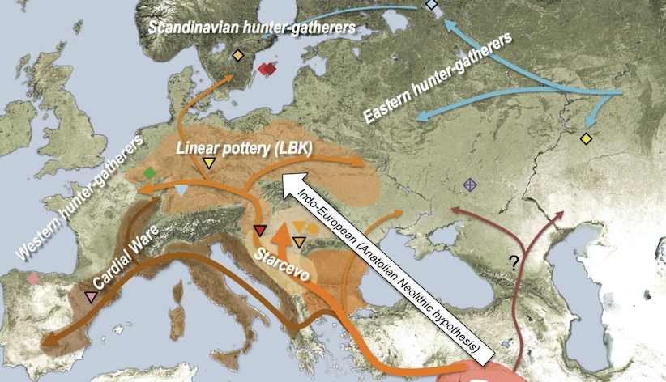
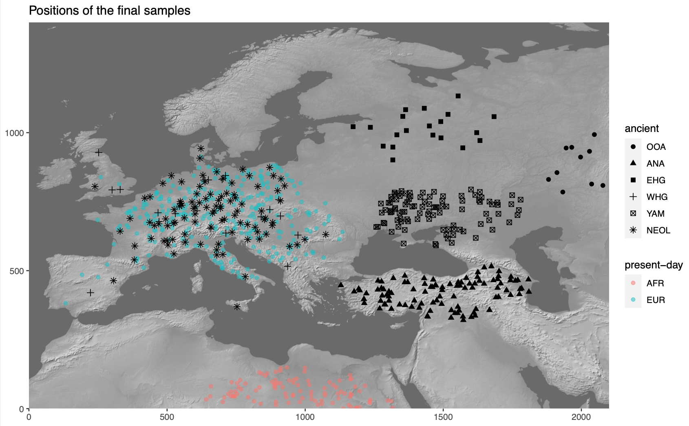

```{r, include = FALSE}
knitr::opts_chunk$set(
  collapse = TRUE,
  comment = "#>",
  fig.width = 7,
  fig.height = 5,
  dpi = 100
)
```


## Introduction


## Motivation

**What we want to do is simulate this kind of population history (splits
and admixture events):**

{width="80%"}

**in the context of this:**

{width="80%"}

**to produce this kind of data:**

{width="80%"}

This is possible to do in [SLiM](https://messerlab.org/slim/) using its
`defineSpatialMap()` functionality. However, there is currently no way
to define spatial maps programmatically, let alone build spatio-temporal
models which include population splits, admixture, migration, and
expansion. The package `spammr` is designed to do exactly this, and feed
the generated spatial maps into a dedicated back-end SLiM script.

## Philosophy

Geospatial analysis is a deep and complex topic, with many dozen
libraries and programs designed to deal with the annoying fact that the
Earth is a sphere but we often have no other choice but to plot things
(and simulate things in our case!) on a two-dimensional plane.

Luckily, most of the technical issues with [Coordinate Reference
Systems](https://en.wikipedia.org/wiki/Spatial_reference_system),
transformations between them and manipulation of geometric objects are
pretty much solved now. Unfortunately, dealing with these issues in
practice is quite challenging and requires non-trivial amount of domain
expertise. Programming even a simple task in this context also requires
a lot of code and there are no tools available for programming
population genetic simulations which are explicitly spatial in nature.

This R package is designed to provide a collection of primitives (a
[Domain Specific
Language](https://en.wikipedia.org/wiki/Domain-specific_language) of
sorts) for encoding migration and spatial boundaries of populations
across space and time *without having to explicitly deal with many of
the challenges inherent to geospatial analyses*.

Another goal is to make these spatio-temporal models fully reproducible,
easy to write and debug by inspecting each step of the configuration
visually, and finally to allow automated feeding of defined spatial maps
into the [SLiM](https://messerlab.org/slim/) population genetics
simulation framework.

```{r, echo = FALSE}
ggplot2::ggplot() +
    ggplot2::geom_sf(data = rnaturalearth::ne_coastline("small", "sf"), fill = NA, color = "black") +
    ggplot2::theme_bw() + ggplot2::coord_sf(crs = "EPSG:4326")
```

## Installation and setup

First, let's install the latest version of the package and load it:

```{r installation, eval=FALSE}
devtools::install_github("bodkan/spammr")
```

Now we can load it with other R package dependencies:

```{r setup}
#library(spammr)
devtools::load_all("~/projects/spammr")
```


## Defining the overall world map

Before we do anything else, we need to define a section of the map of
the world which will provide context for all downstream spatio-temporal
manipulation of population ranges.

In principle, any source of geospatial data which can be manipulated
using the [simple features (sf)](https://r-spatial.github.io/sf/)
infrastructure could be used. For now the `spammr` package implicitly
uses the [Natural Earth](https://www.naturalearthdata.com/) project data
(in it's vectorizes form!), which it internally loads using the
[rnaturalearth](https://cran.r-project.org/web/packages/rnaturalearth/README.html) interface.

The first function we will look at is `world_map()`, which will load the
map of the entire world in a vectorized format and zoom in (in fact,
crop) to a specified section of the world.

Note that in the call below, we specify the coordinates of the zoom in a
geographical Coordinate Reference System (CRS), i.e.
longitude/latitude), but we also specified that we want to perform all
the downstream manipulation of the spatial population maps in a
projected CRS ([Lambert Azimuthal Equal-Area
projection](https://epsg.io/3035)). This is more appropriate for
representing a wider European continent used in this tutorial. Of
course, different CRS projection could be used based on which part of
the world we want to simulate.

This is the current approach of `spammr`: let the user specify
everything in an easy to understand longitude/latitude geographical CRS.
However, in case it is necessary, the internal data structures and the
final exported spatial maps can be internally handled in a realistic
projected CRS which is better for ensuring undistorted distances and
proportions.

```{r}
world <- world_map(
  xrange = c(-15, 60),  # min-max longitude
  yrange = c(20, 65),   # min-max latitude
  crs = "EPSG:3035"  # real projected CRS used internally
)
```

Internally, the `world` object is a normal `sf` class object without
additional components. This is unlike other `spammr` object described
below, which are also `sf` objects but which carry additional internal
components.

Note that the summary of the object says "projected CRS: ETRS89-extended
/ LAEA Europe". This means that the world map has indeed been
transformed in the projected CRS we specified above.

```{r}
world
```


## Plotting geographical features and population ranges

The `spammr` package implements its own [generic
method](https://adv-r.hadley.nz/s3.html#s3-methods) called `plot()`,
which overrides the default `plot()` function used for [simple
features](https://r-spatial.github.io/sf/index.html) `sf` objects.

We do this in order to make it easier and more convenient to iteratively
build more complex models. The function can smartly decide based given
input arguments, what is the right way to present the data for the user
which helps to define models more quickly without relying on the
lower-level mechanisms of the `sf` package.

More on that below, but here we will just plot the world context we just
created:

```{r}
plot(world, title = "Zoomed-in world map context")
```


## Defining smaller geographic regions

In addition to the overall spatial map context, we can also define
smaller geographic boundaries. This is mostly useful whenever we want to
restrict a population movement (such as spatial population expansion) to
a smaller region of the map that has some intuitive geographic meaning
(i.e. Anatolia, West Eurasia, etc.).

```{r}
europe_anatolia <- region(
  "Western Europe & Anatolia",
  world,
  coords = list(
    c(-10, 35), c(-5, 35), c(10, 38), c(20, 35), c(38, 35),
    c(40, 40), c(30, 45), c(20, 58), c(-5, 60), c(-15, 50)
  )
)

europe <- region(
  "Western Europe",
  world,
  coords = list(
    c(-8, 35), c(-5, 36), c(10, 38), c(20, 35), c(25, 35),
    c(28, 45), c(20, 58), c(-5, 60), c(-15, 50)
  )
)

anatolia <- region(
  "Anatolia",
  world,
  coords = list(
    c(28, 35), c(40, 35),
    c(42, 40), c(30, 43), c(27, 40), c(25, 38)
  )
)
```

Again, the object returned by the `region()` function is actually a
normal `sf` object, but carrying some additional annotation such as the
name of the region (here "Anatolia"):

```{r}
anatolia
```

However, the object also carries additional class annotations for the
purpose of internal `spammr` machinery:

```{r}
class(anatolia)
```

Furthermore, note that in all `region()` calls we specified the `world`
object defined at the very beginning. This object is added as a hidden
attribute to each `spammr` object and represents the context for all
geospatial transformations, expansions, and plotting.

Again, we can use the generic `plot()` function to plot both geographic
regions in the context of the defined section of the world map:

```{r}
plot(europe, anatolia, title = "Geographic regions")
```

Note that the `world` object is no longer explicitly specified. It is
not needed, because each other class of objects provided to the `plot()`
function must carry it as a "world" attribute. In fact, each such object
must carry the same world context - `spammr` complains whenever this is
not the case.

We can check that the component is really there, although hidden, and
indeed is the same as the world object we created at the beginning:

```{r}
all(attr(europe, "world") == world)
all(attr(anatolia, "world") == world)
```


## Defining spatial population boundaries

### Circular population ranges

The whole point of `spammr` is formalizing the specification of spatial
population boundaries and their changes over time. The core function for
this is `population()`, which accepts the population `name` and the
`time` in which we want to enforce that population's boundary, as well
as the `world` object described above. Finally, this function accepts a
`center` and `radius` arguments (in case of circular population
boundaries):

```{r}
ooa <- population(
  "OOA",
  time = 55000,
  parent = "ancestor",
  Ne = 2000,
  world,
  center = c(65, 45), radius = 500
)

whg <- population(
  name = "WHG",       # population identifier
  time = 25000,       # time in years ago
  Ne = 4000,
  parent = ooa,
  world,              # world map 'context' for the population
  center = c(-1, 47), # (longitude, latitude)
  radius = 1300       # radius of a circle in km
)
```

If we call the `plot()` function on the returned object, we have the
option to either plot the population range in its "raw" form or in its
interected form, in which case the raw boundary is intersected with
spatial landscape (removing large bodies of water, etc.).

The intersected form is what is ultimately exported in a serialized form
(see below) to be loaded as a spatial map into SLiM. This is why the
`plot()` function renders population ranges by default.

```{r}
plot(whg, intersect = F, title = "'Raw' population range")
plot(whg, title = "'Intersected' population range")
```

### Polygon population ranges

Alternatively, it is also possible to define finer population boundaries
using a polygon geometry object (`coords=` argument) or a region object
created by the `region()` function above. Again, as a reminder, note
that all coordinates are described in the context of the geographic CRS.

```{r}
whg <- population(
  name = "WHG",   # population identifier
  time = 25000,   # time in years ago
  Ne = 4000,
  parent = ooa,
  world,          # world map 'context' for the population
  region = europe # geographic region object
)
```

```{r}
plot(whg, intersect = F, title = "'Raw' population range")
plot(whg, title = "'Intersected' population range")
```

Let's create more populations and their boundaries:

```{r}
ana <- population(
  name = "ANA", time = 9000, Ne = 8000, parent = ooa,
  world,center = c(34, 38), radius = 700,
  region = anatolia
)

yam <- population(
  name = "YAM", time = 7000, Ne = 6000, parent = ooa,
  world,
  coords = list(   # polygon specified using coordinates of vertices
    c(26, 50), c(38, 49), c(48, 50),
    c(48, 56), c(38, 59), c(26, 56)
  )
)

neol <- population(
  name= "NEOL", time = 7000, Ne = 10000, parent = whg,
  world,center = c(10, 48), radius = 800
)
```


## Spatial population expansion

We can simulate the expanding range of a population using the function
`expand()`, which accepts a parameter specifying by how many kilometers
should the boundary expand (the `by` argument), how long should the
expansion take (the `duration` argument) and how many intermediate
spatial map snapshots should be exported representing this expansion
(the `snapshots` argument).

For instance, let's represent the expansion of Anatolian farmers (this
uses an optional parameter `region` which restricts the expansion only
to Europe, instead of all around Anatolia).

```{r}
plot(ana, title = "Anatolian farmer population")
```

```{r}
ana <- ana %>%
  expand(
    by = 2500,
    duration = 5000,
    snapshots = 10,
    region = europe_anatolia
  )
```

Note that in principle, you could specify the entire spatio-temporal
history of a population in a single pipeline using the pipe operator
`%>%`.

We can inspect the object returned by the `expand()` function and see
that it contains he spatial maps ("snapshots") of the expansion process
across time:

```{r}
ana
```

We can (and should) check the results visually:

```{r}
plot(ana, title = "Anatolian expansion into Europe")
```

To visually see what is really going on behind the scene, we can plot
the raw form of the expansion:

```{r}
plot(ana, title = "Anatolian expansion into Europe (not intersected)", intersect = F)
```


## Population migration across a landscape

To describe a a directional population movement, we can use the function `migrate()`. This accepts the coordinates of the destination points along the way (`trajectory`), the `duration` of the migration, and the number of individual spatial maps to save during export (`snapshots`, same as the `expand()` function above).

```{r}
plot(yam, title = "Yamnaya range")
```

```{r}
yam <- yam %>%
  migrate(
    trajectory = c(10, 48), # migrate to this point
    duration = 1000,        # how many years does the migration take?
    snapshots = 8           # how many intermediate maps should be saved?
)
```

We can inspect the object returned by the `migrate()` function and see
that it contains not just the first YAM population range at 7000 years
ago, but also the ranges of the intermediate locations:

```{r}
yam
```

Checking the result visually again, we see:

```{r}
plot(yam, title = "Intermediate migration maps")
```

The migration trajectory can be much more complicated, however. Imagine
this:

```{r}
population(
  "nomadic population", time = 10000, Ne = 1000,
  parent = ooa,
  world,
  center = c(40, 60), radius = 350
) %>%
  migrate(
    trajectory = list(c(50, 50), c(50, 40), c(40, 30), c(20, 30),
                      c(0, 40), c(0, 50), c(20, 60), c(40, 60)),
    duration = 100,
    snapshots = 50
  ) %>%
  plot(intersect = F, title = "Migration along a trajectory")
```


## Plotting multiple `spammr` objects

In addition to plotting individual population ranges, the generic function `plot()` can handle a combination of population ranges, and can also partition them in individual facets. This is very useful for visual inspection of the specified model and for looking for potential issues before the export of individual spatio-temporal maps.

```{r}
plot(ooa, whg, neol, yam, ana)
```


## Rendering and export

OK, so far so good. We have nice and fancy way to plot colorful shapes
on a map, representing spatio-temporal population dynamics.

The ultimate goal of `spammr` is a formal specification of
spatio-temporal population boundaries for the purpose of forward simulations in SLiM. The crucial piece of machinery which connects the `spammr` R package with SLiM is an Eidos function called `defineSpatialMap()` which, among other parameters, accepts a two-dimensional matrix (essentially, a raster image) describing a spatial simulation landscape. See SLiM manual for more information.

**TODO: write a short tutorial on the SLiM side of the problem too.**

How do we link the visual (still vectorized!) spatial population ranges
shown above to SLiM? We need to export them in a rasterized form as
greyscale bitmaps The key is a `spammr` function `render`()`.

Without any arguments, the function simply generates a (named) list of
ggplot2 objects:

```{r}
maps <- render(whg, ana, neol, yam)
names(maps)
```

Each of these objects contains a black-and-white rasterized version of
the population range at a particular snapshot in time. Let's plot one of
them (representing the spatial range of the Anatolian farmers 5,500
thousand years ago - already at the stage in which they migrated to
central Europe):

```{r}
maps[["ANA_5500"]]
```

And here's the whole series:

```{r}
cowplot::plot_grid(plotlist = maps)
```

This is what will be ultimately loaded into SLiM, using our back-end
SLiM script which will swap different spatial maps in and out, as needed
throughout the course of the simulation.


## TODO and open questions

### 1. How to tie the visual configuration to an explicit admixture graph?

I.e., a population *A* splitting from a population *B* at a time *t*,
with a *Ne* of X.

Should this be represented as columns in the annotation data frame in
each `sf` object?

Should this be encoded in a separate table?

### 2. How to validate the entire model?

Currently, the "compilation" procedure dumps the spatial maps in a given
format on disk. Presumably (having solved item 1. above), we would also
save the table of split times, as well as the table of admixture edges
*and* a table of spatial maps.

The compilation process should validate that the configured
visual/split/admixture model is meaningful:

i)  Population migration maps should overlap to a reasonable degree?
    I.e. there should be a sufficient continuity/overlap between
    consecutive spatial maps over time.

ii) The overlap model should form a directed acyclic graph - there
    should be no "unreachable" population states.

### 3. How to actually implement admixture in a spatial context?

For instance, how to enforce that a population *C* contributes 60% of
its ancestry to a population *D*? What sort of meaning does it actually
have in the context of spatial maps and how they will be utilized by the
back-end SLiM script?

### 4. At which stage should the the user specify SLiM bits relevant to their work?

There's a clear conflict between every SLiM script being tailored to
each specific use-case and the fact that I want to make things as
reproducible and automatic as possible.

I have a nice generic SLiM back-end that slurps in the spatial maps,
defines population splits and migrations... but that's just the
demographic part. Should the user modify that script in SLiM GUI (which
is awesome and a big reason to use SLiM in the first place)? This hurts
the reproducibility, but I can't reasonably implement an R interface to
every possible SLiM use-case.
