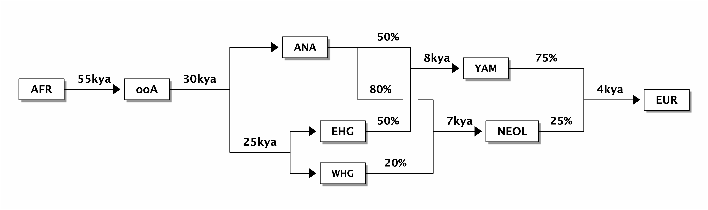
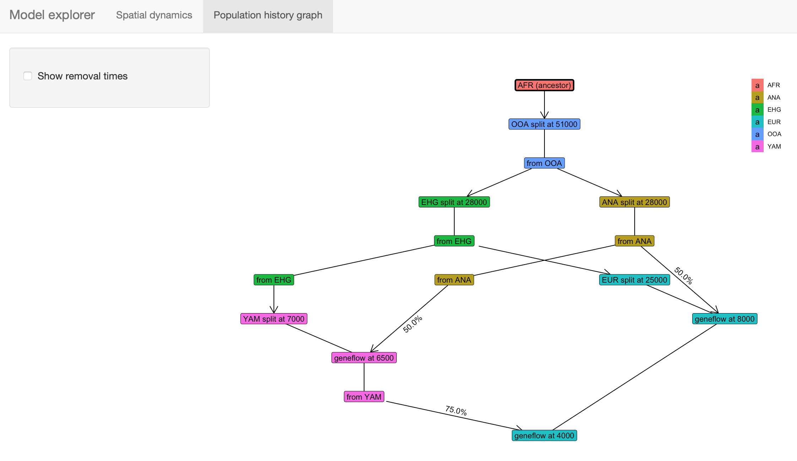

```{r, include = FALSE}
knitr::opts_chunk$set(
  collapse = TRUE,
  comment = "#>",
  fig.width = 6,
  fig.height = 4,
  dpi = 80,
  eval = TRUE
)
```


## Introduction


## Motivation

**What we want to do is simulate this kind of population history
  (splits and geneflow events):**

{width="80%"}

**in the context of this:**

{width="80%"}

This is possible to do in [SLiM](https://messerlab.org/slim/) using
its `defineSpatialMap()` functionality. However, there is currently no
way to define spatial maps programmatically, let alone build
spatio-temporal models which include population splits, geneflow,
migration, and expansion. The package `slendr` is designed to do
exactly this, and feed the generated spatial maps into a dedicated
back-end SLiM script.

## Philosophy

Geospatial analysis is a deep and complex topic, with dozens of
libraries and programs designed to deal with the annoying fact that the
Earth is a sphere but we often have to plot things
(and simulate things in our case!) on a two-dimensional plane.

Luckily, most of the technical issues with [Coordinate Reference
Systems](https://en.wikipedia.org/wiki/Spatial_reference_system),
transformations between them and manipulation of geometric objects are
pretty much solved now. Unfortunately, dealing with these issues in
practice is quite challenging and requires non-trivial amount of
domain expertise. Programming even a simple task in this context also
requires a lot of code and there are no tools dedicated to programming
population complex spatial population genetic simulations.

This R package is designed to provide a collection of primitives (a
[Domain Specific
Language](https://en.wikipedia.org/wiki/Domain-specific_language) of
sorts) for programming population dynamics (splits, movement,
geneflow, and expansion of spatial boundaries) across space and time
*without having to explicitly deal with many of the challenges
inherent to geospatial analyses*.

Another goal is to make these spatio-temporal models fully
reproducible, easy to write and debug by inspecting each step of the
configuration visually, and finally to allow automated feeding of
defined spatial maps into the [SLiM](https://messerlab.org/slim/)
population genetics simulation framework.

```{r world-map, echo = FALSE}
ggplot2::ggplot() +
    ggplot2::geom_sf(data = rnaturalearth::ne_coastline("small", "sf"),
    fill = NA, color = "black") +
    ggplot2::theme_bw() + ggplot2::coord_sf(crs = "EPSG:4326")
```

## Installation and setup

First, let's install the latest version of the package and load
it. _slendr_ is not yet on CRAN (but will be soon!), so you will need
to install the development version from Github using `devtools`.

Here are the installation steps:

1. Install non-R software dependencies

Some of the R libraries that _slendr_ uses internally rely on non-R
software that needs to be installed before doing anything else. At the
very least, you should make sure to install `udunits` and `gdal` on
your system (if you're on a Mac, I recommend
[homebrew](https://brew.sh/)). In my experience, some early users had
those already installed without even knowing it (perhaps because they
already used tools or R packages which depend on them).

2. Install the `devtools` package:

```{r, eval = FALSE}
install.packages("devtools")
```

On some systems, `devtools` installation fails because of missing
libgit dependency. If that happens, please install `libgit2` first (on
a Mac, you can use homebrew again).

3. Install _slendr_:

```{r, eval = FALSE}
devtools::install_github("bodkan/slendr")
```

```{r, echo = FALSE, message = FALSE}
devtools::load_all(".")
set.seed(314159)
```

4. That's it! You can now load the package with the usual:

```{r, eval = FALSE}
library(slendr)
```

Note that the package relies on several R packages for geospatial
analyses which, in turn, depend on other software. In case the
installation procedure in step #3 fails, inspect the error logs and
install the software dependencies manually (on a Mac, use a tool such
as `homebrew`). If that happens, I'd appreciate if you could submit an
issue on [Github](https://github.com/bodkan/slendr/issues). Thank you!

Finally, because the package is actively being worked on, improvements
and bug fixes are being added every couple of hours. Make sure to
install the development version each time you're about to test some
things (such as the examples in this vignette).


## Defining the overall world map

Before we do anything else, we need to define a section of the map of
the world which will provide context for all downstream spatio-temporal
manipulation of population ranges.

In principle, any source of geospatial data which can be manipulated
using the [simple features (sf)](https://r-spatial.github.io/sf/)
infrastructure could be used. For now the `slendr` package implicitly
uses the [Natural Earth](https://www.naturalearthdata.com/) project
data (in it's vectorized form!), which it internally loads using the
[rnaturalearth](https://cran.r-project.org/web/packages/rnaturalearth/README.html)
interface.

The first function we will look at is `map()`. This function will load
the map of the entire world in a vectorized format and zoom in to a
specified section of the world.

Note that in the call below, we specify the coordinates of the zoom in
a geographical Coordinate Reference System (CRS), i.e.
longitude/latitude), but we also specified that we want to perform all
the downstream manipulation of the spatial population maps in a
projected CRS ([Lambert Azimuthal Equal-Area
projection](https://epsg.io/3035)). This is more appropriate for
representing a wider European continent used in this tutorial. Of
course, different CRS projection could be used based on which part of
the world we want to simulate.

This is the current approach of `slendr`: let the user specify
everything in an easy to understand longitude/latitude geographical
CRS, but the internal data structures and the final exported spatial
maps are internally handled in a projected CRS which is better for
ensuring undistorted distances and proportions.

```{r world_zoom}
map <- world(
  xrange = c(-15, 60), # min-max longitude
  yrange = c(20, 65),  # min-max latitude
  crs = "EPSG:3035"    # real projected CRS used internally
)
```

Internally, the `map` object is a normal `sf` class object without
additional components. This is unlike other `slendr` object described
below, which are also `sf` objects but which carry additional internal
components.

Note that the summary of the object says "projected CRS:
ETRS89-extended / LAEA Europe". This means that the world map has
indeed been transformed in the projected CRS we specified above.

```{r}
map
```


## Plotting geographical features and population ranges

The `slendr` package implements its own plotting function called `plot()`.

We do this in order to make it easier and more convenient to
iteratively build more complex models. The function can smartly decide
(based on given input arguments) what is the right way to present the
data for the user which helps to define models more quickly without
relying on the lower-level mechanisms of the `sf` package.

More on that below, but here we will just plot the world context we
just created:

```{r plot_world}
plot(map, title = "Zoomed-in world map context")
```


## Defining smaller geographic regions

In addition to the overall spatial map context, we can also define
smaller geographic boundaries. This is mostly useful whenever we want
to restrict a population movement (such as spatial population
expansion) to a smaller region of the map that has some intuitive
geographic meaning (i.e. Anatolia, West Eurasia, etc.).

```{r}
africa <- region(
  "Africa", map,
  polygon = list(c(-18, 20), c(40, 20), c(30, 33),
                 c(20, 32), c(10, 35), c(-8, 35))
)
europe <- region(
  "Europe", map,
  polygon = list(
    c(-8, 35), c(-5, 36), c(10, 38), c(20, 35), c(25, 35),
    c(33, 45), c(20, 58), c(-5, 60), c(-15, 50)
  )
)
anatolia <- region(
  "Anatolia", map,
  polygon = list(c(28, 35), c(40, 35), c(42, 40),
                 c(30, 43), c(27, 40), c(25, 38))
)
```

Note that the objects created above are _not_ population boundaries
(not yet anyway)! These are nothing else but labels of some generic
geographic boundaries which can be used later. They are not attached
to any population at this point.


Again, the object returned by the `region()` function is actually a
normal `sf` object, but carrying some additional annotation such as
the name of the region (here "Anatolia"):

```{r}
anatolia
```

However, the object also carries additional class annotations for the
purpose of internal `slendr` machinery:

```{r}
class(anatolia)
```

Furthermore, note that in all `region()` calls we specified the
`map` object defined at the very beginning. This object is added as
a hidden attribute to each `slendr` object and represents the context
for all geospatial transformations, expansions, and plotting.

Again, we can use the generic `plot()` function to plot both
geographic regions in the context of the defined section of the world
map:

```{r plot_europe_anatolia}
plot(africa, europe, anatolia, title = "Geographic regions")
```

Note that the `map` object is no longer explicitly specified. It is
not needed, because each other class of objects provided to the
`plot()` function must carry it as a "map" attribute. In fact, each
such object must carry the same map context - `slendr` complains
whenever this is not the case.

We can check that the component is really there, although hidden,
using the built-in `attr` function and verify that it is the same as
the map object we created at the beginning:

```{r}
all(attr(europe, "map") == map)
all(attr(anatolia, "map") == map)
```


## Defining spatial population boundaries


One of the aims of the _slendr_ package is formalizing the
specification of spatial population boundaries and their changes over
time. The core function for this is `population()`, which accepts the
population `name` and the `time` in which we want to enforce that
population's boundary, the effective population size of this
population, as well as the `map` object described above. We also
have to specify from which population did our population split from
(or explicitly say that it's an ancestral population). As for
specifying the actual spatial boundaries, we have several options.


### Polygon population ranges

We can define fine population boundaries using a polygon geometry
object (`polygon = ` argument) or a region object created by the
`region()` function above. Again, as a reminder, note that all
coordinates are described in the context of the geographic CRS.

First, let's create the African ancestors of modern humans. We
restrict the spatial boundary of the African population to the
`africa` region defined above:

```{r plot_afr}
afr <- population(
  "AFR", parent = "ancestor", time = 52000, N = 3000,
  map = map, polygon = africa
)

plot(afr)
```


### Circular population ranges

In case we want to simulate a more abstract and simpler population
boundary, we can specify a `center` and `radius` arguments instead of
the polygons. All distance units in the _slendr_ package are specified
in the coordinate system given during "world creation". For instance,
EPSG 3035 we're using here specifies distances in meters:

Here we define the location of the population of non-Africans right
after their split from the African ancestors:

```{r, message = FALSE}
ooa <- population(
  "OOA", parent = afr, time = 51000, N = 500, remove = 25000,
  center = c(33, 30), radius = 400e3
)
```

If we call the `plot()` function on the returned object, we have the
option to either plot the population range in its "raw" form or in its
"intersected" form, in which case the raw boundary is intersected with
the "background" landscape (removing large bodies of water, etc.).

The intersected form is what is ultimately exported in a serialized
form (see below) to be loaded as a spatial map into SLiM. This is why
the `plot()` function renders intersected population ranges by
default.

```{r plot_ooa}
plot(ooa, intersect = FALSE, title = "'Raw' population range")
plot(ooa, title = "'Intersected' population range")
```


## Population movement across a landscape

To describe a a directional population movement, we can use the
function `move()`. This accepts the coordinates of the destination
points along the way (`trajectory`) and the `duration` of the migration and automatically generates intermediate spatial maps along the trajectory of movement to satisfy a sufficient degree of spatial continuity (this number can be also specified manually).

```{r, message = FALSE}
ooa <- ooa %>% move(
  trajectory = list(c(40, 30), c(50, 30), c(60, 40)),
  start = 50000, end = 40000
)
```

We can inspect the object returned by the `move()` function and see
that it now contains not just the first YAM population range at 7000
years ago, but also the ranges of the intermediate locations:

```{r}
ooa
```

Checking the result visually again, we see:

```{r plot_ooa_migration}
plot(ooa, title = "Intermediate migration maps")
```


Let's create a population of Eastern Hunter Gatherers (EHG), which
split from the first non-Africans 28000 years ago:

```{r plot_ehg}
ehg <- population(
  "EHG", parent = ooa, time = 28000, N = 1000, remove = 6000,
  polygon = list(
    c(26, 55), c(38, 53), c(48, 53), c(60, 53),
    c(60, 60), c(48, 63), c(38, 63), c(26, 60))
)

plot(ehg)
```

While we're at it, let's also create a population of Western Hunter
Gatherers (WHG). Because the people living in this region eventually
became present day Europeans after receiving geneflow from other
groups over time (see below), we will call them "EUR" to simplify the
modeling code a little bit:

```{r plot_eur}
eur <- population( # European population
  name = "EUR", parent = ehg, time = 25000, N = 2000,
  polygon = europe
)

plot(eur)
```


## Spatial population expansion

We can simulate the expanding range of a population using the function
`expand()`, which accepts a parameter specifying by how many
kilometers should the boundary expand (the `by` argument), how long
should the expansion take (the `duration` argument) and how many
intermediate spatial map snapshots should be exported representing
this expansion (the `snapshots` argument).

For instance, let's represent the expansion of Anatolian farmers, who
also split from the OOA population at 28000 years ago, at the time of
the split of the EHG population. Note that we use use an optional
parameter `polygon` which restricts the expansion only to Europe,
instead of all around Anatolia:

```{r, message = FALSE}
ana <- population( # Anatolian farmers
  name = "ANA", time = 28000, N = 3000, parent = ooa, remove = 4000,
  center = c(34, 38), radius = 500e3, polygon = anatolia
) %>%
  expand( # expand the range by 2.500 km
    by = 2500e3, start = 10000, end = 7000,
    polygon = join(europe, anatolia)
  )
```

Note that in principle, you could specify the entire spatio-temporal
history of a population in a single pipeline using the pipe operator
`%>%`.

Again, we can inspect the object returned by the `expand()` function
and see that it contains the spatial maps ("snapshots") of the
expansion process across time:

```{r}
ana
```

We can (and should) check the results visually:

```{r plot_ana}
plot(ana, title = "Anatolian expansion into Europe")
```

To visually see what is really going on behind the scenes, we can plot
the raw form of the expansion:

```{r plot_ana_raw}
plot(ana, title = "Anatolian expansion into Europe (not intersected)", intersect = FALSE)
```


We can see that the population of Anatolian farmers at some point
invades the spatial boundary of the EUR population. On its own, this
doesn't imply geneflow. In the section on geneflow below, we will
see how _slendr_ implements geneflow of overlapping (but also
non-overlapping) populations.


Let's add a couple of more populations and migrations before we move
on to implementing geneflow between them,


Yamnaya steppe herders:

```{r plot_yam}
yam <- population( # Yamnaya steppe population
  name = "YAM", time = 7000, N = 500, parent = ehg, remove = 2500,
  polygon = list(c(26, 50), c(38, 49), c(48, 50),
                 c(48, 56), c(38, 59), c(26, 56))
)

plot(yam)
```

Yamnaya invading Europe:


```{r plot_yam_migr, message = FALSE}
yam <- yam %>%
  move(
    trajectory = c(15, 50),
    start = 5000, end = 3000, snapshots = 8
  )

plot(yam)
```


## Plotting multiple `slendr` objects

In addition to plotting individual population ranges, the generic
function `plot()` can handle a combination of population ranges, and
can also partition them in individual facets. This is useful for
visual inspection of the specified model and for looking for potential
issues before the export of individual spatio-temporal
maps. Obviously, this is a lot of multi-dimensional information:

```{r plot_maps}
plot(afr, ooa, ehg, eur, ana, yam)
```

Below you will see a better way to explore a _slendr_ model interactively.


## Define geneflow events

The way `slendr` implements geneflow events is by calling the
`geneflow()` function. This function has a very straightforward
interface which you should be able to understand from the examples
below.

One thing to note is that the `from` and `to` populations must have
overlapping spatial ranges in order to simulate geneflow. This is
probably rather obvious, as populations can't mix in space-time if
they don't overlap at a given point in space-time.

For example, if you look at the spatial boundaries plotted above,
you'll see that the European and African populations don't have any
overlap in population ranges. If we try to instruct `slendr` to
simulate geneflow between them, we will get an error:

```{r eval = FALSE}
geneflows <- geneflow(from = eur, to = afr, rate = 0.1, start = 20000, end = 15000)
```

```
Not a sufficient overlap between population ranges of EUR and AFR
at time 20000. The required overlap is 0.20 but the current overlap is
0.000000.

Please check the spatial maps of both populations by running
`plot(eur, afr)` and adjust them accordingly. Alternatively, in case
this makes sense for your model, you can add `overlap = F` which
will instruct slendr to simulate geneflow without spatial overlap
between populations.
```

The error message instructs us to visually verify that this is the
case, which can be done by `slendr`'s `plot()` function and the
optional parameter `pop_facets = F` (which is set to `TRUE` by
default):

```{r plot_nonoverlapping}
plot(eur, afr)
```

Many models will include multiple geneflow events, which we can
collect in a simple R list:

```{r}
gf <- list(
  geneflow(from = ana, to = yam, rate = 0.5, start = 6500, end = 6400, overlap = FALSE),
  geneflow(from = ana, to = eur, rate = 0.5, start = 8000, end = 6000),
  geneflow(from = yam, to = eur, rate = 0.75, start = 4000, end = 3000)
)
```

The `geneflow()` function returns nothing else than a
data frame collecting all the geneflow parameters for the
`compile()` step below:

```{r}
gf
```


## Compile the whole model and load it in SLiM

The most crucial function of `slendr` is `compile()`. It takes all
population ranges defined across space and time together with list of
geneflow events (this is optional, of course, as some models won't
include geneflow), and then proceeds by converting all vectorized
spatial ranges to a raster bitmap form. Furthermore, it compiles all
information about split times, $N_e$ values, geneflow directions,
times and rates, to a series of tables. All of that will be saved
automatically in a dedicated directory in a format that is understood
by the backend SLiM script provided by `slendr` (more on that below).

```{r}
model <- compile(
  populations = list(afr, ooa, ehg, eur, ana, yam), # populations defined above
  geneflow = gf, # geneflow events defined above
  generation_time = 30,
  resolution = 10e3, # resolution in meters per pixel
  competition_dist = 130e3, mate_dist = 100e3, # spatial interaction in SLiM
  dispersal_dist = 70e3, # how far will offspring end up from their parents
  dir = file.path(tempdir(), "tutorial-model"),  overwrite = TRUE
)
```

What do the files in the model directory look like? In an ideal case,
you as a user should never worry about these things. In fact, the
whole purpose of `slendr` is to let you work on much higher level of
abstraction without worrying about these low-level details. That said,
you might find it useful to see how things are stored in the
background...

First of all, we can inspect the contents of the directory and see
that it does, indeed, contain all defined spatial maps (now PNG files,
which is what SLiM requires).

```{r}
list.files(file.path(tempdir(), "tutorial-model"), pattern = "*.png")
```

It also contains a series of tab-separated configuration tables. These
tables contain summaries of the model parameters which we defined
graphically above, namely:

- the table of population splits:

```{r}
read.table(file.path(tempdir(), "tutorial-model", "splits.tsv"), header = TRUE)
```

- the table of geneflow events:

```{r}
read.table(file.path(tempdir(), "tutorial-model", "geneflow.tsv"), header = TRUE)
```

- and finally, the table of populations whose spatial maps will be
  updated throughout the simulation, as well as the times of those
  updates (this table is rather long, so we're taking a peek at only
  the first couple of lines):

```{r}
head(read.table(file.path(tempdir(), "tutorial-model", "maps.tsv"), header = TRUE))
```

The object returned by the `compile()` function (called `model` here) binds all of this information together. In fact, for easier debugging and sanity checks, it carries the locations of these tables (as well as other important information) in it as elements of a list `model$splits`, `model$geneflows`, etc.

In case you'd want to separate model specification and running into different scripts, _slendr_ includes a function `read()` just for this purpose:

```{r}
loaded_model <- read(file.path(tempdir(), "tutorial-model"))
```


## Visualize the entire history of splits and geneflows

With the couple of code snippets above, we have defined a simple
history of European populations over the last 50 thousand years. This
history includes population splits and geneflow events as well as
other demographic changes. While _slendr_ tries to make the formal
specification of spatio-temporal population dynamics as concise as
possible, in the hope to increase reproducibility and minimize errors,
because the geneflow history can be very complex and occurs both
across space and time, it is hard to really visualize everything that
will happen on the SLiM side after the simulation starts just from the
code alone.

For this purpose, the package includes a function `graph()` which
takes in all the information about the relationships between
populations (i.e., the population and geneflow objects we defined
above) and plots it all in the form of a so-called _admixture graph_
(see
[here](https://academic.oup.com/genetics/article/192/3/1065/5935193)
for a discussion of the admixture graph concept).

One important thing to note here is that unlike traditional admixture
graphs where each node/population is present only once, in the full
_slendr_ graph, a single population can participate in many geneflow
events over the course of history. This is visualized by assigning a
color to each population, and different nodes of the same color
representing snapshots in time when a demographic event affecting that
population happens.

```{r plot_graph, fig.width = 12, fig.height = 12}
graph(model)
```


## Interactive exploration of spatio-temporal models

A slightly fancier way to visualize models is implemented in a function `explore()`. This function accepts a compiled model as its only parameter and spawns an [R shiny](https://shiny.rstudio.com)-based browser app which makes it possible to click through the time snapshots interactively and visualize the spatial maps in each time point.

```{r eval = FALSE}
explore(model)
```




## Running the simulation

The way we feed the entire serialized model into SLiM is through the
`slim()` function, which understands the format of the model directory
created by the `compile()` function and generates a SLiM script (using
a backend skeleton script which is a part of this package and can be
found by calling `system.file("inst/extdata/backend.slim", package =
"slendr")`, in case you'd like to peek into its internals).

Note that when you run this model in SLiMgui (which should
automatically open by calling the command below), you will see
populations pop up in individual panels. This is how SLiMgui tracks
spatial ranges of different populations.  _Everyone is still simulated
in the same world_, it's just that the simulation visualizes
individual population ranges separately to reduce clutter.

A couple of more things to note: notice that the function accepts
several parameters determining the length of the simulated sequence
and the recombination rate, as well as the length of the burnin
period, the total time of the simulation run (excluding burnin), and
generation time (which is used to convert all times defined during
model specification above into SLiM's inetrnal units of generations).

Finally, the parameter `track_ancestry` determines whether we want our
SLiM script to track ancestry proportion changes in all simulations
using neutral markers uniformly distributed along each genome. The
default value of this parameter is `FALSE` and no ancestry tracking is
performed. Any other non-zero, posititive integer value specifies how
many markers we want to use for tracking. Please note that this
*significantly* increases the simulation overhead, not only because
the actual burden of mutation objects being simulated, but also
because the ancestry is calculated in each generation for each
simulated genome. In this case, we're tracking ancestry using a single
non-recombining marker to minimize computational time for the purposes
of this demo.

Ancestry tracking is very useful to monitor that the spatial geneflow
model as defined in R really behaves as expected even on the SLiM
side. This can be verified by inspecting files named as
`output_ancestry_XXX.tsv` in the specified output directory. See the
manpage of `slim()` for more details.

```{r}
slim(
  model,
  seq_length = 1, recomb_rate = 0, # simulate only a single locus
  save_locations = TRUE, # save the location of everyone who ever lived
  track_ancestry = 1,
  method = "batch", # change to "gui" to execute the model in SLiMgui
  seed = 314159265
)
```

## Post-simulation diagnostics

In case we instructed `slendr` to track ancestry proportions, we can
visualize them after the simulation is over using the built-in
`diagnostics()` function. This is quite bare-bones for now and the way
diagnostics are generated is subject to change...

```{r plot_ancestries}
ancestries(model)
```

Similarly, we can recapitulate the spatial dynamics with the _slendr_
function `animate()` (this functions is also very bare-bones at the
moment and is mostly useful as a proof of concept rather than anything
else):

```{r plot_gif}
animate(model, steps = 100, width = 500, height = 300)
```

In case an argument `gif = ...` was provided, the function will save
the animation to the specified location as a GIF file. Note that
unless your simulation is very short and/or involves only a small
population, rendering of the animation can take several minutes.
