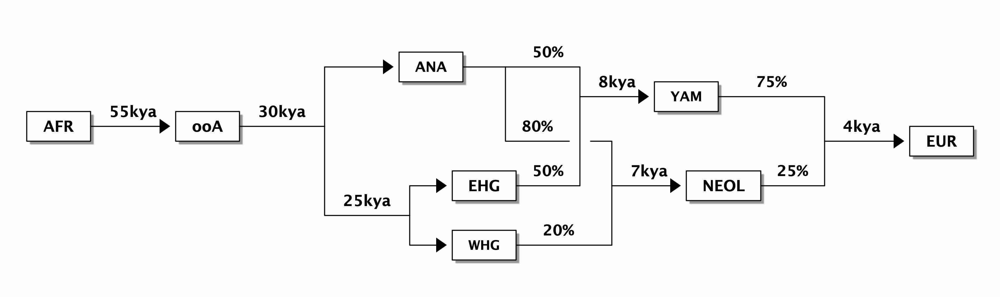
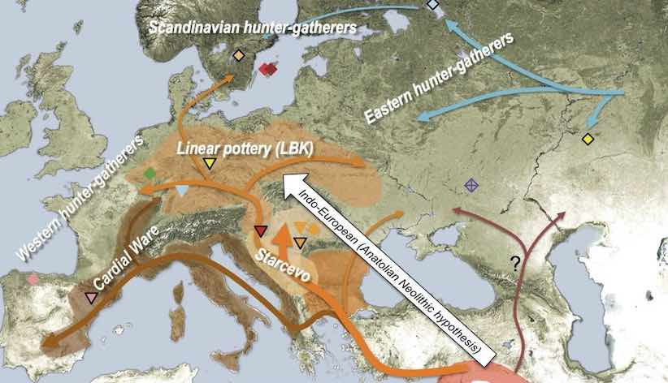
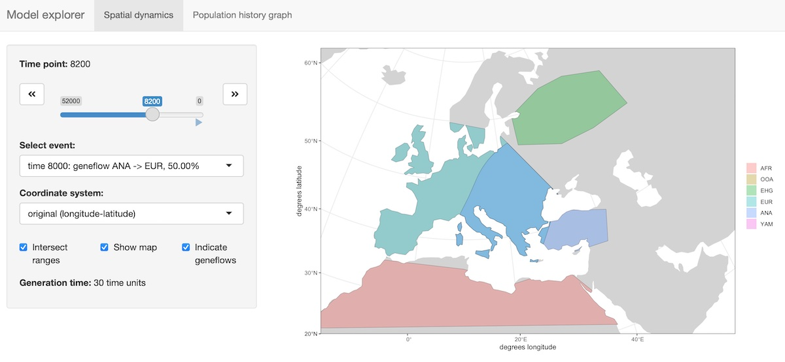

```{r, include = FALSE}
env_present <- "automatic_slendr_python_env" %in% reticulate::conda_list()$name

knitr::opts_chunk$set(
  collapse = FALSE,
  comment = "#>",
  fig.width = 6,
  fig.height = 4,
  dpi = 80,
  eval = Sys.which("slim") != "" && env_present && Sys.getenv("$RUNNER_OS") != "macOS"
)
```

## Motivation

Our motivation for starting this project was to create a programmable simulation framework which would add an explicit spatial dimension to population genetics models. Specifically, the original idea was to be able to take models such as the one here---

{width="80%"}

representing a very simplified view of the history of anatomically modern humans (AMH) in West Eurasia over the last \~50 thousand years (a comprehensive overview can be found in a review by [Lazaridis](https://arxiv.org/abs/1805.01579))---and design a tool which makes it possible to simulate such models in an explicit geographical context to capture processes similar to those in the following figure (taken from a study by [Haak et al. 2015](https://www.nature.com/articles/nature14317)):

{width="80%"}

The reason for doing this is probably clear. A lot of what we do in studying the history of humans and other species is focused on reconstructing population movements, expansions and gene flow events, all of which happen in a geographic context. In fact, this geographic component is often what we are most interested in (i.e., "Where did the ancestors of some population come from?", "By which route and how fast did they migrate?", etc.). However, this goes beyond just simulating demographic history. For instance, selection pressure driving adaptation can often be spatially heterogeneous: members of a population occupying one part of the continent could be exposed to a different environmental pressure than individuals elsewhere, and allele frequency distributions shaped by the adaptation process would reflect this spatial heterogeneity accordingly. Having a framework that enables the simulation of explicitly spatial genomic data in such situations would allow us to build more realistic models and test more specific hypotheses, goals that are simply not possible using non-spatial simulation methods.

The R package *slendr* introduced in this vignette presents such a framework. Internally, the package has two independent but tightly interconnected units:

1.  An **R interface** which provides a set of functional primitives (a "mini-language" of sorts) for encoding various features of spatio-temporal models: population migrations, expansions and gene flow, all happening on a real geographic landscape defined by freely available cartographic data. Populations are represented as simple R objects with easily visualized spatial boundaries, making it possible to build very complex models interactively from a set of small and simple building blocks.

2.  A **SLiM simulation back end** represented by a built-in generic SLiM script designed to read all the spatio-temporal model configuration parameters and objects established in step 1. above, and tailor the simulation run to the user-defined model. Alternatively, *slendr* also supports executing standard population genetics models in a random-mating setting. This means that models do not need an explicit geographic map and can be simulated either with the same built-in SLiM back end script, or with a more efficient [*msprime* back end](vignette-07-backends.html) which is also provided with the package.

The most important design objective was to make the integration of parts 1. and 2. appear completely seamless. Even for extremely complex models, the model building and execution (i.e., simulation) can be performed without leaving the convenience of an R interface such as RStudio. All the simulation complexities happen automatically under the hood and knowledge of SLiM is not required. In fact, the motto of the *slendr* package is "Write complex spatiotemporal population genetics models as a simple R script."

## Geospatial data

Geospatial analysis is a deep and complex topic, with dozens of libraries and programs designed to deal with the fact that the Earth is a three-dimensional object but we are forced to plot geographical objects (and, in our case, simulate data) on a two-dimensional plane.

Luckily, most of the technical issues with [Coordinate Reference Systems](https://en.wikipedia.org/wiki/Spatial_reference_system), transformations between them and manipulation of geometric objects (shifting of population boundaries, expansions, etc.) are pretty much solved now. Unfortunately, dealing with these issues in practice is quite challenging and requires a non-trivial degree of domain expertise. Programming even a very simple task in geospatial data analysis also often requires a lot of code.

This R package is designed to provide a collection of primitives (a ["mini-language"](https://en.wikipedia.org/wiki/Domain-specific_language) of sorts) for programming population dynamics (splits, movement, gene flow, and expansion of spatial boundaries) across space and time *without having to explicitly deal with any of the challenges inherent to geospatial analyses*.

## Installation and setup

First, let's install the latest version of the package and load it. *slendr* is not yet on CRAN (but will be soon!), so you will need to install the development version from GitHub using `devtools`.

Here are the installation steps:

1.  Install non-R software dependencies

Some of the R libraries that *slendr* uses internally rely on non-R software that needs to be installed before doing anything else. At the very least, you should make sure to install `udunits` and `gdal` on your system (if you're on a Mac, I recommend [homebrew](https://brew.sh/)).

There is one simple test to make sure that you will be able to install and use *slendr*. A lot of the geospatial heavy lifting is being done by the [*sf*](http://r-spatial.github.io/sf/) package. This is an R package we use to manipulate geometric objects in space and time (all of which is considered internal low-level implementation detail, so you are never exposed to it). **My suggestion is to first make sure that you can successfully install *sf* by running `install.packages("sf").`** After that, installing *slendr* is trivial.

2.  Install the *devtools* package:

```{r, eval = FALSE}
install.packages("devtools")
```

On some systems, *devtools* installation fails because of a missing `libgit` dependency. If that happens, please install `libgit2` first (on a Mac, you can use [homebrew](https://brew.sh/) again).

3.  Install *slendr*:

```{r, eval = FALSE}
devtools::install_github("bodkan/slendr")
```

This is necessary because *slendr* is not on [CRAN](https://cran.r-project.org) yet. Once it is there, it will be possible to install it by simply running `install.packages("slendr")` in your R console.

4.  That's it! You can now load the package with the usual:

```{r}
library(slendr)

set.seed(314159)
```

Finally: because the package is actively being worked on, improvements and bug fixes are being added every couple of hours. **Make sure to install the latest development version (step 3. above) each time you're about to test something (such as the examples in this vignette).**

## Defining the overall world map

Before we do anything else, we need to define a section of the map of the world which will provide context for all downstream spatio-temporal manipulation of population ranges.

In principle, any source of geospatial data which can be manipulated using the [simple features (sf)](https://r-spatial.github.io/sf/) infrastructure could be used. For now the *slendr* package implicitly uses the [Natural Earth](https://www.naturalearthdata.com/) project data (in its vectorized form!), which it internally loads using the [rnaturalearth](https://cran.r-project.org/package=rnaturalearth/README.html) interface.

The first *slendr* function we will look at is `map()`. This function will load the map of the entire world in a vectorized format and zoom in to a specified section of the world.

Note that in the call below, we specify the coordinates of the zoom in a geographical Coordinate Reference System (CRS), longitude/latitude, but we also specified that we want to perform all the downstream manipulation of the spatial population maps in a projected CRS ([Lambert Azimuthal Equal-Area projection](https://epsg.io/3035)) which is more appropriate for representing the wider European continent used in this tutorial. Of course, different CRS projections could be used based on which part of the world we want to simulate. Describing the intricacies of coordinate reference systems is beyond the scope of this tutorial, but if you're interested in learning more I encourage you to read a couple of paragraphs in [this section](https://keen-swartz-3146c4.netlify.app/intro.html#coordinate-reference-systems) of a freely available textbook dedicated to this topic (written by the author of the *sf* package himself!).

This is the approach of *slendr*: let the user specify everything in an easy-to-understand longitude/latitude geographical CRS (which can be read from any map, making it very easy to define spatial boundaries and trajectories of movement), but the internal data structures and the final exported spatial maps are internally handled in a projected CRS, which is important to make sure that distances and proportions are not distorted.

```{r, world_zoom, results = FALSE}
map <- world(
  xrange = c(-15, 60), # min-max longitude
  yrange = c(20, 65),  # min-max latitude
  crs = "EPSG:3035"    # projected CRS used internally
)
```

Internally, the `map` object is currently a normal `sf` class object without additional components. This is unlike other `slendr` objects described below, which are also `sf` objects but which carry additional internal components.

Note that the summary of the object says "projected CRS: ETRS89-extended / LAEA Europe". This means that the world map has indeed been transformed into the projected CRS we specified above.

```{r}
map
```

## Plotting geographic features and population ranges

The *slendr* package implements its own plotting function called `plot()`.

We do this in order to make it easier and more convenient to iteratively build more complex models. The function can intelligently decide (based on given input arguments) the right way to present the data to the user, which helps to define models more quickly without relying on the lower-level mechanisms of the `sf` package. You will see some examples of `plot()` in action below.

## Defining smaller geographic regions

In addition to the overall spatial map context, we can also define smaller geographic boundaries. This is mostly useful whenever we want to restrict a population's movement (such as spatial population expansion) to a smaller region of the map that has some intuitive geographic meaning (i.e., Anatolia, West Eurasia, etc.).

```{r}
africa <- region(
  "Africa", map,
  polygon = list(c(-18, 20), c(40, 20), c(30, 33),
                 c(20, 32), c(10, 35), c(-8, 35))
)
europe <- region(
  "Europe", map,
  polygon = list(
    c(-8, 35), c(-5, 36), c(10, 38), c(20, 35), c(25, 35),
    c(33, 45), c(20, 58), c(-5, 60), c(-15, 50)
  )
)
anatolia <- region(
  "Anatolia", map,
  polygon = list(c(28, 35), c(40, 35), c(42, 40),
                 c(30, 43), c(27, 40), c(25, 38))
)
```

Note that the objects created above are *not* population boundaries (not yet anyway)! These are simply labels for some generic geographic boundaries that can be used later. They are not attached to any population at this point.

Again, the object returned by the `region()` function is actually an `sf` object, but carries some additional annotation such as the name of the region (here "Anatolia"):

```{r}
anatolia
```

However, the object also carries additional class annotations for the purpose of internal *slendr* machinery:

```{r}
class(anatolia)
```

Furthermore, note that in all `region()` calls we specified the `map` object that we defined at the very beginning. This object is added as a hidden attribute to each `slendr` object and represents the context for all geospatial transformations, expansions, and plots.

We can use the generic `plot()` function to plot these geographic regions in the context of the defined section of the world map:

```{r plot_europe_anatolia}
plot(africa, europe, anatolia, title = "Geographic regions")
```

Note that the `map` object is no longer explicitly specified. It is not needed, because each other class of objects provided to the `plot()` function must carry it as a "map" attribute. In fact, each such object must carry the same map context --- *slendr* complains whenever this is not the case.

We can check that the component is really there, although hidden, using the built-in `attr` function and verify that it is the same as the map object we created at the beginning:

```{r}
all(attr(europe, "map") == map)
all(attr(anatolia, "map") == map)
```

## Defining spatial population boundaries

One of the aims of the *slendr* package is to formalize the specification of spatial population boundaries and their changes over time. The core function for this is `population()`, which takes a population `name`, the `time` at which we want to enforce that population's boundary, the effective population size of the population at that time, and the `map` object described above. We also have to specify which existing population the specified population split from (or explicitly say that it's an ancestral population). As for specifying the actual spatial boundaries, we have several options.

### Polygon population ranges

We can define detailed population boundaries using a polygon geometry object or a region object created by the `region()` function above, using a `polygon =` argument to `population()`. Again, as a reminder, note that all coordinates are described in the context of the geographic CRS.

First, let's create the African ancestors of modern humans. We restrict the spatial boundary of the African population to the `africa` region defined above:

```{r plot_afr}
afr <- population(
  "AFR", parent = "ancestor", time = 52000, N = 3000,
  map = map, polygon = africa
)

plot(afr)
```

### Circular population ranges

If we want to simulate a more abstract and simple population boundary, we can specify a circular range with `center` and `radius` arguments instead of a polygon. All distance units in the *slendr* package are specified in the coordinate system given during "world creation". For instance, EPSG 3035 (which we're using here) specifies distances in meters.

Here we define the location of the population of non-Africans right after their split from their African ancestors:

```{r, message = FALSE}
ooa <- population(
  "OOA", parent = afr, time = 51000, N = 500, remove = 25000,
  center = c(33, 30), radius = 400e3
)
```

If we call the `plot()` function on the returned object, we have the option to either plot the population range in its "raw" form or in its "intersected" form, in which case the raw boundary is intersected with the "background" landscape (removing large bodies of water, etc.).

The intersected form is what is ultimately exported in a serialized format (see below) to be loaded as a spatial map into SLiM. This is why the `plot()` function renders intersected population ranges by default.

```{r plot_ooa}
plot(ooa, intersect = TRUE, title = "'Intersected' population range")
```

## Population movement across a landscape

To describe a directional population movement, we can use the function `move()`. This accepts the coordinates of the destination points along the way (`trajectory`) and the `duration` of the migration, and automatically generates a number of intermediate spatial maps along the trajectory of movement to produce a reasonable degree of spatial continuity (this number can be also specified manually).

```{r, message = FALSE}
ooa <- ooa %>% move(
  trajectory = list(c(40, 30), c(50, 30), c(60, 40)),
  start = 50000, end = 40000
)
```

We can inspect the object returned by the `move()` function and see that it now contains not just the first YAM population range at 7000 years ago, but also the ranges of the intermediate locations:

```{r}
ooa
```

Checking the result visually again, we see:

```{r plot_ooa_migration}
plot(ooa, title = "Intermediate migration maps")
```

Let's create a population of Eastern Hunter Gatherers (EHG), which split from the first non-Africans 28000 years ago:

```{r plot_ehg}
ehg <- population(
  "EHG", parent = ooa, time = 28000, N = 1000, remove = 6000,
  polygon = list(
    c(26, 55), c(38, 53), c(48, 53), c(60, 53),
    c(60, 60), c(48, 63), c(38, 63), c(26, 60))
)
```

While we're at it, let's also create a population of Western Hunter Gatherers (WHG). Because the people living in this region eventually became present day Europeans after receiving gene flow from other groups over time (see below), we will call them "EUR" to simplify the modeling code a little bit:

```{r plot_eur}
eur <- population( # European population
  name = "EUR", parent = ehg, time = 25000, N = 2000,
  polygon = europe
)
```

## Spatial population expansion

We can simulate the expanding range of a population using the function `expand()`, which accepts parameters specifying how many kilometers the boundary should expand by (the `by` argument), how long should the expansion should take (the `duration` argument) and how many intermediate spatial map snapshots should be exported representing the expansion (the `snapshots` argument).

For instance, let's represent the expansion of Anatolian farmers, who also split from the OOA population at 28000 years ago at the time of the split of the EHG population. Note that we use an optional parameter, `polygon`, which restricts the expansion only to Europe, instead of all around Anatolia:

```{r, message = FALSE}
ana <- population( # Anatolian farmers
  name = "ANA", time = 28000, N = 3000, parent = ooa, remove = 4000,
  center = c(34, 38), radius = 500e3, polygon = anatolia
) %>%
  expand( # expand the range by 2.500 km
    by = 2500e3, start = 10000, end = 7000,
    polygon = join(europe, anatolia)
  )
```

Note that, in principle, you could specify the entire spatio-temporal history of a population in a single pipeline using the pipe operator `%>%`.

Again, we can inspect the object returned by the `expand()` function and see that it contains the spatial maps ("snapshots") of the expansion process across time:

```{r}
ana
```

We can (and should) check the results visually:

```{r plot_ana}
plot(ana, title = "Anatolian expansion into Europe")
```

To visually see what is really going on behind the scenes, you can also plot the raw, non-intersected form of the expansion with:

```{r plot_ana_raw, eval = FALSE}
plot(ana, title = "Anatolian expansion into Europe (not intersected)", intersect = FALSE)
```

We can see that the population of Anatolian farmers at some point invades the spatial boundary of the EUR population. On its own, this doesn't imply gene flow. In the section on gene flow below, we will see how *slendr* implements gene flow between overlapping (or non-overlapping) populations.

Let's add a couple more populations and migrations before we move on to implementing gene flow between them.

Yamnaya steppe herders:

```{r plot_yam_migr}
yam <- population( # Yamnaya steppe population
  name = "YAM", time = 7000, N = 500, parent = ehg, remove = 2500,
  polygon = list(c(26, 50), c(38, 49), c(48, 50),
                 c(48, 56), c(38, 59), c(26, 56))
) %>%
  move(
    trajectory = c(15, 50),
    start = 5000, end = 3000, snapshots = 8
  )

plot(yam)
```

## Plotting multiple *slendr* objects

In addition to plotting individual population ranges, the generic function `plot()` can handle a combination of population ranges, and can also partition them into individual facets. This is useful for visual inspection of the specified model, and for looking for potential issues before the export of individual spatio-temporal maps. Obviously, this is a lot of multi-dimensional information:

```{r plot_maps}
plot(afr, ooa, ehg, eur, ana, yam)
```

Below you will see a better way to explore a *slendr* model interactively.

## Defining gene flow events

The way *slendr* implements gene flow events is by calling the `geneflow()` function. This function has a very straightforward interface, shown below.

One thing to note is that by default, the `from` and `to` populations for gene flow events must have overlapping spatial ranges in order to simulate gene flow. This is probably rather obvious, as populations can't mix in space-time if they don't overlap at a given point in space-time.

For example, if you look at the spatial boundaries plotted above, you'll see that the European and African populations don't have any overlap in population ranges. If we try to instruct *slendr* to simulate geneflow between them, we will get an error:

```{r eval = FALSE}
geneflows <- geneflow(from = eur, to = afr, rate = 0.1, start = 20000, end = 15000)
```

    Not a sufficient overlap between population ranges of EUR and AFR
    at time 20000. The required overlap is 0.20 but the current overlap is
    0.000000.

    Please check the spatial maps of both populations by running
    `plot(eur, afr)` and adjust them accordingly. Alternatively, in case
    this makes sense for your model, you can add `overlap = F` which
    will instruct slendr to simulate geneflow without spatial overlap
    between populations.

The error message instructs us to visually verify that this is the case, which can be done by *slendr*'s `plot()` function and the optional parameter `pop_facets = F` (which is set to `TRUE` by default).

Many models will include multiple gene flow events, which we can collect in a simple R list:

```{r}
gf <- list(
  geneflow(from = ana, to = yam, rate = 0.5, start = 6500, end = 6400, overlap = FALSE),
  geneflow(from = ana, to = eur, rate = 0.5, start = 8000, end = 6000),
  geneflow(from = yam, to = eur, rate = 0.75, start = 4000, end = 3000)
)
```

The `geneflow()` function simply returns a data frame collecting all the geneflow parameters for the `compile()` step below:

```{r}
gf
```

## Compile the whole model and load it in SLiM

The most crucial function of *slendr* is `compile()`. It takes all population ranges defined across space and time, together with a list of gene flow events (optional, since some models won't include gene flow), and then proceeds by converting all vectorized spatial ranges into raster bitmaps. Furthermore, it compiles all information about split times, $N_e$ values, gene flow directions, times, and rates into a series of tables. All of that will be saved automatically in a dedicated directory in a format that is understood by the back end SLiM script provided by *slendr* (more on that below).

```{r}
model <- compile(
  populations = list(afr, ooa, ehg, eur, ana, yam), # populations defined above
  geneflow = gf, # geneflow events defined above
  generation_time = 30,
  resolution = 10e3, # resolution in meters per pixel
  competition_dist = 130e3, mate_dist = 100e3, # spatial interaction in SLiM
  dispersal_dist = 70e3, # how far will offspring end up from their parents
  path = file.path(tempdir(), "tutorial-model"),  overwrite = TRUE
)
```

What do the files in the model directory look like? Ideally, you as a user should never worry about that; in fact, the whole purpose of *slendr* is to let you work at a much higher level of abstraction without worrying about such low-level details. That said, you might find it useful to see what things look like behind the curtain...

First of all, we can inspect the contents of the directory and see that it does, indeed, contain all defined spatial maps (now PNG files, which is what SLiM requires).

```{r}
list.files(file.path(tempdir(), "tutorial-model"), pattern = "*.jpg")
```

It also contains a series of tab-delimited configuration tables. These tables contain summaries of the model parameters that we defined graphically above, namely:

-   the table of population splits:

```{r}
read.table(file.path(tempdir(), "tutorial-model", "populations.tsv"), header = TRUE)
```

-   the table of geneflow events:

```{r}
read.table(file.path(tempdir(), "tutorial-model", "geneflow.tsv"), header = TRUE)
```

-   and finally, the table of populations whose spatial maps will be updated throughout the simulation, as well as the times of those updates (this table is rather large, so we're not showing it here).

The object returned by the `compile()` function (called `model` here) binds all of this information together. In fact, for easier debugging and sanity checking, it carries the locations of these tables (as well as other important information) inside itself, as elements of a list: `model$splits`, `model$geneflows`, etc.

In case you'd want to separate model specification and running into different scripts, *slendr* includes a function `read()` just for this purpose:

```{r}
loaded_model <- read(file.path(tempdir(), "tutorial-model"))
```

## Visualize the entire history of splits and gene flow

With the code snippets above, we have defined a simple history of European populations over the last 50000 years. This history includes population splits and gene flow events, as well as other demographic changes. While *slendr* tries to make the formal specification of spatio-temporal population dynamics as concise as possible, it is hard to really visualize everything that will happen on the SLiM side after the simulation starts just from the code alone.

For this purpose, the package includes a function named `plot_graph()` which takes in all the information about the relationships between populations (i.e., the population and gene flow objects we defined above) and plots it all in the form of a so-called *admixture graph* (see [here](https://academic.oup.com/genetics/article/192/3/1065/5935193) for a discussion of the admixture graph concept).

One important thing to note here is that unlike traditional admixture graphs where each node/population is present only once, in the full *slendr* graph a single population can participate in many gene flow events over the course of its history. This is visualized by assigning a color to each population, and different nodes of the same color represent snapshots in time when a demographic event affecting that population happens.

```{r plot_graph, fig.width = 8, fig.height = 7}
plot_graph(model)
```

## Interactive exploration of spatio-temporal models

A slightly fancier way to visualize models is implemented in the function `explore()`. This function accepts a compiled model as its only parameter and spawns an [R shiny](https://shiny.rstudio.com)-based browser app which makes it possible to click through the time snapshots interactively and visualize the spatial maps in each time point.

```{r eval = FALSE}
explore(model)
```

{width="80%"}

{width="80%"}

## Running the simulation

The way we feed the entire serialized model into SLiM is through the `slim()` function, which understands the format of the model directory created by the `compile()` function and generates a SLiM script (using a back end skeleton script which is a part of this package and can be found by calling `system.file("inst/scripts/script.slim", package = "slendr")`, in case you'd like to peek into its internals).

Note that when you run this model in SLiMgui (which should automatically open by calling the command below), you will see populations pop up in individual panes within the window. This is how SLiMgui tracks spatial ranges of different populations. *Everyone is still simulated in the same world*, it's just that the simulation visualizes individual population ranges separately to reduce clutter.

Notice that the function accepts several parameters determining the length of the simulated genetic sequence, the recombination rate, the length of the burnin period (to generate genetic diversity prior to simulated population dynamics), the total time of the simulation run (excluding burnin), and the generation time for the simulated organism (which is used to convert all times defined during model specification above into SLiM's internal units of generations).

```{r}
slim(
  model,
  sequence_length = 1, recombination_rate = 0, # simulate only a single locus
  save_locations = TRUE, # save the location of everyone who ever lived
  method = "batch", # change to "gui" to execute the model in SLiMgui
  random_seed = 314159
)
```

By default, simulation output files are put in the same directory where the model configuration data is stored, and are given a common prefix `output_`. Both the directory and the output file prefix can be specified by setting the `output_dir` and `output_prefix` arguments of the function `slim()`.

In case the `save_locations` parameter was provided, you can generate an animation of the model dynamics across time by calling:

```{r, eval = FALSE}
animate(model = model, steps = 70, width = 500, height = 300)
```

If an argument `gif = ...` is provided, `animate()` will save the animation to the specified location as a GIF file. In this case, the command would produce the animation you can see on the *slendr* package [landing page](https://www.slendr.net).

However, note that unless your simulation is very short and/or involves only a small population, saving the location of every individual who ever lived will slow down your simulations significantly and that rendering of the animation can take also several minutes.

For troubleshooting your models, executing them with `slim(..., method = "gui")` is a more efficient option as you will be able to inspect model dynamics in real-time in SLiMgui. We suggest that you only use the animation feature for creating animations for publications and presentation, not for your daily *slendr* work.

## More information

This vignette described only the most basic features of the *slendr* package but it is already quite long. There is much more to *slendr* than what we demonstrated here. For instance:

- You can tweak parameters influencing dispersal dynamics (how "clumpy" populations are, how far offspring can migrate from their parents, etc.) and change how those dynamics evolve over time. See [this vignette](vignette-03-interactions.html) for more information.

- You can use *slendr* to program non-spatial models, which means that any standard, Wright-Fisher demographic model can be simulated with only a few lines of R code and, for instance, plugged into an [Approximate Bayesian Computation](https://en.m.wikipedia.org/wiki/Approximate_Bayesian_computation) pipeline or other analyses leveraging readily available R packages. You can find more in [this vignette](vignette-04-nonspatial-models.html) and a much more detailed example in a vignette about [SLiM and *msprime* back ends](vignette-07-backends.html).

- You can build complex spatial models which are still abstract (not assuming any real geographic location), including traditional simulations of demes in a lattice structure. A complete example is shown [in this vignette](vignette-02-grid-model.html).

- Because SLiM saves data in the `.trees` tree-sequence file format, thanks to the R package [*reticulate*](https://rstudio.github.io/reticulate/index.html) for interfacing with Python code you have the incredible power of [*tskit*](https://tskit.dev/tskit/docs/stable/) and [*pyslim*](https://tskit.dev/pyslim/docs/latest/introduction.html) to process simulated data at a massive scale right at your fingertips, all within the convenient environment of R. See a much more detailed example in a vignette about [this vignette](vignette-07-backends.html) for an extensive tutorial of this feature.
