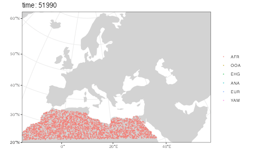

```{r, include = FALSE}
knitr::opts_chunk$set(
  collapse = FALSE,
  comment = "#>",
  fig.width = 7,
  fig.height = 4,
  dpi = 100,
  eval = TRUE
)

# for some reason knitr/reticulate sets this to default, sabotaging
# our efforts to make reticulate use our custom environment -- this
# appears to solve the problem
Sys.unsetenv("RETICULATE_PYTHON")

devtools::load_all(".")
set.seed(314159)
```

**Note:** This vignette is a work in progress as we are currently figuring out the best way to expose the spatially annotated tree sequence data for analyses and visualization. Please check back regularly to see if this notice has been removed.

## Introduction

The main selling point of the *slendr* R package is programming complex *spatially explicit* population genetic models. Because we use SLiM as the simulation engine, we can store simulated data efficiently in a tree sequence format which allows us to run large population-scale simulations. In the previous vignettes, we described how you can specify spatial population dynamics and how you can access tree sequence data and calculate population genetic statistics on it (focusing on [non-spatial models](vignette-05-tree%20sequences) for simplicity). Now it's time to show you how to work with simulated tree sequence in a spatial context.

## Model specification

```{r, collapse = TRUE, message = FALSE}
library(slendr)

library(dplyr)
library(ggplot2)

# use a previously created Python virtual environment containing
# tskit, pyslim and msprime
reticulate::use_virtualenv("~/.pyenv/versions/retipy", required = TRUE)
```

First, let's program our spatial model. We will use the same demographic model of modern human history in West Eurasia, which we extensively discussed in the [introductory tutorial](vignette-01-tutorial.html) and on the main [landing page](../index.html). Here is a complete model definition script, without further comments:

```{r}
# simulated world map
map <- world(
  xrange = c(-15, 60),
  yrange = c(20, 65),
  crs = "EPSG:3035"
)

# couple of broad geographic regions
africa <- region("Africa", map, polygon = list(c(-18, 20), c(40, 20), c(30, 33),
                                               c(20, 32), c(10, 35), c(-8, 35)))
europe <- region("Europe", map, polygon = list(c(-8, 35), c(-5, 36), c(10, 38),
                                               c(20, 35), c(25, 35), c(33, 45),
                                               c(20, 58), c(-5, 60), c(-15, 50)))
anatolia <- region("Anatolia", map, polygon = list(c(28, 35), c(40, 35), c(42, 40),
                                                   c(30, 43), c(27, 40), c(25, 38)))

# define population histories

afr <- population( # African ancestral population
  "AFR", parent = "ancestor", time = 52000, N = 3000,
  map = map, polygon = africa
)

ooa <- population( # population of the first migrants out of Africa
  "OOA", parent = afr, time = 51000, N = 500, remove = 25000,
  center = c(33, 30), radius = 400e3
) %>%
  move(
    trajectory = list(c(40, 30), c(50, 30), c(60, 40)),
    start = 50000, end = 40000, snapshots = 20
  )

ehg <- population( # Eastern hunter-gatherers
  "EHG", parent = ooa, time = 28000, N = 1000, remove = 6000,
  polygon = list(
    c(26, 55), c(38, 53), c(48, 53), c(60, 53),
    c(60, 60), c(48, 63), c(38, 63), c(26, 60))
)

eur <- population( # European population
  name = "EUR", parent = ehg, time = 25000, N = 2000,
  polygon = europe
)

ana <- population( # Anatolian farmers
  name = "ANA", time = 28000, N = 3000, parent = ooa, remove = 4000,
  center = c(34, 38), radius = 500e3, polygon = anatolia
) %>%
  expand( # expand the range by 2.500 km
    by = 2500e3, start = 10000, end = 7000,
    polygon = join(europe, anatolia), snapshots = 20
  )

yam <- population( # Yamnaya steppe population
  name = "YAM", time = 7000, N = 500, parent = ehg, remove = 2500,
  polygon = list(c(26, 50), c(38, 49), c(48, 50),
                 c(48, 56), c(38, 59), c(26, 56))
) %>%
  move(trajectory = list(c(15, 50)), start = 5000, end = 3000, snapshots = 10)

# geneflow events
gf <- list(
  geneflow(from = ana, to = yam, rate = 0.5, start = 6500, end = 6400, overlap = FALSE),
  geneflow(from = ana, to = eur, rate = 0.5, start = 8000, end = 6000),
  geneflow(from = yam, to = eur, rate = 0.75, start = 4000, end = 3000)
)

# compile the spatial model
model <- compile(
  populations = list(afr, ooa, ehg, eur, ana, yam),
  geneflow = gf,
  generation_time = 30, resolution = 10e3,
  competition_dist = 130e3, mate_dist = 100e3, dispersal_dist = 70e3,
  dir = "~/Desktop/sims", overwrite = TRUE
)
```

As a sanity check that we defined the demography correctly, here is a graph summarizing population divergences and geneflow events which we will refer to later in this vignette:

```{r, model_graph}
plot_graph(model)
```

## Scheduling sampling events and simulation

Now we will schedule the sampling of a single individual from each population every four thousand years, starting from 40 thousand years ago all the way to the present (this is a feature discussed in the basic [tree sequence overview](vignette-05-tree%20sequences.html#scheduling-of-sampling-events-1)):

```{r}
# one ancient individual every 1 thousand years
ancient <- sampling(model,
                    times = seq(40000, 1, by = -1000),
                    list(ooa, 1), list(ehg, 1), list(eur, 1),
                    list(ana, 1), list(yam, 1))

# present-day Africans and Europeans
present <- sampling(model, times = 0, list(afr, 5), list(eur, 5))

samples <- rbind(ancient, present)
```

Because we want to explore how to handle spatio-temporal population genomic tree sequence data in *slendr*, we have to turn on the tree sequence recording (`ts_recording = TRUE`):

```{r}
slim(
  model, seq_length = 100e3, recomb_rate = 1e-8, burnin = 200e3,
  ts_recording = TRUE, sampling = samples,
  method = "batch", seed = 314159, overwrite = TRUE
)
```

After the simulation is done, we can load the data in the same way we did in our [first exploration](vignette-05-tree%20sequences.html#loading-and-processing-tree%20sequence-output-files-1) of tree sequence features in *slendr*. We will also immediately simplify the tree sequence data structure to only those genealogies which involve individuals that we explicitly scheduled for sampling, and perform recapitation to ensure the coalescence of all genealogies along the genome:

```{r}
ts <- ts_load(model, recapitate = TRUE, simplify = TRUE, recomb_rate = 1e-8, Ne = 10000)
```

## Extracting spatial tree sequence infrmation

As we showed in the [basic tutorial](vignette-05-tree-sequences.html), the most important function for data exploration is `ts_data()`. This function extracts all information about individuals and nodes recorded in a tree sequence object loaded and annotated by *slendr* :

```{r}
data <- ts_data(ts)
```

For completeness, we have also functions such as `ts_individuals()`, `ts_nodes()` and `ts_edges()` which extract [tree sequence tables](https://tskit.dev/tskit/docs/stable/data-model.html#table-definitions) in their "raw" unprocessed form, but `ts_data()` is much more convenient for data exploration and analyses. First, it combined information in the low-level tables of individuals and nodes into a single table but more importantly, if the model which generated this data was a spatial model, `ts_data()` automatically annotates the node/individual tables with the position of each node in space (in real projected coordinates) and time. This means that we can do spatial data analysis directly on the table returned by `ts_data()`.

Even better, although we can see below that the returned object belongs to *slendr*'s own class `slendr_ts_data`, it is internally stored as a spatial `sf` object. This means that we can use all the functionality of the powerful [R package *sf*](https://r-spatial.github.io/sf/) as well as many other packages for geospatial analyses *directly on the data*:

```{r}
class(data)
```

Typing the object into the R console presents a user-friendly summary of the spatio-temporal data extracted from the tree sequence:

```{r}
data
```

In the first part of the summary, we see how many individuals (sampled or retained) and nodes are present in the tree sequence together with additional useful information, including a section of the internally stored `sf` object. And this is a crucial point---**we can always access the internal `sf` object with the spatial data** by running the following, which avoid the verbose summary above and exposes the underlying [*sf* data frame](https://r-spatial.github.io/sf/articles/sf1.html#how-simple-features-in-r-are-organized-1) directly:

```{r}
data[]
```

Because the data returned by `ts_data()` is internally transformed to the projected CRS used by the model, we can use the returned object as any other data of the class `sf`. For instance, at the beginning of this vignette, we specified the world map of the model to be represented in projected CRS (EPSG 3035) which we can verify by typing:

```{r}
map
```

The fact that the `ts_data()` result is just another `sf` object makes it easy to visualize overlay contents on this map, as we will see below.

## Using the *simple features* interface

It's hard to overstate how powerful the [R ecosystem around the *sf* package](https://r-spatial.github.io/sf/) is. However, getting familiar with this package and geospatial analysis in general can be a bit of a hurdle, especially for novice users because it takes time to get familiar with many new concepts.

Although many *slendr* features for encoding and programming spatial models and handling simulated tree sequence data discussed so far are designed to abstract away most of the complexities of the underlying low-level details to let you focus on the problem at hand, spatial data analysis is unfortunately whole another matter. Luckily, because the data generated by *slendr* is no different from any other source of spatial data out there and you have great [free resources](https://keen-swartz-3146c4.netlify.app/intro.html) at your disposal.

The bottom line is: the spatio-temporal data extracted from tree sequences by *slendr* is no different than an any other normal [`sf`](https://r-spatial.github.io/sf/) object. Any resource that you find for manipulating, plotting, and analysing `sf` data can be applied to *slendr* results as well.

In the remainder of this vignette we will look at a couple of examples.

## Plotting locations of simulated sampled individuals

Every spatial object in *slendr* is internally of the class `sf`. The flexibility of of [*ggplot2*](https://ggplot2.tidyverse.org) and [*sf*](https://r-spatial.github.io/sf/) packages means that we can overlay the locations of sampled individuals (saved in a `sf` format by `ts_data()`) on top of our world map (also an `sf` object):

```{r, slendr_map_ts}
sampled_data <- ts_data(ts, remembered = TRUE)

ggplot() +
  geom_sf(data = map, fill = "lightgray", color = NA) +
  geom_sf(data = sampled_data, aes(shape = pop, color = time)) +
  ggtitle("Locations of simulated sampled individuals") +
  scale_color_continuous(type = "viridis") +
  theme_bw()
```

Because `sf` *simple features* objects (and, by extension, even `slendr_spatial` objects) are internally stored as [normal data frames](https://r-spatial.github.io/sf/articles/sf1.html#how-simple-features-in-r-are-organized) with couple more bells and whistles on top of them, we have all the [powerful tools](https://www.tidyverse.org) for manipulating tabular data at our disposal.

As an example, let's say we wanted to split the sampled individuals in the tree sequence into epochs and plot those individually using standard *ggplot2* features. We could simply first do this, adding a new column specifying to which epoch does each simulated individual belong:

```{r}
epochs <- sampled_data %>% 
  mutate(epoch = cut(time, breaks = c(40000, 30000, 10000, 4000, 0)),
         epoch = ifelse(is.na(epoch), 0, epoch),
         epoch = factor(epoch, labels = c("present", "(present, 4 ky]", "(4 ky, 10 ky]",
                                          "(10 ky, 30 y]", "(30 ky, 40 ky]")))
```

This chunk of code simply adds a new column `epoch` to the `sf` spatial data frame object called `epochs` here.

Then we can use the *ggplot2* function `geom_sf` to plot the locations of sampled individuals on the map, with each facet corresponding to one epoch (the warning can be safely ignored):

```{r, map_epochs}
ggplot() +
  geom_sf(data = map, fill = "lightgray", color = NA) +
  geom_sf(data = epochs, aes(shape = pop, color = pop)) +
  facet_wrap(~ epoch) +
  ggtitle("Locations of simulated sampled individuals in different epochs") +
  theme_bw()
```

We hope this little excursion to handling *slendr* spatial objects (and, by extension, `sf` objects) with standard data frame manipulation functions and *ggplot2* visualisation convinced you that you have a great flexibility in analysing spatial *slendr* data. For best introduction into so-called "tidy" data analysis, we encourage you to read the freely-available book [R for Data Science](https://r4ds.had.co.nz).

## Extracting spatio-temporal ancestral relationships

Perhaps even more useful than plotting the locations of simulated individuals is accessing the locations (and times) of *all ancestors* of a particular tree sequence node (a "focal node"). Starting from the focal node or individual, we can trace the geographical location of nodes in its lineage going back all the way to the root with the function `ts_ancestors()`.

The simplest use case is determining the locations and times of every single node in the genealogical history of an individual along the tree sequence (it is possible to recover ancestral relationships for multiple samples at once too):

```{r}
ind <- "EUR25"

lineages <- ts_ancestors(ts, ind)
```

The function starts at a given node (or, if a name of a sampled diploid individual is provided, two nodes), extracts information about all the parent nodes of that node in the entire tree sequence, records their locations and times, then proceeds one level "higher" in the genealogical history to gather information about the parents of those parent nodes, etc., until it reaches a root node. The result of this process is another `sf` object in which each row of the table encodes information about single branch in the genealogy of the "focal" node or individual (in our example, `r ind`):

```{r}
lineages
```

In each row of the table, two columns `location` and `parent_location` carry the spatial location of a node (`node_id`) and its parent node (`parent_id`), respectively, same with the columns `time` and `parent_time` (times of nodes) and `pop` and `parent_pop` (populations to which the nodes belong). The column `connection` contains an `sf` geometry object of the line connecting the two nodes in the coordinate reference system of the "model world". The column `focal_id` tells us to which focal node's genealogy the rows of the table belong to, and the `level` column shows how deep in the genealogical past does each branch (i.e. row of the table) belong to.

This table contains a complete information about spatio-temporal relationships between the nodes in the genealogy of the given focal sample. In the spirit of demonstrating of *slendr* tree sequence tables interact with the *sf* and *ggplot2* environments, let's look at the most immediate parent nodes of the two nodes in the sampled individual `r ind` (i.e. nodes at the level 1) using the `filter` function from the R package [dplyr](https://r4ds.had.co.nz/transform.html#filter-rows-with-filter):

```{r}
filter(lineages, level == 1)
```

```{r, include = FALSE}
counts <- filter(lineages, name == ind, level == 1) %>% count(focal_id)
```

We can see that the individual `r ind` has `r sum(counts$n)` different parent nodes in the tree sequence---`r counts[1, ]$n` ancestors of the first chromosome/node, `r counts[2, ]$n` ancestors of the second node.

As we mentioned above, there are three columns encoding spatial information: `location` and `parent_location` carry information about the location of the child and parent node (`POINT` class), and the `connection` object (`LINESTRING` class) contains the line connecting the two nodes (both a branch in the tree sequence and also the spatial connection). We can plot all three spatial features (two points and a line) individually on a map:

```{r level1_branches}
level1_branches <- ts_ancestors(ts, "EUR10") %>% filter(level == 1)

ggplot() +
  geom_sf(data = map, fill = "lightgray", color = NA) +
  geom_sf(data = level1_branches[, ]$location, shape = 13, size = 3, color = "red") +
  geom_sf(data = level1_branches[, ]$parent_location, shape = 20, color = level1_branches[, ]$focal_id) +
  geom_sf(data = level1_branches[, ]$connection, linetype = 3) +
  theme_bw() +
  ggtitle("Parent nodes (blue) of a focal individual (red)")
```

In the figure above we can see the red focal node and `r nrow(level1_branches)` of its immediate parents in the tree sequence genealogy (in the coalescent sense, not immediate parents of that individual!).

A more convenient way to do this analysis is a companion function to `ts_ancestors()` called `plot_ancestors()`. This function accepts an `sf` object with the spatial branching data created by `ts_ancestors()` and plots the paths between nodes on a map leading from a focal node up to the root(s) of the tree sequence (instead of just paths to immediate parents shown in the previous figure). In this case, because we are working with a single diploid individual, we get two sets of paths for each of its nodes (chromosomes) and plot them in two facets:

```{r plot_ancestors_time}
plot_ancestors(lineages, ind)
```

Lets compare this result to the animation which recapitulates the simulation:



After comparing our spatial tree sequence figure with the animation, we can immediately notice several things:

1.  All spatial tree sequence paths trace the ancestry of our single European individual `r ind` back to Africa. In fact, we also see a cluster of past ancestral nodes (i.e. concentrated coalescent events) in the place where the Out of Africa (OOA) migrant population settled around 40,000 thousand years ago (yellow population in the the animation).

2.  The first node of the individual in the left panel (node 60 representing the first chromosome) traces part of its ancestry to the EHG population (filled squares) and part to the Anatolia (triangles). This makes sense, because we have simulated European ancestry as being part Anatolian. The second chromosome (node 61) only traces its ancestry to Yamnaya indicated by a star. Again, this is expected because we programmed Yamnaya to also contribute significant part of ancestry to present-day Europeans (compare to the demographic graph on top of this vignette). In turn, the Yamnaya node traces its ancestry to EHG (which is its parental population).

By default, branches are colored by the time of coalescence. We can also plot the number of coalescent events separating a focal node (red crossed circle) and one of its ancestors by specifying `color = "level"` (where level 1 represents branches leading to all of the focal node's parents):

```{r plot_ancestors_levels}
plot_ancestors(lineages, ind, color = "level")
```

Let's look at the spatial ancestry of another sample. For instance, we know that the simulated history of the Anatolian population in our model is much simpler. According to the demographic graph above, Anatolians split from the ancestral population of Eurasians in Anatolia and then expanded in a wave to Europe. We have sampled the following individuals:

```{r}
ts_samples(ts) %>% filter(pop == "ANA")
```

```{r, include = FALSE}
ana_ind <- ts_samples(ts) %>% filter(pop == "ANA") %>% tail(1)
```

Can we see a hint of the spatial dynamics of Anatolians in the spatio-temporal distribution of ancestral node locations of one of the sampled individuals? Let's pick the last individual (`r ana_ind$name`) and immediately plot its spatial ancestry tidyverse-style using the pipe operator `%>%`:

```{r, plot_ancestors_levels_ana}
ts_ancestors(ts, "ANA22") %>% plot_ancestors(color = "level")
```

As we might expect given the late age of the sample (`r ana_ind$time`), its position in the map above (red crossed circle) is not in Anatolia but in Europe because it represents one of the descendants of migrants who moved from Anatolia into Europe. This can be clearly seen in the position of its parental nodes in the tree sequence: these nodes represent real individuals who lived at some point in the past, and we can see that they did, indeed, lived in Anatolia.

## Calculating distances and other statistics using the *sf* package

TODO
