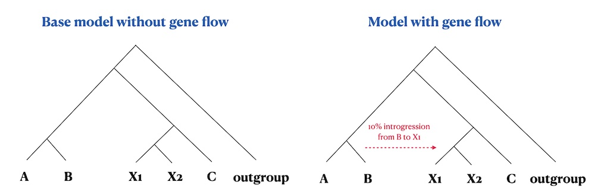
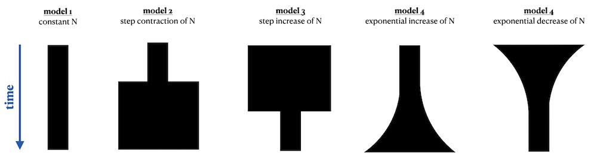

```{r, include = FALSE}
env_present <- "automatic_slendr_python_env" %in% reticulate::conda_list()$name

knitr::opts_chunk$set(
  collapse = FALSE,
  comment = "#>",
  fig.width = 8,
  fig.height = 6,
  dpi = 80,
  eval = Sys.which("slim") != "" && env_present
)
```

Even though the most distinguishing feature of the *slendr* R package is programming spatial population genetic models across real and abstract geographic landscapes, having the ability to run "standard", non-spatial models directly from an R environment could be often quite useful. This is why *slendr* supports also non-spatial SLiM models, which can be executed by *slendr* simply by excluding the map component from a SLiM simulation (briefly discussed in [this vignette](vignette-04-nonspatial-models.html)).

In some cases, the forward nature of a SLiM simulation (meaning that many individuals need to be tracked in each generation) makes the simulations too slow. For instance, running an [Approximate Bayesian Computation (ABC)](https://en.wikipedia.org/wiki/Approximate_Bayesian_computation) analysis often requires running thousands or even millions of simulations. In cases like this, the faster the simulations the better.

For these situations, the *slendr* R package provides an alternative back end for simulating non-spatial population models using the Python coalescent simulation framework [*msprime*](https://tskit.dev/msprime/docs/stable/intro.html). Unlike forward time simulators, coalescent simulations only reconstruct the genealogical history of a sample of individuals of interest backwards in time, which makes it much more computational efficient.

The goal of this vignette is to demonstrate that a single *slendr* model configuration can be run using the built-in SLiM and msprime backend engines _without any changes_!

To start off, let's load the *slendr* package together with some standard R data analysis packages, and instruct *reticulate* where to look for a Python environment with all necessary Python dependencies (see [this](vignette-05-tree-sequences.html#r-interface-for-tskit-and-pyslim-1) section of another vignette for instructions how to setup the Python environment the easiest way possible):

```{r, message = FALSE}
library(slendr)

library(dplyr)
library(ggplot2)
library(purrr)
library(tidyr)

# activate slendr's Python interface, installing all dependencies if necessary
setup_env()

# check that we have the correct environment
check_env()

seed <- 42
set.seed(seed)
```

## Detecting gene flow from msprime and SLiM tree sequences

### Defining a model

We now define up a simple *non-spatial* model of gene flow between populations (also known as population admixture or introgression). This will involve essentially the same procedure which we have shown in another vignette introducing [non-spatial *slendr* models](vignette-04-nonspatial-models.html). Note that this is no different from how we would normally specify a spatial model, except that we left out the `map` argument in making the `population()` calls.

To demonstrate additional features of the *slendr* interface to the [*tskit*](https://tskit.dev/tskit/docs/stable/introduction.html) Python library, we will perform gene flow detection test using the so-called $f_4$ and $f_4$-ratio statistics (very briefly introduces in [this vignette](vignette-05-tree-sequences.html)). To make things a little more interesting, we will define two population models: one model without any gene flow, and another which includes gene flow. In defining this model and expressing the $f$-statistics we will use the same nomenclature used in the first study by [Patterson _et al._](https://academic.oup.com/genetics/article/192/3/1065/5935193) that described $f_4-ratio$ statistic in the first place. if you're not familiar with these statistical tests of gene flow, we recommend that you take a look at the relevant sections of the linked paper.
shiny_graph
{width="90%"}

Let's start by first defining the populations and their splits as established in the figure above:

```{r}
seq_len <- 200e6 # amount of sequence to simulate
rec_rate <- 1e-8 # uniform recombination rate
mut_rate <- 1e-8 # mutation rate

o <- population("outgroup", time = 1, N = 10)
b <- population("b", parent = o, time = 500, N = 10)
c <- population("c", parent = b, time = 1000, N = 10)
x1 <- population("x1", parent = c, time = 2000, N = 10000)
x2 <- population("x2", parent = c, time = 2000, N = 10000)
a <- population("a", parent = b, time = 1500, N = 10)
```

Note that the Ne of the populations `x1` and `x2` is set to be much higher than the rest. We set the $N_e$ of the other populations to lower values to speed up the forward SLiM simulations (they won't affect the results we're interested in anyway). Higher values of the $N_e$ of `x1` and `x2` populations will ensure that the effect of the drift acting on those two populations will be much smaller. Because we will simulate and later measure the proportion of ancestry from the population `b` to `x1`, this will ensure that the ancestry proportion will not drift too far away from the expectation and it will make the interesting patterns stand out more clearly.

(Of course, this is all done for demonstration purposes only and to speed up the SLiM simulations by making the $N_e$ of the other populations smaller. In practice, we would be running these kinds of simulations only using the *msprime* back end.)

## Compiling the model and simulating data

We will now use those populations to compile two models: the first model will be without any geneflow (left panel in the figure wo above), the second model will include 10% gene flow from `b` to `x1` (right panel in the figure above). We will also schedule sampling of a couple of individuals at the very end of the simulation: 50 individuals each from populations `x1` and `x2` to capture a bit more of the natural variation of `b` ancestry in `x1`, and only one individual from the rest.

```{r}
# no gene flow model
model_nogf <- compile(populations = list(a, b, x1, x2, c, o), generation_time = 1, sim_length = 2200)

samples <- sampling(model_nogf, times = 2200,
                    list(a, 1), list(b, 1), list(x1, 50), list(x2, 50), list(c, 1), list(o, 1))

# model with gene flow
gf <- geneflow(from = b, to = x1, start = 2100, end = 2150, rate = 0.1)

model_gf <- compile(populations = list(a, b, x1, x2, c, o), geneflow = gf, generation_time = 1, sim_length = 2200) 

samples <- sampling(model_gf, times = 2200,
                    list(a, 1), list(b, 1), list(x1, 50), list(x2, 50), list(c, 1), list(o, 1))
```

Now we will run both models (with and without gene flow) in the two *slendr* backends, SLiM and msprime:

```{r}
# model without gene flow
slim(model_nogf, sequence_length = seq_len, recombination_rate = rec_rate, sampling = samples, random_seed = seed)
msprime(model_nogf, sequence_length = seq_len, recombination_rate = rec_rate, sampling = samples, random_seed = seed)

# model with b -> x1 gene flow
slim(model_gf, sequence_length = seq_len, recombination_rate = rec_rate, sampling = samples, random_seed = seed)
msprime(model_gf, sequence_length = seq_len, recombination_rate = rec_rate, sampling = samples, random_seed = seed)
```

Note that we are using exactly the same model configuration object in both simulation runs! In fact, even the function interface looks nearly exactly the same. It doesn't matter what the specific details of your demographic models are, *slendr* will interpret them correctly regardless of which back end simulation engine you choose to use.

Because *slendr* saves all output files directly to the model directory by default, we can detect two distinct tree sequence output files, one generated by *slendr*'s SLiM backend, another by its msprime backend:

```{r}
cat(system(paste("cd", model_nogf$path, "; ls *.trees"), intern = TRUE), sep = "\n")
cat(system(paste("cd", model_gf$path, "; ls *.trees"), intern = TRUE), sep = "\n")
```

However, on a closer inspection of the files you would notice they have very different sizes. In particular, the `output_msprime.trees` much smaller. This is because being a coalescent simulator, msprime only saves information about nodes which are coalescent nodes somewhere (and some time) in the tree sequence.

### Comparing the outputs of msprime and SLiM runs of a *slendr* model

Having run our introgression models with the two simulation back ends, let's load both SLiM and msprime tree sequence outputs and compare their contents (hoping they will be the same!).

```{r}
# SLiM outputs -- we can use built-in slendr functions for those
slim_nogf <- ts_load(model_nogf, file = file.path(model_nogf$path, "output_slim.trees"),
                     recapitate = TRUE, simplify = TRUE, mutate = TRUE,
                     Ne = 10, recombination_rate = rec_rate, mutation_rate = mut_rate,
                     random_seed = seed)

slim_gf <- ts_load(model_gf, file = file.path(model_gf$path, "output_slim.trees"),
                   recapitate = TRUE, simplify = TRUE, mutate = TRUE,
                   Ne = 10, recombination_rate = rec_rate, mutation_rate = mut_rate,
                   random_seed = seed)

# msprime outputs (note that recapitation and simplification doesn't make
# sense here because we already have fully coalesced genealogies for our
# individuals  of interest
msprime_nogf <- ts_load(model_nogf, file = file.path(model_nogf$path, "output_msprime.trees"),
                   mutate = TRUE, mutation_rate = mut_rate, random_seed = seed)

msprime_gf <- ts_load(model_gf, file = file.path(model_gf$path, "output_msprime.trees"),
                   mutate = TRUE, mutation_rate = mut_rate, random_seed = seed)
```

As we can see below, the tree sequence summary of the data loaded and processed by *slendr*'s `ts_load()` function (data produced by the SLiM backend) is very similar to what we got "manually" for the msprime-produced tree sequence using the custom defined functions. This is somehow obvious but it is a nice and cheap sanity check indicating that the tree sequence data structure produced by the two backends from the same demographic model is almost the same.

```{r}
slim_nogf
msprime_nogf
```

### Comparing results of population genetics statistics

Having loaded both msprime and SLiM tree sequences generated by the same model, let's see if we can get comparable results when we calculate some statistics of interest.

Let's first extract all individuals from populations `x1` and `x2` and estimate the values of $f_4(c, x1 \textrm{ or } x2; b, o)$ (which should be significantly negative for individuals in the population `x1` due to it's ancestry coming from `b` in the introgression models but consistent with zero for `x2`) and $f_4\textrm{-ratio}(a, b, \textrm{ or } x2; c, o)$, which estimates the *proportion* of `b`-like ancestry in `x1` and `x2`:

```{r}
# extract vector of names of the "test individuals" in populations `x1` and `x2`
X <- ts_samples(slim_gf) %>% filter(pop %in% c("x1", "x2")) %>% pull(name)
X
```

```{r}
# calculate f4-statistics on individuals of `x1` and `x2` populations using data
# from the two models (a model with no gene flow and a gene flow model) -- we use
# map_dfr to iterate across all individuals from `X_individuals` and binding all
# resulting data frames into a single data frame
df_slim_f4 <- rbind(
  map_dfr(X, ~ ts_f4(slim_nogf, "c_1", .x, "b_1", "outgroup_1")) %>% mutate(model = "no gene flow"),
  map_dfr(X, ~ ts_f4(slim_gf, "c_1", .x, "b_1", "outgroup_1")) %>% mutate(model = "gene flow")
) %>%
  select(X, f4, model) %>%
  mutate(simulator = "SLiM backend")

# compute the proportions of `b` ancestry in `x1` (expected 10%) and `x2`
# (expected 0% because this population did not receive any gene flow from `b`)
df_slim_f4ratio <- rbind(
  ts_f4ratio(slim_nogf, X, "a_1", "b_1", "c_1", "outgroup_1") %>% mutate(model = "no gene flow"),
  ts_f4ratio(slim_gf, X, "a_1", "b_1", "c_1", "outgroup_1") %>% mutate(model = "gene flow")
) %>%
  select(X, alpha, model) %>%
  mutate(simulator = "SLiM backend")
```

Now, let's repeat the same analysis on tree sequences produced by the *msprime* backend from the same two *slendr* demographic models:

```{r}
df_msprime_f4 <- rbind(
  map_dfr(X, ~ ts_f4(msprime_nogf, "c_1", .x, "b_1", "outgroup_1")) %>% mutate(model = "no gene flow"),
  map_dfr(X, ~ ts_f4(msprime_gf, "c_1", .x, "b_1", "outgroup_1")) %>% mutate(model = "gene flow")
) %>%
  select(X, f4, model) %>%
  mutate(simulator = "msprime backend")

# compute the proportions of `b` ancestry in `x1` (expected 10%) and `x2`
# (expected 0% because this population did not receive any gene flow from `b`)
df_msprime_f4ratio <- rbind(
  ts_f4ratio(msprime_nogf, X, "a_1", "b_1", "c_1", "outgroup_1") %>% mutate(model = "no gene flow"),
  ts_f4ratio(msprime_gf, X, "a_1", "b_1", "c_1", "outgroup_1") %>% mutate(model = "gene flow")
) %>%
  select(X, alpha, model) %>%
  mutate(simulator = "msprime backend")

```

Finally we can proceed with plotting both SLiM and msprime backend results of the two models and compare them together. As noted above, despite the fact that SLiM is a forward simulator and msprime is a coalescent simulator, population genetic expectations from both the gene flow and no gene flow models should match very closely (barring a level of uncertainty expected due to randomness of the population genetic processes at play).

```{r, msprime_slim_f4_distributions}
df_f4 <- rbind(df_slim_f4, df_msprime_f4) %>%
  mutate(population = ifelse(grepl("x1_", X),
                             "x1 (received gene flow)",
                             "x2 (no gene flow)"))

ggplot(df_f4, aes(f4, fill = population)) +
  geom_histogram(bins = 50) +
  facet_grid(simulator ~ model) +
  geom_vline(xintercept = 0, linetype = 2) +
  labs(y = "number of individuals", x = "f4 statistic",
       title = "f4(c, x1 or x2; b, outgroup)",
       subtitle = "f4 ~0 is consistent with no gene flow, negative value indicates gene flow with 'b'") +
  theme(legend.position = "bottom")
```

```{r, msprime_slim_f4ratio_distributions}
df_f4ratio <- rbind(df_slim_f4ratio, df_msprime_f4ratio) %>%
  mutate(population = ifelse(grepl("x1_", X),
                             "x1 (received gene flow)",
                             "x2 (no gene flow)"))

ggplot(df_f4ratio, aes(alpha, fill = population)) +
  geom_histogram(bins = 30) +
  facet_grid(simulator ~ model) +
  geom_vline(xintercept = 0.1, linetype = 2) +
  labs(y = "number of individuals", x = "ancestry proportion (f4-ratio statistic)",
       title = "f4-ratio estimate of 'b' ancestry calculated from simulated data",
       subtitle = "f4-ratio = f4(a, outgroup; x1 or x2, c) / f4(a, outgroup; b, c)") +
  theme(legend.position = "bottom")
```

Things seem to be looking good and behave as expected! A couple of observations:

- In the model without gene flow, the $f_4$ statistic value is zero for both `x1` and `x2` populations. This is expected, because $f_4$ ~0 is consistent with the relationship between lineages conforming to a standard phylogenetic tree (no admixture edges). Essentially, $f_4$ is a hypothesis test of "tree-ness" of the data.
- In the model which includes gene flow from `b` to `x1`, the $f_4$ value is significantly negative. This means that a simple tree hypothesis can be rejected and that gene flow must have occurred between `b` and `x1`. Note that this test does not reveal the _direction_ of gene flow, only it's presence.
- Consistently with the $f_4$ results, the $f_4-ratio$ estimates match our expectations. Specifically, the statistic estimates around 10% ancestry of `b` in `x1` in the gene flow model and 0% ancestry in all other cases.
- Most importantly, the results obtained from the SLiM and msprime back ends are nearly exactly the same. This means that (for non-spatial models) you can use SLiM and *msprime* backend interchangeably.

## Computing allele frequency spectra

Let's look at one more example. Imagine the following five demographic models describing the changes in the population size of some abstract population:

{width="90%"}

These models and the population size change events could be, depending on the specifics of our project, defined using different time units. If you work with radiocarbon-dated samples and ancient DNA you might be used to thinking about population history in units of "years before present"&mdash;in this case, the "present" time (bottom of the figure) would be at time 0 and earlier events  would be specified as "5000 years before present", etc.

On the other hand, if you were interested in modelling some theoretical population, you might not want to concern yourselves with this and would be quite happy starting our simulation at "generation 1" and continue until some specified "generation X".

The *slendr* package makes all of this extremely easy, because you can specify times in whatever direction and units you want, as long as they are kept consistent for all populations and events in your model. This is a rather unique feature among popgen simulation software as most programs either make you express your model in "generations in forward direction", or you have to explicitly convert time in generations going backwards.

In the previous section of the vignette we have shown that SLiM and msprime can be both used as simulation backend. In the remainder of this vignette we will present additional analysis, demonstrating the fact that you can express time of your models in a forward or backward direction and still run those models in *slendr*'s SLiM (forward simulator) or *msprime* (backward simulator).

Specifically, we will define all five demographic models from the figure above twice, in different orientations of time -- forward or backward. We will then compute allele frequency spectrum from each simulation (five models, each forward or backward) and verify that both forward and backward pairs give the same result regardless of whether we use the SLiM back end or the *msprime* backend.

### Model definition

```{r}
N <- 1000
N_factor <- 5 # by what factor should Ne change

seq_len <- 250e6
rec_rate <- 1e-8
mut_rate <- 1e-8
```

First, let's define the five population histories in a forward time direction:

```{r}
# constant Ne model
forward_const <- population("const", time = 1, N = N)

# decreasing step Ne model
forward_decr <- population("decr", time = 1, N = N, map = FALSE) %>%
  resize(time = 2000, N = N / N_factor, how = "step")

# increasing step Ne model
forward_incr <- population("inc", time = 1, N = N) %>%
  resize(time = 2000, N = N * N_factor, how = "step")

# exponential increase in size
forward_exp_incr <- population("exp_inc", time = 1, N = N) %>%
  resize(time = 2000, end = 3000, N = N * N_factor, how = "exponential")

# exponential decrease in size
forward_exp_decr <- population("exp_decr", time = 1, N = N) %>%
  resize(time = 2000, end = 3000, N = N / N_factor, how = "exponential")
```

Now let's flip the flow of time around and define the population histories in units of "time ago":

```{r}
# constant Ne model
backward_const <- population("const", time = 5000, N = N)

# decreasing step Ne model
backward_decr <- population("decr", time = 5000, N = N) %>%
  resize(time = 3000, N = N / N_factor, how = "step")

# increasing step Ne model
backward_incr <- population("inc", time = 5000, N = N) %>%
  resize(time = 3000, N = N * N_factor, how = "step")

# exponential increase in size
backward_exp_incr <- population("exp_inc", time = 5000, N = N) %>%
  resize(time = 3000, end = 2000, N = N * N_factor, how = "exponential")

# exponential decrease in size
backward_exp_decr <- population("exp_decr", time = 5000, N = N) %>%
  resize(time = 3000, end = 2000, N = N / N_factor, how = "exponential")
```

For convenience, we will write a helper function which will, for a given population history object (ten objects just above), compile a *slendr* model, run it in both SLiM and *msprime* back ends, load the tree sequence, and compute allele frequency spectrum (AFS) from it. This will save us lots of code repetition (always a good thing), minimize the chance of copy-pasting bugs (definitely a good thing!) and compare the AFS patterns across different models and the two *slendr* simulation back ends (they should be the same according to population genetics theory).

```{r}
compile_run_afs <- function(model_name, pop, seed = 42) {
  # maximum length of the simulation (necessary for forward models which start
  # in generation 1)
  sim_length <- 5000 

  # define sampling times given the direction of time
  if (split_time(pop) == 1) {
    sampling_time <- sim_length
    direction <- "forward"
  } else {
    sampling_time <- 0
    direction <- "backward"
  }

  # compile model
  model <- compile(pop, generation_time = 15, direction = direction, sim_length = sim_length)

  samples <- sampling(model, times = sampling_time, list(pop, 50))

  # run the model in SLiM
  slim(model, sequence_length = seq_len, recombination_rate = rec_rate,
       sampling = samples, random_seed = seed, verbose = FALSE)

  # run the same model in msprim
  msprime(model, sequence_length = seq_len, recombination_rate = rec_rate,
          sampling = samples, random_seed = seed, verbose = FALSE)

  # load the SLiM tree sequence
  slim_ts <- ts_load(
    model, file = file.path(model$path, "output_slim.trees"),
    recapitate = TRUE, simplify = TRUE, mutate = TRUE,
    Ne = N, recombination_rate = rec_rate, mutation_rate = mut_rate,
    random_seed = seed
  )

  # load the msprime tree sequence
  msprime_ts <- ts_load(
    model, file = file.path(model$path, "output_msprime.trees"),
    mutate = TRUE, mutation_rate = mut_rate, random_seed = seed
  )

  # compute the AFS from the SLiM and msprime tree sequences and bind the
  # results (derived allele counts per frequency bin) in a data frame
  msprime_afs <- ts_afs(msprime_ts, polarised = TRUE)
  slim_afs <- ts_afs(slim_ts, polarised = TRUE)

  rbind(
    data.frame(simulator = "msprime", model = model_name, f = msprime_afs),
    data.frame(simulator = "SLiM", model = model_name, f = slim_afs)
  ) %>%
    group_by(simulator, model) %>%
    mutate(n = 1:n(), direction = direction) %>%
    ungroup()
}
```

Now that this function doesn't do anything special. It simply wraps a standard *slendr* simulation pipeline (1. create population(s); 2. compile a model object; 3. simulate the model; 4. load the results; 5. analyse the data) into a single function.

Now that we have the whole pipeline, we can generate all of our simulated data and bind all the result into a single data frame:

```{r}
afs <- bind_rows(
  compile_run_afs("constant", forward_const),
  compile_run_afs("constant", backward_const),
  compile_run_afs("step contraction", forward_decr),
  compile_run_afs("step contraction", backward_decr),
  compile_run_afs("step increase", forward_incr),
  compile_run_afs("step increase", backward_incr),
  compile_run_afs("exponential decrease", forward_exp_decr),
  compile_run_afs("exponential decrease", backward_exp_decr),
  compile_run_afs("exponential increase", forward_exp_incr),
  compile_run_afs("exponential increase", backward_exp_incr)
) %>%
  mutate(model = factor(
    model, levels = c("step contraction", "constant", "step increase",
                      "exponential decrease", "exponential increase"))
  )
```

Finally, we can plot the allele frequency spectra from all models, for the two time directions, and for the two simulation back ends:

```{r, msprime_slim_afs}
ggplot(afs, aes(n, f, color = direction, linetype = simulator)) +
  geom_line(stat = "identity") +
  facet_wrap(~ model) +
  labs(x = "number of derived alleles", y = "frequency",
       title = "Site frequency spectra obtained from five demographic models",
       subtitle = "Each model was specified in forward or backward direction of time and executed by
two different backend scripts in slendr (SLiM and msprime)") +
  guides(color = guide_legend("direction of\ntime in slendr"),
         linetype = guide_legend("slendr backend\nengine used")) +
  scale_linetype_manual(values = c(3, 2)) +
  scale_x_continuous(breaks = c(1, seq(20, 100, 20)), limits = c(1, 100)) +
  theme(legend.position = "bottom")
```

Again, a couple of things to note:

- The two models that involve population contraction (be it in a single step or an exponential collapse), we see a decrease in low frequency variants. On the other hand, models with population expansion show a high proportion of low frequency variants. The model with constant population size shows intermediate pattern. This is a nice validation that the simulation works as expected as it is exactly what is predicted by population genetics theory.

- Both forward and backward time models give exactly the same result. This is not unexpected as anything else would be a bug in *slendr*. However, although unsurprising, we hope that it makes it clear that you are free to use whatever time unit specification you want to encode *slendr* models.

- For non-spatial models, results obtained from *msprime* and SLiM back ends are consistent with one another. Again, this makes sense because although they are completely different software, population genetic theory governing the shape of allele frequency spectra applies equally to both. In fact, the same example as we have just implemented is an important part of *slendr* unit test suite which verifies that the simulations created with *slendr* are correct.

## Conclusion

This example shows that if you have a standard, non-spatial demographic model and would like to implement and simulate it in R, *slendr* gives you a way to do so efficiently using it's *msprime* back end in addition to the SLiM back end used throughout most of the documentation.
